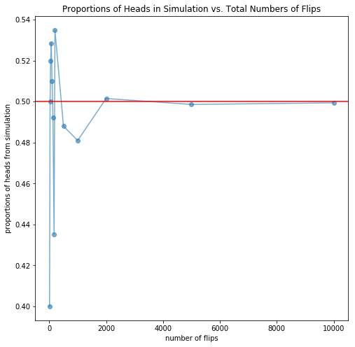
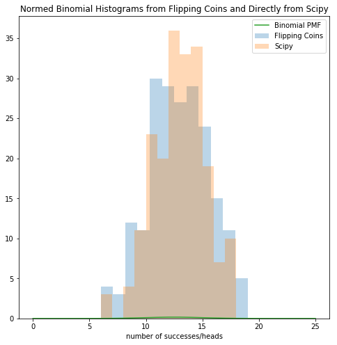

## Contents
{:.no_toc}
*  
{: toc}


```python
## RUN THIS CELL TO GET THE RIGHT FORMATTING 
import requests
from IPython.core.display import HTML
styles = requests.get("https://raw.githubusercontent.com/Harvard-IACS/2018-CS109A/master/content/styles/cs109.css").text
HTML(styles)
```


<style>
blockquote { background: #AEDE94; }
h1 { 
    padding-top: 25px;
    padding-bottom: 25px;
    text-align: left; 
    padding-left: 10px;
    background-color: #DDDDDD; 
    color: black;
}
h2 { 
    padding-top: 10px;
    padding-bottom: 10px;
    text-align: left; 
    padding-left: 5px;
    background-color: #EEEEEE; 
    color: black;
}

div.exercise {
	background-color: #ffcccc;
	border-color: #E9967A; 	
	border-left: 5px solid #800080; 
	padding: 0.5em;
}

span.sub-q {
	font-weight: bold;
}
div.theme {
	background-color: #DDDDDD;
	border-color: #E9967A; 	
	border-left: 5px solid #800080; 
	padding: 0.5em;
	font-size: 18pt;
}
div.gc { 
	background-color: #AEDE94;
	border-color: #E9967A; 	 
	border-left: 5px solid #800080; 
	padding: 0.5em;
	font-size: 12pt;
}
p.q1 { 
    padding-top: 5px;
    padding-bottom: 5px;
    text-align: left; 
    padding-left: 5px;
    background-color: #EEEEEE; 
    color: black;
}
header {
   padding-top: 35px;
    padding-bottom: 35px;
    text-align: left; 
    padding-left: 10px;
    background-color: #DDDDDD; 
    color: black;
}
</style>


```python
%matplotlib inline
import numpy as np
import scipy as sp
import pandas as pd
import scipy.stats
import matplotlib.pyplot as plt
```


## Basic Statistics

*Complete the following: you can perform the calculations by hand (show your work) or using software (include the code and output, screenshots are fine if it is from another platform).*

**1.5**. 37 of the 76 female CS concentrators have taken Data Science 1 (DS1) while 50 of the 133 male concentrators haven taken DS1.  Perform a statistical test to determine if interest in Data Science (by taking DS1) is related to sex.  Be sure to state your conclusion.

**Answer**:

This can be answered using several different classical hypothesis tests: (i) $z$-test for 2 proportions, (ii) $\chi^2$ test for independence, (iii) Fisher's exact test, or (iv) logistic regression (other approaches are also reasonable).  All 4 test results are provided below:  

The $z$-statistic is calculated for you here, the rest are left up to software:
$$\hat{p}_1 = 37/76 = 0.4868$$ $$\hat{p}_2 = 50/133 = 0.3759$$ $$\hat{p}_{pooled} = (37+50)/(76+133) = 0.4163$$

$$z = \frac{\hat{p}_1-\hat{p}_2}{\sqrt{\hat{p}_{pooled}(1-\hat{p}_{pooled})\left(\frac{1}{n_1}+\frac{1}{n_2}\right)}} = \frac{0.4868-0.3759}{\sqrt{0.4163(0.5873)(\frac{1}{76}+\frac{1}{133})}} = 1.565$$ 


```python
import statsmodels
from statsmodels.stats.proportion import proportions_ztest

x = np.array([37,50])
n = np.array([76,133])

zstat, pvalue = statsmodels.stats.proportion.proportions_ztest(x, n)    
print("Two-sided z-test for proportions: z =", zstat,", pvalue =",pvalue)
```


    Two-sided z-test for proportions: z = 1.56461178592235 , pvalue = 0.11767396368458083


```python
y = n - x
cont_table = np.array([y,x])
chi2stat, pvalue, df, exp = scipy.stats.chi2_contingency(cont_table)
print("Chi-sq test for independence: chi2 =",chi2stat,", pvalue =",pvalue)
```


    Chi-sq test for independence: chi2 = 2.0128746736116727 , pvalue = 0.15596953904839853


```python
OR, pvalue = scipy.stats.fisher_exact(cont_table)
print("Fisher's Exact Test: estimated odds ratio =",OR,", pvalue =",pvalue)
```


    Fisher's Exact Test: estimated odds ratio = 0.6349723217193096 , pvalue = 0.1447189385430398


```python
import statsmodels.formula.api as sm

xs = np.repeat([0,1], n, axis=0)
ys = np.repeat([0,1,0,1], [x[0], y[0],x[1],y[1]], axis=0)

pd.crosstab(ys,xs)

X = statsmodels.tools.tools.add_constant(xs)

model = sm.Logit(ys,X)
 
model1 = model.fit()

model1.summary()
```


    Optimization terminated successfully.
             Current function value: 0.673227
             Iterations 4


<table class="simpletable">
<caption>Logit Regression Results</caption>
<tr>
  <th>Dep. Variable:</th>         <td>y</td>        <th>  No. Observations:  </th>  <td>   209</td> 
</tr>
<tr>
  <th>Model:</th>               <td>Logit</td>      <th>  Df Residuals:      </th>  <td>   207</td> 
</tr>
<tr>
  <th>Method:</th>               <td>MLE</td>       <th>  Df Model:          </th>  <td>     1</td> 
</tr>
<tr>
  <th>Date:</th>          <td>Sun, 28 Jul 2019</td> <th>  Pseudo R-squ.:     </th> <td>0.008588</td>
</tr>
<tr>
  <th>Time:</th>              <td>15:53:32</td>     <th>  Log-Likelihood:    </th> <td> -140.70</td>
</tr>
<tr>
  <th>converged:</th>           <td>True</td>       <th>  LL-Null:           </th> <td> -141.92</td>
</tr>
<tr>
  <th> </th>                      <td> </td>        <th>  LLR p-value:       </th>  <td>0.1184</td> 
</tr>
</table>
<table class="simpletable">
<tr>
    <td></td>       <th>coef</th>     <th>std err</th>      <th>z</th>      <th>P>|z|</th>  <th>[0.025</th>    <th>0.975]</th>  
</tr>
<tr>
  <th>const</th> <td>    0.0526</td> <td>    0.229</td> <td>    0.229</td> <td> 0.819</td> <td>   -0.397</td> <td>    0.502</td>
</tr>
<tr>
  <th>x1</th>    <td>    0.4542</td> <td>    0.291</td> <td>    1.560</td> <td> 0.119</td> <td>   -0.116</td> <td>    1.025</td>
</tr>
</table>


All 4 tests have similar results: all 4 p-values hover between 0.118 and 0.156.  Thus, we are unable to reject the null hypothesis (of no difference in CS109A enrollment between the sexes amoung the CS concentrators).  Male and female CS concentrators may truly take CS109A at the same rate.

## Simulation of a Coin Throw

We'd like to do some experiments with coin flips, but we don't have a physical coin at the moment. So let us **simulate** the process of flipping a coin on a computer. To do this we will use a form of the **random number generator** built into `numpy`. In particular, we will use the function `np.random.choice` which picks items with uniform probability from a list. If we provide it a list ['H', 'T'], it will pick one of the two items in the list. We can also ask it to do this multiple times by specifying the parameter `size`. 


```python
def throw_a_coin(n_trials):
    return np.random.choice(['H','T'], size=n_trials)
```


`np.sum` is a function that returns the sum of items in an iterable (i.e. a list or an array).  Because python coerces `True` to 1 and `False` to 0, the effect of calling `np.sum` on the array of `True`s and `False`s will be to return the number of of `True`s in the array which is the same as the number of heads.

**Question 2: The 12 Labors of Bernoullis**

Now that we know how to run our coin flip experiment, we're interested in knowing what happens as we choose larger and larger number of coin flips.


**2.1**.  Run one experiment of flipping a coin 40 times storing the resulting sample in the variable `throws1`.   What's the total proportion of heads?

**2.2**.  **Replicate** the experiment in 2.1 storing the resulting sample  in the variable `throws2`.   What's the proportion of heads?  How does this result compare to that you obtained in question 2.1?

**2.3**.  Write a function  called `run_trials` that takes as input a list, called `n_flips`, of integers representing different values for the number of coin flips in a trial.  For each element in the input list, `run_trials` should run the coin flip experiment with that number of flips and calculate the proportion of heads.  The output of `run_trials` should be the list of calculated proportions.  Store the output of calling `run_trials` in a list called `proportions`.

**2.4**.  Using the results in 2.3, reproduce the plot below. 
<!--of the proportion of observed heads to total coins flipped in the trial when `run_trials` is run for each of the sample sizes in `trials` -->  

**2.5**.  What's the appropriate observation about the result of running the coin flip experiment with larger and larger numbers of coin flips?  Choose the appropriate one from the choices below. 

> A. Regardless of sample size the probability of in our experiment of observing heads is 0.5 so the proportion of heads observed in the coin-flip experiments will always be 0.5.  
>
> B. The proportions **fluctuate** about their long-run value of 0.5 (what you might expect if you tossed the coin an infinite amount of times), in accordance with the notion of a fair coin (which we encoded in our simulation by having `np.random.choice` choose between two possibilities with equal probability), with the fluctuations seeming to become much smaller as the number of trials increases.
>
> C. The proportions **fluctuate** about their long-run value of 0.5 (what you might expect if you tossed the coin an infinite amount of times), in accordance with the notion of a fair coin (which we encoded in our simulation by having `np.random.choice` choose between two possibilities with equal probability), with the fluctuations constant regardless of the number of trials.


**Answers**

**2.1**


```python
throws1 = throw_a_coin(40)
print("Throws: ", throws1)
print("Number of Heads:", np.sum(throws1 == 'H'))
print("p2 = Number of Heads/Total Throws:", np.sum(throws1 ==  'H')/40.)
```


    Throws:  ['T' 'T' 'T' 'H' 'T' 'H' 'T' 'H' 'T' 'T' 'T' 'T' 'T' 'H' 'T' 'H' 'T' 'T'
     'T' 'H' 'T' 'T' 'H' 'T' 'H' 'T' 'H' 'H' 'T' 'H' 'T' 'T' 'H' 'H' 'H' 'T'
     'T' 'H' 'T' 'H']
    Number of Heads: 16
    p2 = Number of Heads/Total Throws: 0.4


**2.2** 


```python
throws2 = throw_a_coin(40)
print("Throws: ",throws2)

print("Number of Heads:", np.sum(throws2 == 'H'))
print("p2 = Number of Heads/Total Throws:", np.sum(throws2 ==  'H')/40.)
```


    Throws:  ['H' 'T' 'H' 'H' 'H' 'T' 'T' 'H' 'H' 'H' 'H' 'H' 'T' 'H' 'T' 'H' 'H' 'T'
     'H' 'T' 'T' 'H' 'H' 'H' 'T' 'T' 'H' 'T' 'T' 'H' 'T' 'T' 'T' 'H' 'T' 'T'
     'H' 'T' 'T' 'T']
    Number of Heads: 20
    p2 = Number of Heads/Total Throws: 0.5


**2.3** 


```python
n_flips = [10, 30, 50, 70, 100, 130, 170, 200, 500, 1000, 2000, 5000, 10000]
```


```python
def run_trials(n_flips: list) -> list:
    '''Run one replication of coin flip experiment for each element in trials.
       
       Args:
           n_flips: List of numbers to use as coin flip experiment sizes.
       
       Returns:
           A list of the proportions of heads observed in each coin flip experiment.
    '''
    
    return([np.sum(throw_a_coin(j) == 'H')/np.float(j) for j in n_flips])
```


```python
proportions = run_trials(n_flips)
proportions
```


    [0.4,
     0.5,
     0.52,
     0.5285714285714286,
     0.51,
     0.49230769230769234,
     0.43529411764705883,
     0.535,
     0.488,
     0.481,
     0.5015,
     0.4986,
     0.4994]


**2.4** 


```python
def plot_trials(ax, trials, proportions):
    
    ax.plot(trials, proportions, 'o-', alpha=0.6);
    ax.axhline(0.5, 0, 1, color='r');
    ax.set_xlabel('number of flips');
    ax.set_ylabel('proportions of heads from simulation');
    ax.set_title('Proportions of Heads in Simulation vs. Total Numbers of Flips');
    
    return ax
```


```python
fig, ax = plt.subplots(figsize=(8,8))

plot_trials(ax, n_flips, proportions);
```





**2.5** 

B


## Multiple Replications of the Coin Flip Experiment

The coin flip experiment that we did above gave us some insight, but we don't have a good notion of how robust our results are under repetition as we've only run one experiment for each number of coin flips. Lets redo the coin flip experiment, but let's incorporate multiple repetitions of each number of coin flips. For each choice of the number of flips,  $n$, in an experiment, we'll do $M$ replications of the coin tossing experiment.

**Question 3. So Many Replications**

**3.1**.  Write a function `make_throws` which takes as arguments the `n_replications` ($M$) and the `n_flips` ($n$), and returns a list (of size $M$) of proportions, with each proportion calculated by taking the ratio of heads to to total number of coin flips in each replication of $n$ coin tosses.  `n_flips` should be a python parameter whose value should default to 20 if unspecified when `make_throws` is called. 

**3.2**.  Create the variables `proportions_at_n_flips_100` and `proportions_at_n_flips_1000`.  Store in these variables the result of `make_throws` for `n_flips` equal to 100 and 1000 respectively while keeping `n_replications` at 200.  Create a plot with the histograms of `proportions_at_n_flips_100` and `proportions_at_n_flips_1000`.  Make sure to title your plot, label the x-axis and provide a legend.(See below for an example of what the plot may look like)  

**3.3**. Calculate the mean and variance of the results in the each of the variables `proportions_at_n_flips_100` and `proportions_at_n_flips_1000` generated in 3.2.

**3.4**. Based upon the plots what would be your guess of what type of distribution is represented by histograms in 3.2?  Explain the factors that influenced your choice.
> A. Gamma Distribution
>
> B. Beta Distribution
>
> C. Gaussian

**3.5**. Let's just assume for arguments sake that the answer to 3.4 is **C. Gaussian**.  Plot a **normed histogram** of your results `proportions_at_n_flips_1000` overlayed with your selection for the appropriate gaussian distribution to represent the experiment of flipping a coin 1000 times.   (**Hint:  What parameters should you use for your Gaussian?**)


**Answers**

**3.1**


```python
def make_throws(n_replications : int, n_flips = 20) -> list:
    """
    Generate a list of probabilities representing the probability of heads in a sample of fair coins

    Args:
        n_replications: number of samples or replications
        n_flips:  number of coin flips in each replication

    Returns:
        Array of probabilities of heads, one from each sample or replication

    Example
    -------
    >>> make_throws(number_of_samples = 3, sample_size = 20)
    [0.40000000000000002, 0.5, 0.59999999999999998]
    """
    sample_props = []
    for i in range(n_replications):
        replication = throw_a_coin(n_flips)
        mean_of_replication = np.mean(replication == 'H')
        sample_props.append(mean_of_replication)
    return sample_props

```


**3.2**


```python
proportions_at_n_flips_100 = make_throws(n_replications=200, n_flips=100)
proportions_at_n_flips_1000 = make_throws(n_replications=200, n_flips=1000)
```


```python
def plot_sample_mean_distributions(ax, mean_samples, labels):
    [ax.hist(sample, alpha=0.3, label=labels[i], bins=12) for i, sample in enumerate(mean_samples)]
    ax.set_xlabel("mean proportion of heads")
    ax.set_title("Histogram of Samples at Different Numbers of Flips");
    ax.legend();
    return ax

mean_samples = [proportions_at_n_flips_100, proportions_at_n_flips_1000]
labels = ["100 flips", "1000 flips"]
fig, ax = plt.subplots(figsize=(8,8))
plot_sample_mean_distributions(ax, mean_samples, labels);

```


**3.3**


```python
print("Mean of 200 trials of 100 flips each: {:.4} ".format(np.mean(proportions_at_n_flips_100)))
print("Mean of 200 trials of 1000 flips each: {:.4} ".format(np.mean(proportions_at_n_flips_1000)))
print("Variance of 200 trials of 100 flips each: {:.5} ".format(np.var(proportions_at_n_flips_100)))
print("Variance of 200 trials of 1000 flips each: {:.5} ".format(np.var(proportions_at_n_flips_1000)))
```


    Mean of 200 trials of 100 flips each: 0.5014 
    Mean of 200 trials of 1000 flips each: 0.4995 
    Variance of 200 trials of 100 flips each: 0.0022967 
    Variance of 200 trials of 1000 flips each: 0.00028715 


**3.4**

C -- The distributions are roughly symmetric and unimodal and each is comprised of a sum of iid distributions (i.e. the bernoullis representing the coin flips), so we feel that the gaussian would be a good guess as the underlying distribution.


**3.5**


```python
fig, ax = plt.subplots(figsize=(8,8))
x = np.linspace(0.44,0.56, num=500)

ax.hist(np.array(proportions_at_n_flips_1000), alpha=0.3, label="1000 flips")
ax.plot(x, scipy.stats.norm.pdf(x, loc=np.mean(proportions_at_n_flips_1000), 
                                scale = np.sqrt(np.var(proportions_at_n_flips_1000))), label="Gaussian PDF" )
ax.set_xlabel("proportion of heads")
ax.set_title("Histogram of Samples at Different Numbers of Flips");
ax.legend();

```


## Working With Distributions in Numpy/Scipy

Earlier in this problem set we've been introduced to the Bernoulli "aka coin-flip" distribution and worked with it indirectly by using np.random.choice to make a random selection between two elements 'H' and 'T'.  Let's see if we can create comparable results by taking advantage of the machinery for working with other probability distributions in python using numpy and scipy.

**Question 4: My Normal Binomial**

Let's use our coin-flipping machinery to do some experimentation with the binomial distribution.  The binomial distribution, often represented by  $k \sim Binomial(n, p)$ is often described the number of successes in `n` Bernoulli trials with each trial having a probability of success `p`.  In other words,  if you flip a coin `n` times, and each coin-flip has a probability `p` of landing heads, then the number of heads you observe is a sample from a bernoulli distribution.

**4.1**. Sample the binomial distribution using coin flips by writing a function `sample_binomial1` which takes in integer parameters `n` and `size`.  The output of `sample_binomial1` should be a list of length `size` observations with each observation being the outcome of flipping a coin `n` times and counting the number of heads.  By default `size` should be 1.  Your code should take advantage of the `throw_a_coin` function we defined above. 

**4.2**. Sample the binomial distribution directly using scipy.stats.binom.rvs by writing another function `sample_binomial2` that takes in integer parameters `n` and `size` as well as a float `p` parameter `p` where $p \in [0 \ldots 1]$.  The output of `sample_binomial2` should be a list of length `size` observations with each observation a sample of $Binomial(n, p)$ (taking advantage of scipy.stats.binom).  By default `size` should be 1 and `p` should be 0.5.

**4.3**. Run sample_binomial1 with 25 and 200 as values of the `n` and `size` parameters respectively and store the result in `binomial_trials1`. Run sample_binomial2 with 25, 200 and 0.5 as values of the `n`, `size` and `p` parameters respectively and store the results in `binomial_trials2`.  Plot normed histograms of `binomial_trials1` and `binomial_trials2`.  On both histograms, overlay a plot of the pdf of $Binomial(n=25, p=0.5)$

**4.4**. How do the plots in 4.3 compare?

**4.5**. Find the mean and variance of `binomial_trials1`.  How do they compare to the mean and variance of $Binomial(n=25, p=0.5)$

**Answers**

**4.1**


```python
def sample_binomial1(n : int, size : int = 1) -> list:
    """
    Generate a list of observations with each observation being the outcome of flipping a coin `n` times and counting 
    the number of heads
    Args:
        n: number of coins flipped
        size:  The number of observations

    Returns:
        A list of observations each one being the total number of heads out of  n total coins flipped
    """
    observations = []
    for i in range(size):
        throws = throw_a_coin(n)
        observations.append(np.sum(throws == 'H'))

    return observations
```


**4.2**


```python
def sample_binomial2(n : int, size : int = 1, p : float = 0.5) -> list:
    """
    Generate a list of observations with each observation being the number of successes out of n trials with success 
    probability p
    Args:
        n: number of trials
        size:  The number of observations
        p: Probability of success in each trial

    Returns:
        A list of observations each one being the total number successes out of n trials
    """
    return scipy.stats.binom.rvs(n, p, size=size)
```


**4.3**


```python
binomial_trials1 = sample_binomial1(n=25, size=200)
binomial_trials2 = sample_binomial2(n=25, size=200, p = 0.5)

def plot_binomial_trials(ax, mean_samples, labels):
    [ax.hist(sample,alpha=0.3, label=labels[i], bins=12) for i, sample in enumerate(mean_samples)]
    
    binomial = scipy.stats.binom.pmf(range(26),25, 0.5)
    ax.plot(binomial, label="Binomial PMF")
    ax.set_xlabel("number of successes/heads")
    ax.set_title("Normed Binomial Histograms from Flipping Coins and Directly from Scipy");
    ax.legend();
    return ax

binomial_trials = [binomial_trials1, binomial_trials2]
labels = ["Flipping Coins", "Scipy"]
fig, ax = plt.subplots(figsize=(8,8))
plot_binomial_trials(ax, binomial_trials, labels);

```





**4.4**

They are similar enough for any differences to be the result of random chance.  Since the underlying distributions being plotted are the result of the sum of iid distributions (Bernoullis), the CLT holds and the resulting distributions although Binomial should be also be approximately Gaussian.


**4.5**


```python
print("Mean of Binomial Trials From Coin Flips: {}".format(np.mean(binomial_trials1)))
print("Variance of Binomial Trials From Coin Flips: {}".format(np.var(binomial_trials1)))
print("Mean of Binomial(n=25, p=0.5): {}".format(scipy.stats.binom.mean(25, 0.5)))
print("Variance of Binomial(n=25, p=0.5): {}".format(scipy.stats.binom.var(25, 0.5)))
```


    Mean of Binomial Trials From Coin Flips: 12.91
    Variance of Binomial Trials From Coin Flips: 6.211899999999999
    Mean of Binomial(n=25, p=0.5): 12.5
    Variance of Binomial(n=25, p=0.5): 6.25


The means are very similar.  The variance of the sample differs somewhat from the true variance, but that difference can be explained by random chance.

## Unit Testing 

In the following section we're going to do a brief introduction to unit testing.  We do so not only because unit testing has become an increasingly important part of of the methodology of good software practices, but also because we plan on using unit tests as part of our own CS109 grading practices as a way of increasing rigor and repeatability decreasing complexity and manual workload in our evaluations of your code.  We'll provide an example unit test at the end of this section.


```python
import ipytest
```


***Unit testing*** is one of the most important software testing methodologies.  Wikipedia describes unit testing as "a software testing method by which individual units of source code, sets of one or more computer program modules together with associated control data, usage procedures, and operating procedures, are tested to determine whether they are fit for use."

There are many different python libraries that support software testing in general and unit testing in particular.  PyTest is one of the most widely used and well-liked libraries for this purpose.  We've chosen to adopt PyTest (and ipytest which allows pytest to be used in ipython notebooks) for our testing needs and we'll do a very brief introduction to Pytest here so that you can become familiar with it too. 

If you recall the function that we provided you above `throw_a_coin`, which we'll reproduce here for convenience, it took a number and returned that many "coin tosses".  We'll start by seeing what happens when we give it different sizes of $N$.  If we give $N=0$, we should get an empty array of "experiments".


```python
def throw_a_coin(N):
    return np.random.choice(['H','T'], size=N)
```


```python
throw_a_coin(0)
```


    array([], dtype='<U1')


Great!  If we give it positive values of $N$ we should get that number of 'H's and 'T's.


```python
throw_a_coin(5)
```


    array(['T', 'H', 'H', 'T', 'T'], dtype='<U1')


```python
throw_a_coin(8)
```


    array(['T', 'T', 'H', 'T', 'H', 'T', 'T', 'H'], dtype='<U1')


Exactly what we expected!  

What happens if the input isn't a positive integer though?


```python
throw_a_coin(4.5)
```


    ---------------------------------------------------------------------------

    TypeError                                 Traceback (most recent call last)

    <ipython-input-35-7a98054470df> in <module>
    ----> 1 throw_a_coin(4.5)
    

    <ipython-input-31-9b62022d816e> in throw_a_coin(N)
          1 def throw_a_coin(N):
    ----> 2     return np.random.choice(['H','T'], size=N)
    

    mtrand.pyx in mtrand.RandomState.choice()


    mtrand.pyx in mtrand.RandomState.randint()


    mtrand.pyx in mtrand.RandomState.randint()


    randint_helpers.pxi in mtrand._rand_int64()


    TypeError: 'float' object cannot be interpreted as an integer


or 


```python
throw_a_coin(-4)
```


    ---------------------------------------------------------------------------

    ValueError                                Traceback (most recent call last)

    <ipython-input-36-8560c28a4e91> in <module>
    ----> 1 throw_a_coin(-4)
    

    <ipython-input-31-9b62022d816e> in throw_a_coin(N)
          1 def throw_a_coin(N):
    ----> 2     return np.random.choice(['H','T'], size=N)
    

    mtrand.pyx in mtrand.RandomState.choice()


    mtrand.pyx in mtrand.RandomState.randint()


    mtrand.pyx in mtrand.RandomState.randint()


    randint_helpers.pxi in mtrand._rand_int64()


    ValueError: negative dimensions are not allowed


It looks like for both real numbers and negative numbers, we get two kinds of errors a `TypeError` and a `ValueError`.  We just engaged in one of the most rudimentary forms of testing, trial and error.  We can use pytest to automate this process by writing some functions that will automatically (and potentially repeatedly) test individual units of our code methodology.  These are called ***unit tests***.

Before we write our tests, let's consider what we would think of as the appropriate behavior for `throw_a_coin` under the conditions we considered above.  If `throw_a_coin` receives positive integer input, we want it to behave exactly as it currently does -- returning an output consisting of a list of characters 'H' or 'T' with the length of the list equal to the positive integer input. For a positive floating point input, we want `throw_a_coin_properly` to treat the input as if it were rounded down to the nearest integer (thus returning a list of 'H' or 'T' integers whose length is the same as the input rounded down to the next highest integer.  For a any negative number input or an input of 0, we want `throw_a_coin_properly` to return an empty list.

We create pytest tests by writing functions that start or end with "test".  We'll use the **convention** that our tests will start with "test".  

We begin the code cell with ipytest's clean_tests function as a way to clear out the results of previous tests starting with "test_throw_a_coin" (the * is the standard wild card character here).


```python
## the * after test_throw_a_coin tells this code cell to clean out the results
## of all tests starting with test_throw_a_coin
ipytest.clean_tests("test_throw_a_coin*")

## run throw_a_coin with a variety of positive integer inputs (all numbers between 1 and 20) and
## verify that the length of the output list (e.g ['H', 'H', 'T', 'H', 'T']) matches the input integer
def test_throw_a_coin_length_positive():
    for n in range(1,20):
        assert len(throw_a_coin(n)) == n

## verify that throw_a_coin produces an empty list (i.e. a list of length 0) if provide with an input
## of 0
def test_throw_a_coin_length_zero():
    ## should be the empty array
    assert len(throw_a_coin(0)) == 0
    

## verify that given a positive floating point input (i.e. 4.34344298547201), throw_a_coin produces a list of
## coin flips of length equal to highest integer less than the input
def test_throw_a_coin_float():
    for n in np.random.exponential(7, size=5):
        assert len(throw_a_coin(n)) == np.floor(n)
        

## verify that given any negative input (e.g. -323.4), throw_a_coin produces an empty
def test_throw_a_coin_negative():
    for n in range(-7, 0):
        assert len(throw_a_coin(n)) == 0

        
ipytest.run_tests()
```


    unittest support for ipytest is deprecated, use pytest
    unittest.case.FunctionTestCase (test_throw_a_coin_float) ... ERROR
    unittest.case.FunctionTestCase (test_throw_a_coin_length_positive) ... ok
    unittest.case.FunctionTestCase (test_throw_a_coin_length_zero) ... ok
    unittest.case.FunctionTestCase (test_throw_a_coin_negative) ... ERROR
    
    ======================================================================
    ERROR: unittest.case.FunctionTestCase (test_throw_a_coin_float)
    ----------------------------------------------------------------------
    Traceback (most recent call last):
      File "<ipython-input-37-78a86d656b91>", line 22, in test_throw_a_coin_float
        assert len(throw_a_coin(n)) == np.floor(n)
      File "<ipython-input-31-9b62022d816e>", line 2, in throw_a_coin
        return np.random.choice(['H','T'], size=N)
      File "mtrand.pyx", line 1163, in mtrand.RandomState.choice
      File "mtrand.pyx", line 995, in mtrand.RandomState.randint
      File "mtrand.pyx", line 996, in mtrand.RandomState.randint
      File "randint_helpers.pxi", line 253, in mtrand._rand_int64
    TypeError: 'numpy.float64' object cannot be interpreted as an integer
    
    ======================================================================
    ERROR: unittest.case.FunctionTestCase (test_throw_a_coin_negative)
    ----------------------------------------------------------------------
    Traceback (most recent call last):
      File "<ipython-input-37-78a86d656b91>", line 28, in test_throw_a_coin_negative
        assert len(throw_a_coin(n)) == 0
      File "<ipython-input-31-9b62022d816e>", line 2, in throw_a_coin
        return np.random.choice(['H','T'], size=N)
      File "mtrand.pyx", line 1163, in mtrand.RandomState.choice
      File "mtrand.pyx", line 995, in mtrand.RandomState.randint
      File "mtrand.pyx", line 996, in mtrand.RandomState.randint
      File "randint_helpers.pxi", line 253, in mtrand._rand_int64
    ValueError: negative dimensions are not allowed
    
    ----------------------------------------------------------------------
    Ran 4 tests in 0.006s
    
    FAILED (errors=2)


As you see, we were able to use pytest (and ipytest which allows us to run pytest tests in our ipython notebooks) to automate the tests that we constructed manually before and get the same errors and successes.  Now time to fix our code and write our own test!

**Question 5: You Better Test Yourself before You Wreck Yourself!**

Now it's time to fix `throw_a_coin` so that it passes the tests we've written above as well as add our own test to the mix!

**5.1**. Write a new function called `throw_a_coin_properly` that will pass the tests that we saw above.  For your convenience we'll provide a new jupyter notebook cell with the tests rewritten for the new function.  All the tests should pass.  For a positive floating point input, we want `throw_a_coin_properly` to treat the input as if it were rounded down to the nearest integer.  For a any negative number input, we want `throw_a_coin_properly` to treat the input as if it were 0.

**5.2**. Write a new test for `throw_a_coin_properly` that verifies that all the elements of the resultant arrays are 'H' or 'T'.

**Answers**

**5.1**


```python
def throw_a_coin_properly(n_trials):
    n = int(n_trials)    
    if n < 0: n = 0       
    return np.random.choice(['H', 'T'], size=n)
    
```


```python
ipytest.clean_tests("test_throw_a_coin*")

def test_throw_a_coin_properly_length_positive():
    for n in range(1,20):
        assert len(throw_a_coin_properly(n)) == n
        

def test_throw_a_coin_properly_length_zero():
    ## should be the empty array
    assert len(throw_a_coin_properly(0)) == 0
    

def test_throw_a_coin_properly_float():
    
    for n in np.random.exponential(7, size=5):
        assert len(throw_a_coin_properly(n)) == np.floor(n)
        

def test_throw_a_coin_properly_negative():
    
    for n in range(-7, 0):
        assert len(throw_a_coin_properly(n)) == 0

        
ipytest.run_tests()
```


    unittest.case.FunctionTestCase (test_throw_a_coin_properly_float) ... ok
    unittest.case.FunctionTestCase (test_throw_a_coin_properly_length_positive) ... ok
    unittest.case.FunctionTestCase (test_throw_a_coin_properly_length_zero) ... ok
    unittest.case.FunctionTestCase (test_throw_a_coin_properly_negative) ... ok
    
    ----------------------------------------------------------------------
    Ran 4 tests in 0.004s
    
    OK


**5.2** 


```python
ipytest.clean_tests("test_throw_a_coin*")

## write a test that verifies you don't have any other elements except H's and T's
def test_throw_a_coin_properly_verify_H_T():
    
    # your code here
    
    #randomly generate throws
    throws = 25 * np.random.randn(10)
    
    for throw in throws:
        assert np.all(np.isin(throw_a_coin_properly(throw), ['H', 'T']))
        
        
ipytest.run_tests()
```


    unittest.case.FunctionTestCase (test_throw_a_coin_properly_verify_H_T) ... ok
    
    ----------------------------------------------------------------------
    Ran 1 test in 0.003s
    
    OK

