## Contents
{:.no_toc}
*  
{: toc}


```python
#RUN THIS CELL 
import requests
from IPython.core.display import HTML
styles = requests.get("https://raw.githubusercontent.com/Harvard-IACS/2018-CS109A/master/content/styles/cs109.css").text
HTML(styles)
```


<style>
blockquote { background: #AEDE94; }
h1 { 
    padding-top: 25px;
    padding-bottom: 25px;
    text-align: left; 
    padding-left: 10px;
    background-color: #DDDDDD; 
    color: black;
}
h2 { 
    padding-top: 10px;
    padding-bottom: 10px;
    text-align: left; 
    padding-left: 5px;
    background-color: #EEEEEE; 
    color: black;
}

div.exercise {
	background-color: #ffcccc;
	border-color: #E9967A; 	
	border-left: 5px solid #800080; 
	padding: 0.5em;
}

span.sub-q {
	font-weight: bold;
}
div.theme {
	background-color: #DDDDDD;
	border-color: #E9967A; 	
	border-left: 5px solid #800080; 
	padding: 0.5em;
	font-size: 18pt;
}
div.gc { 
	background-color: #AEDE94;
	border-color: #E9967A; 	 
	border-left: 5px solid #800080; 
	padding: 0.5em;
	font-size: 12pt;
}
p.q1 { 
    padding-top: 5px;
    padding-bottom: 5px;
    text-align: left; 
    padding-left: 5px;
    background-color: #EEEEEE; 
    color: black;
}
header {
   padding-top: 35px;
    padding-bottom: 35px;
    text-align: left; 
    padding-left: 10px;
    background-color: #DDDDDD; 
    color: black;
}
</style>


You are hired by the administrators of the [Capital Bikeshare program](https://www.capitalbikeshare.com) program in Washington D.C., to **help them predict the hourly demand for rental bikes** and **give them suggestions on how to increase their revenue**. Your task is to prepare a short report summarizing your findings and make recommendations.

The predicted hourly demand could be used for planning the number of bikes that need to be available in the system at any given hour of the day. It costs the program money if bike stations are full and bikes cannot be returned, or empty and there are no bikes available. You will use multiple linear regression and polynomial regression and will explore techniques for subset selection to predict bike usage. The goal is to build a regression model that can predict the total number of bike rentals in a given hour of the day, based on all available information given to you. 

An example of a suggestion to increase revenue might be to offer discounts during certain times of the day either during holidays or non-holidays. Your suggestions will depend on your observations of the seasonality of ridership.

The data for this problem were collected from the Capital Bikeshare program over the course of two years (2011 and 2012).


```python
import numpy as np
import pandas as pd
import matplotlib
import matplotlib.pyplot as plt

import statsmodels.api as sm
from statsmodels.api import OLS

from sklearn import preprocessing
from sklearn.preprocessing import PolynomialFeatures
from sklearn.metrics import r2_score
from sklearn.model_selection import train_test_split

from pandas.plotting import scatter_matrix
import seaborn as sns
import itertools

%matplotlib inline
```


**Overview**

The initial data set is provided in the file `data/BSS_hour_raw.csv`. You will first add features that will help with the analysis and then separate the data into training and test sets. Each row in this file represents the number of rides by registered users and casual users in a given hour of a specific date. There are 12 attributes in total describing besides the number of users the weather if it is a holiday or not etc: 


- `dteday` (date in the format YYYY-MM-DD, e.g. 2011-01-01)
- `season` (1 = winter, 2 = spring, 3 = summer, 4 = fall)
- `hour` (0 for 12 midnight, 1 for 1:00am, 23 for 11:00pm)
- `weekday` (0 through 6, with 0 denoting Sunday)
- `holiday` (1 = the day is a holiday, 0 = otherwise)
- `weather`
    - 1: Clear, Few clouds, Partly cloudy, Partly cloudy
    - 2: Mist + Cloudy, Mist + Broken clouds, Mist + Few clouds, Mist
    - 3: Light Snow, Light Rain + Thunderstorm
    - 4: Heavy Rain + Thunderstorm + Mist, Snow + Fog 
- `temp` (temperature in Celsius)
- `atemp` (apparent temperature, or relative outdoor temperature, in Celsius)
- `hum` (relative humidity)
- `windspeed` (wind speed)
- `casual` (number of rides that day made by casual riders, not registered in the system)
- `registered` (number of rides that day made by registered riders)

**General Hints**
- Use pandas .describe() to see statistics for the dataset.
- When performing manipulations on column data it is useful and often more efficient to write a function and apply this function to the column as a whole without the need for iterating through the elements.
- A scatterplot matrix or correlation matrix are both good ways to see dependencies between multiple variables.
- For Question 2, a very useful pandas method is .groupby(). Make sure you aggregate the rest of the columns in a meaningful way. Print the dataframe to make sure all variables/columns are there!

**Resources**
http://pandas.pydata.org/pandas-docs/stable/generated/pandas.to_datetime.html

## Question 1: Data Cleaning

In this section, we read in the data and begin one of the most important analytic steps: verifying that the data is what it claims to be.

**1.1** Load the dataset from the csv file `data/BSS_hour_raw.csv` into a pandas dataframe that you name `bikes_df`. Do any of the variables' ranges or averages seem suspect? Do the data types make sense?


```python
bikes_df = pd.read_csv("data/BSS_hour_raw.csv")
```


```python
bikes_df.head()
```


<div>
<style scoped>
    .dataframe tbody tr th:only-of-type {
        vertical-align: middle;
    }

    .dataframe tbody tr th {
        vertical-align: top;
    }

    .dataframe thead th {
        text-align: right;
    }
</style>
<table border="1" class="dataframe">
  <thead>
    <tr style="text-align: right;">
      <th></th>
      <th>dteday</th>
      <th>season</th>
      <th>hour</th>
      <th>holiday</th>
      <th>weekday</th>
      <th>workingday</th>
      <th>weather</th>
      <th>temp</th>
      <th>atemp</th>
      <th>hum</th>
      <th>windspeed</th>
      <th>casual</th>
      <th>registered</th>
    </tr>
  </thead>
  <tbody>
    <tr>
      <th>0</th>
      <td>2011-01-01</td>
      <td>1</td>
      <td>0</td>
      <td>0</td>
      <td>6</td>
      <td>0</td>
      <td>1</td>
      <td>0.24</td>
      <td>0.2879</td>
      <td>0.81</td>
      <td>0.0</td>
      <td>3</td>
      <td>13</td>
    </tr>
    <tr>
      <th>1</th>
      <td>2011-01-01</td>
      <td>1</td>
      <td>1</td>
      <td>0</td>
      <td>6</td>
      <td>0</td>
      <td>1</td>
      <td>0.22</td>
      <td>0.2727</td>
      <td>0.80</td>
      <td>0.0</td>
      <td>8</td>
      <td>32</td>
    </tr>
    <tr>
      <th>2</th>
      <td>2011-01-01</td>
      <td>1</td>
      <td>2</td>
      <td>0</td>
      <td>6</td>
      <td>0</td>
      <td>1</td>
      <td>0.22</td>
      <td>0.2727</td>
      <td>0.80</td>
      <td>0.0</td>
      <td>5</td>
      <td>27</td>
    </tr>
    <tr>
      <th>3</th>
      <td>2011-01-01</td>
      <td>1</td>
      <td>3</td>
      <td>0</td>
      <td>6</td>
      <td>0</td>
      <td>1</td>
      <td>0.24</td>
      <td>0.2879</td>
      <td>0.75</td>
      <td>0.0</td>
      <td>3</td>
      <td>10</td>
    </tr>
    <tr>
      <th>4</th>
      <td>2011-01-01</td>
      <td>1</td>
      <td>4</td>
      <td>0</td>
      <td>6</td>
      <td>0</td>
      <td>1</td>
      <td>0.24</td>
      <td>0.2879</td>
      <td>0.75</td>
      <td>0.0</td>
      <td>0</td>
      <td>1</td>
    </tr>
  </tbody>
</table>
</div>


```python
bikes_df.info()
```


    <class 'pandas.core.frame.DataFrame'>
    RangeIndex: 17379 entries, 0 to 17378
    Data columns (total 13 columns):
    dteday        17379 non-null object
    season        17379 non-null int64
    hour          17379 non-null int64
    holiday       17379 non-null int64
    weekday       17379 non-null int64
    workingday    17379 non-null int64
    weather       17379 non-null int64
    temp          17379 non-null float64
    atemp         17379 non-null float64
    hum           17379 non-null float64
    windspeed     17379 non-null float64
    casual        17379 non-null int64
    registered    17379 non-null int64
    dtypes: float64(4), int64(8), object(1)
    memory usage: 1.7+ MB


```python
bikes_df.describe()
```


<div>
<style scoped>
    .dataframe tbody tr th:only-of-type {
        vertical-align: middle;
    }

    .dataframe tbody tr th {
        vertical-align: top;
    }

    .dataframe thead th {
        text-align: right;
    }
</style>
<table border="1" class="dataframe">
  <thead>
    <tr style="text-align: right;">
      <th></th>
      <th>season</th>
      <th>hour</th>
      <th>holiday</th>
      <th>weekday</th>
      <th>workingday</th>
      <th>weather</th>
      <th>temp</th>
      <th>atemp</th>
      <th>hum</th>
      <th>windspeed</th>
      <th>casual</th>
      <th>registered</th>
    </tr>
  </thead>
  <tbody>
    <tr>
      <th>count</th>
      <td>17379.000000</td>
      <td>17379.000000</td>
      <td>17379.000000</td>
      <td>17379.000000</td>
      <td>17379.000000</td>
      <td>17379.000000</td>
      <td>17379.000000</td>
      <td>17379.000000</td>
      <td>17379.000000</td>
      <td>17379.000000</td>
      <td>17379.000000</td>
      <td>17379.000000</td>
    </tr>
    <tr>
      <th>mean</th>
      <td>2.501640</td>
      <td>11.546752</td>
      <td>0.028770</td>
      <td>3.003683</td>
      <td>0.682721</td>
      <td>1.425283</td>
      <td>0.496987</td>
      <td>0.475775</td>
      <td>0.627229</td>
      <td>0.190098</td>
      <td>35.676218</td>
      <td>153.786869</td>
    </tr>
    <tr>
      <th>std</th>
      <td>1.106918</td>
      <td>6.914405</td>
      <td>0.167165</td>
      <td>2.005771</td>
      <td>0.465431</td>
      <td>0.639357</td>
      <td>0.192556</td>
      <td>0.171850</td>
      <td>0.192930</td>
      <td>0.122340</td>
      <td>49.305030</td>
      <td>151.357286</td>
    </tr>
    <tr>
      <th>min</th>
      <td>1.000000</td>
      <td>0.000000</td>
      <td>0.000000</td>
      <td>0.000000</td>
      <td>0.000000</td>
      <td>1.000000</td>
      <td>0.020000</td>
      <td>0.000000</td>
      <td>0.000000</td>
      <td>0.000000</td>
      <td>0.000000</td>
      <td>0.000000</td>
    </tr>
    <tr>
      <th>25%</th>
      <td>2.000000</td>
      <td>6.000000</td>
      <td>0.000000</td>
      <td>1.000000</td>
      <td>0.000000</td>
      <td>1.000000</td>
      <td>0.340000</td>
      <td>0.333300</td>
      <td>0.480000</td>
      <td>0.104500</td>
      <td>4.000000</td>
      <td>34.000000</td>
    </tr>
    <tr>
      <th>50%</th>
      <td>3.000000</td>
      <td>12.000000</td>
      <td>0.000000</td>
      <td>3.000000</td>
      <td>1.000000</td>
      <td>1.000000</td>
      <td>0.500000</td>
      <td>0.484800</td>
      <td>0.630000</td>
      <td>0.194000</td>
      <td>17.000000</td>
      <td>115.000000</td>
    </tr>
    <tr>
      <th>75%</th>
      <td>3.000000</td>
      <td>18.000000</td>
      <td>0.000000</td>
      <td>5.000000</td>
      <td>1.000000</td>
      <td>2.000000</td>
      <td>0.660000</td>
      <td>0.621200</td>
      <td>0.780000</td>
      <td>0.253700</td>
      <td>48.000000</td>
      <td>220.000000</td>
    </tr>
    <tr>
      <th>max</th>
      <td>4.000000</td>
      <td>23.000000</td>
      <td>1.000000</td>
      <td>6.000000</td>
      <td>1.000000</td>
      <td>4.000000</td>
      <td>1.000000</td>
      <td>1.000000</td>
      <td>1.000000</td>
      <td>0.850700</td>
      <td>367.000000</td>
      <td>886.000000</td>
    </tr>
  </tbody>
</table>
</div>


The min of temp and atemp should be below 0 Celsius and the max of temp and atemp should be above 30 Celsius in DC. The average of temp and atemp should also be around 15 Celsius. Looks like these two column either have some data issues or are normalized already.

humidity and windspeed seem to have been normalized too. 

dteday is a pandas object, which is not useful when we want to extract the elements of the date such as the year, month, and day. 

**1.2** Notice that the variable in column `dteday` is a pandas `object`, which is **not**  useful when you want to extract the elements of the date such as the year, month, and day. Convert `dteday` into a `datetime` object to prepare it for later analysis.


```python
bikes_df['dteday'] = pd.to_datetime(bikes_df['dteday'], format='%Y-%m-%d')
```


**1.3** Create three new columns in the dataframe:
- `year` with 0 for 2011, 1 for 2012, etc.
- `month` with 1 through 12, with 1 denoting January.
- `counts` with the total number of bike rentals for that hour (this is the response variable for later).


```python
bikes_df['year'] = bikes_df['dteday'].dt.year - 2011
bikes_df['month'] = bikes_df['dteday'].dt.month
bikes_df['counts'] = bikes_df['casual'] + bikes_df['registered']
```


```python
bikes_df.head()
```


<div>
<style scoped>
    .dataframe tbody tr th:only-of-type {
        vertical-align: middle;
    }

    .dataframe tbody tr th {
        vertical-align: top;
    }

    .dataframe thead th {
        text-align: right;
    }
</style>
<table border="1" class="dataframe">
  <thead>
    <tr style="text-align: right;">
      <th></th>
      <th>dteday</th>
      <th>season</th>
      <th>hour</th>
      <th>holiday</th>
      <th>weekday</th>
      <th>workingday</th>
      <th>weather</th>
      <th>temp</th>
      <th>atemp</th>
      <th>hum</th>
      <th>windspeed</th>
      <th>casual</th>
      <th>registered</th>
      <th>year</th>
      <th>month</th>
      <th>counts</th>
    </tr>
  </thead>
  <tbody>
    <tr>
      <th>0</th>
      <td>2011-01-01</td>
      <td>1</td>
      <td>0</td>
      <td>0</td>
      <td>6</td>
      <td>0</td>
      <td>1</td>
      <td>0.24</td>
      <td>0.2879</td>
      <td>0.81</td>
      <td>0.0</td>
      <td>3</td>
      <td>13</td>
      <td>0</td>
      <td>1</td>
      <td>16</td>
    </tr>
    <tr>
      <th>1</th>
      <td>2011-01-01</td>
      <td>1</td>
      <td>1</td>
      <td>0</td>
      <td>6</td>
      <td>0</td>
      <td>1</td>
      <td>0.22</td>
      <td>0.2727</td>
      <td>0.80</td>
      <td>0.0</td>
      <td>8</td>
      <td>32</td>
      <td>0</td>
      <td>1</td>
      <td>40</td>
    </tr>
    <tr>
      <th>2</th>
      <td>2011-01-01</td>
      <td>1</td>
      <td>2</td>
      <td>0</td>
      <td>6</td>
      <td>0</td>
      <td>1</td>
      <td>0.22</td>
      <td>0.2727</td>
      <td>0.80</td>
      <td>0.0</td>
      <td>5</td>
      <td>27</td>
      <td>0</td>
      <td>1</td>
      <td>32</td>
    </tr>
    <tr>
      <th>3</th>
      <td>2011-01-01</td>
      <td>1</td>
      <td>3</td>
      <td>0</td>
      <td>6</td>
      <td>0</td>
      <td>1</td>
      <td>0.24</td>
      <td>0.2879</td>
      <td>0.75</td>
      <td>0.0</td>
      <td>3</td>
      <td>10</td>
      <td>0</td>
      <td>1</td>
      <td>13</td>
    </tr>
    <tr>
      <th>4</th>
      <td>2011-01-01</td>
      <td>1</td>
      <td>4</td>
      <td>0</td>
      <td>6</td>
      <td>0</td>
      <td>1</td>
      <td>0.24</td>
      <td>0.2879</td>
      <td>0.75</td>
      <td>0.0</td>
      <td>0</td>
      <td>1</td>
      <td>0</td>
      <td>1</td>
      <td>1</td>
    </tr>
  </tbody>
</table>
</div>


## Question 2: Exploratory Data Analysis

In this question, we continue validating the data, and begin hunting for patterns in ridership that shed light on who uses the service and why.

**2.1** Use pandas' `scatter_matrix` command to visualize the inter-dependencies among all predictors in the dataset.  Note and comment on any strongly related variables. [This will take several minutes to run. You may wish to comment it out until your final submission, or only plot a randomly-selected 10% of the rows]


```python
scatter_matrix(bikes_df, alpha=0.2, diagonal='kde', figsize=(15,15))
plt.show()
```


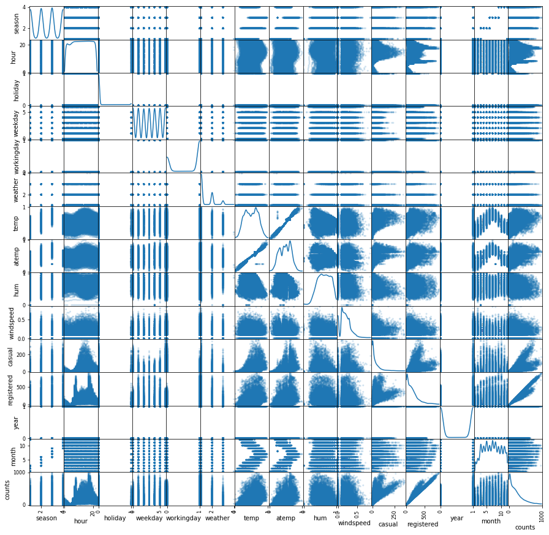


```python
sns.heatmap(bikes_df.corr())
```


    <matplotlib.axes._subplots.AxesSubplot at 0x23542ce2ef0>


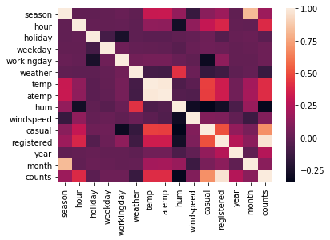


* temp vs atemp: strong positive correlation
* month vs temp/atemp: temp/atemp is higher during the summer and cold during the winter.
* season vs month: 3 months are corresponding to 1 season. 
* workingday vs weekday: weekday 1 to 5 has workingday 1, and weekday 0 and 6 has workingday 0.
* counts vs registered vs casuals: strong positive correlation
* counts vs windspeed: when windspeed is higher than 0.5, counts drops dramatically.
* counts vs hour: counts peak during commute hours and at minimum in the early morning and late night.
* counts vs month: counts are lower in January, Feburary, November and December compared to other months.

**2.2** Make a plot showing the _average_ number of casual and registered riders during each hour of the day. `.groupby` and `.aggregate` should make this task easy. Comment on the trends you observe. 


```python
average = bikes_df.groupby(['hour']).agg({'casual':'mean', 'registered':'mean'})

fig, ax = plt.subplots(1, 1, figsize=(8, 5))
ax.set_ylabel('Number of Rentals')
ax.set_xlabel('Hour of the day')
ax.scatter(average.index.values, average['casual'].values, alpha=0.4 , c='b', label='casual')
ax.scatter(average.index.values, average['registered'].values, alpha=0.4, c='g', label='registered')
ax.legend()
fig.savefig("fig/riders.png")
```


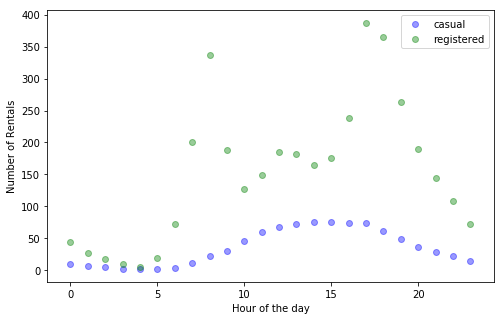


The registered rentals picked during commute hours from 8 am to 10am and from 4pm to 7pm. The causual rentals increased from 7 am, peaked from 12pm to 5pm and trending down afterwards.

**2.3** Use the variable `weather` to show how each weather category affects the relationships in question 2.2.  What do you observe?


```python
average = bikes_df.groupby(['weather','hour']).agg({'casual':'mean','registered':'mean'}).\
                            reset_index(level=['weather', 'hour'])
average.head()
```


<div>
<style scoped>
    .dataframe tbody tr th:only-of-type {
        vertical-align: middle;
    }

    .dataframe tbody tr th {
        vertical-align: top;
    }

    .dataframe thead th {
        text-align: right;
    }
</style>
<table border="1" class="dataframe">
  <thead>
    <tr style="text-align: right;">
      <th></th>
      <th>weather</th>
      <th>hour</th>
      <th>casual</th>
      <th>registered</th>
    </tr>
  </thead>
  <tbody>
    <tr>
      <th>0</th>
      <td>1</td>
      <td>0</td>
      <td>11.429448</td>
      <td>47.732106</td>
    </tr>
    <tr>
      <th>1</th>
      <td>1</td>
      <td>1</td>
      <td>6.951020</td>
      <td>27.444898</td>
    </tr>
    <tr>
      <th>2</th>
      <td>1</td>
      <td>2</td>
      <td>5.008368</td>
      <td>17.809623</td>
    </tr>
    <tr>
      <th>3</th>
      <td>1</td>
      <td>3</td>
      <td>2.868132</td>
      <td>9.127473</td>
    </tr>
    <tr>
      <th>4</th>
      <td>1</td>
      <td>4</td>
      <td>1.273523</td>
      <td>5.140044</td>
    </tr>
  </tbody>
</table>
</div>


```python
f, (ax1, ax2, ax3, ax4) = plt.subplots(4, figsize=(15, 15), sharex=True, sharey=True)

ax1.scatter(average.loc[average['weather']==1,['hour']], average.loc[average['weather']==1,['casual']],marker='*',label='casual')
ax1.scatter(average.loc[average['weather']==1,['hour']], average.loc[average['weather']==1,['registered']],marker='^',label='registered')
ax1.set_title('Weather is Clear')
ax1.set_xlabel('Hour')
ax1.set_ylabel('number of Rentals')
ax1.legend(prop={'size': 12})

ax2.scatter(average.loc[average['weather']==2,['hour']], average.loc[average['weather']==2,['casual']],marker='*',label='casual')
ax2.scatter(average.loc[average['weather']==2,['hour']], average.loc[average['weather']==2,['registered']],marker='^',label='registered')
ax2.set_title('Weather is Cloudy')
ax2.set_xlabel('Hour')
ax2.set_ylabel('number of Rentals')
ax2.legend(prop={'size': 12})

ax3.scatter(average.loc[average['weather']==3,['hour']], average.loc[average['weather']==3,['casual']],marker='*',label='casual')
ax3.scatter(average.loc[average['weather']==3,['hour']], average.loc[average['weather']==3,['registered']],marker='^',label='registered')
ax3.set_title('Weather is Light Snow/Rain')
ax3.set_xlabel('Hour')
ax3.set_ylabel('number of Rentals')
ax3.legend(prop={'size': 12})

ax4.scatter(average.loc[average['weather']==4,['hour']], average.loc[average['weather']==4,['casual']],marker='*',label='casual')
ax4.scatter(average.loc[average['weather']==4,['hour']], average.loc[average['weather']==4,['registered']],marker='^',label='registered')
ax4.set_title('Weather is Heavy Rain/Snow')
ax4.set_xlabel('Hour')
ax4.set_ylabel('number of Rentals')
ax4.legend(prop={'size': 12})
plt.tight_layout()

f.savefig('fig/weather.png')
```


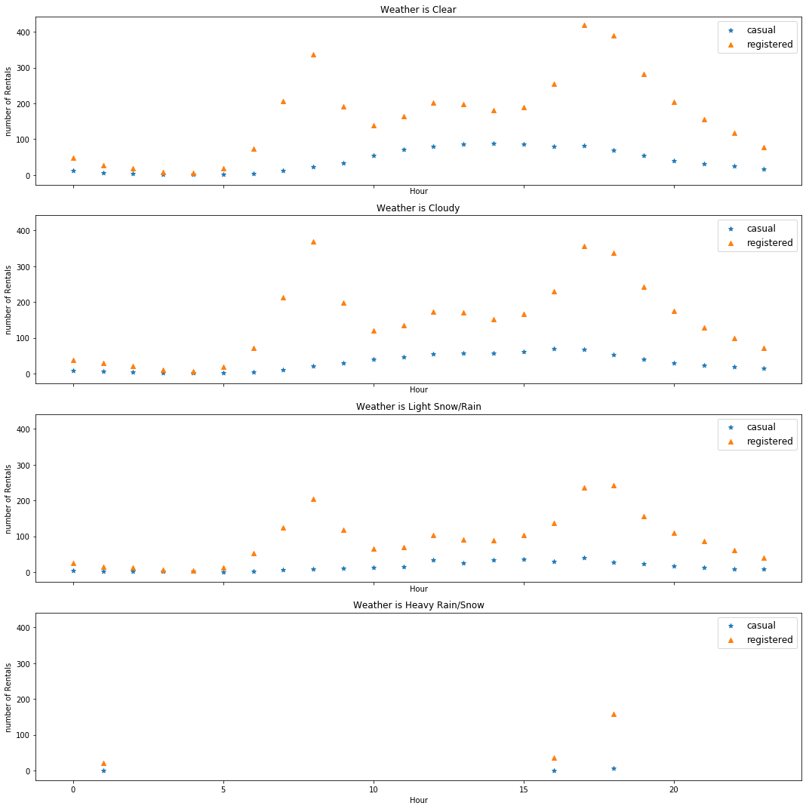


The relationship still maitains for weather = 1 ,2, 3 when the weather is nice or moderate, although the number of retental decreased as weather getting worse. However, when weather = 4 with heavy rain/snow, the relationship disappeared and almost no rentals for the entire day.

**2.4** Make a new dataframe with the following subset of attributes from the previous dataset and with each entry being just **one** day: 

- `dteday`, the timestamp for that day (fine to set to noon or any other time) 
- `weekday`, the day of the week
- `weather`, the most severe weather that day
- `season`, the season that day falls in
- `temp`, the average temperature (normalized)
- `atemp`, the average atemp that day (normalized)
- `windspeed`, the average windspeed that day (normalized)
- `hum`, the average humidity that day (normalized)
- `casual`, the **total** number of rentals by casual users
- `registered`, the **total** number of rentals by registered users
- `counts`, the **total** number of rentals of that day

Name this dataframe `bikes_by_day`.

Make a plot showing  the _distribution_ of the number of casual and registered riders on each day of the week.


```python
bikes_df['dteday'] = bikes_df['dteday'].dt.normalize()

bikes_by_day = bikes_df.groupby(['dteday']).agg({'weekday':'mean',
                                                 'weather':'max',
                                                 'season':'mean',
                                                 'temp':'mean',
                                                 'atemp':'mean',
                                                 'windspeed':'mean',
                                                 'hum':'mean',
                                                 'casual':'sum',
                                                 'registered':'sum',
                                                 'counts':'sum'}).reset_index(level='dteday')

bikes_by_day.head()
```


<div>
<style scoped>
    .dataframe tbody tr th:only-of-type {
        vertical-align: middle;
    }

    .dataframe tbody tr th {
        vertical-align: top;
    }

    .dataframe thead th {
        text-align: right;
    }
</style>
<table border="1" class="dataframe">
  <thead>
    <tr style="text-align: right;">
      <th></th>
      <th>dteday</th>
      <th>weekday</th>
      <th>weather</th>
      <th>season</th>
      <th>temp</th>
      <th>atemp</th>
      <th>windspeed</th>
      <th>hum</th>
      <th>casual</th>
      <th>registered</th>
      <th>counts</th>
    </tr>
  </thead>
  <tbody>
    <tr>
      <th>0</th>
      <td>2011-01-01</td>
      <td>6</td>
      <td>3</td>
      <td>1</td>
      <td>0.344167</td>
      <td>0.363625</td>
      <td>0.160446</td>
      <td>0.805833</td>
      <td>331</td>
      <td>654</td>
      <td>985</td>
    </tr>
    <tr>
      <th>1</th>
      <td>2011-01-02</td>
      <td>0</td>
      <td>3</td>
      <td>1</td>
      <td>0.363478</td>
      <td>0.353739</td>
      <td>0.248539</td>
      <td>0.696087</td>
      <td>131</td>
      <td>670</td>
      <td>801</td>
    </tr>
    <tr>
      <th>2</th>
      <td>2011-01-03</td>
      <td>1</td>
      <td>1</td>
      <td>1</td>
      <td>0.196364</td>
      <td>0.189405</td>
      <td>0.248309</td>
      <td>0.437273</td>
      <td>120</td>
      <td>1229</td>
      <td>1349</td>
    </tr>
    <tr>
      <th>3</th>
      <td>2011-01-04</td>
      <td>2</td>
      <td>2</td>
      <td>1</td>
      <td>0.200000</td>
      <td>0.212122</td>
      <td>0.160296</td>
      <td>0.590435</td>
      <td>108</td>
      <td>1454</td>
      <td>1562</td>
    </tr>
    <tr>
      <th>4</th>
      <td>2011-01-05</td>
      <td>3</td>
      <td>1</td>
      <td>1</td>
      <td>0.226957</td>
      <td>0.229270</td>
      <td>0.186900</td>
      <td>0.436957</td>
      <td>82</td>
      <td>1518</td>
      <td>1600</td>
    </tr>
  </tbody>
</table>
</div>


```python
f, axarr = plt.subplots(2, 7, figsize=(15, 6), sharex=True, sharey=True)

for i in range(7):
    day = bikes_by_day[bikes_by_day['weekday']==i]
    axarr[0, i].hist(day['casual'], alpha=0.3)
    axarr[0, i].set_title('weekday=%i'%i)
    #axarr[0, i].set_xlabel('Number of Rentals')
    axarr[0, i].set_ylabel('Casual Rentals')

    day = bikes_by_day[bikes_by_day['weekday']==i]
    axarr[1, i].hist(day['registered'],alpha=0.3)
    #axarr[1, i].set_title('weekday=%i'%i)
    axarr[1, i].set_xlabel('Number of Rentals')
    axarr[1, i].set_ylabel('Registered Rentals')

f.suptitle('Histogram of registered Rentals for each day',fontsize=14)
f.tight_layout()
f.subplots_adjust(top=0.85)
```


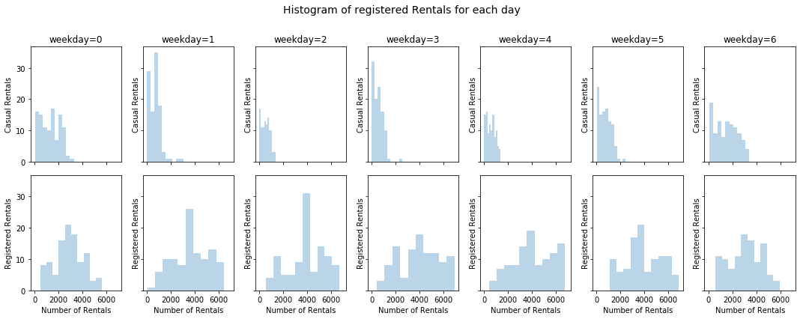


**2.5** Use `bikes_by_day` to visualize how the distribution of **total number of rides** per day (casual and registered riders combined) varies with the **season**. Do you see any **outliers**? Here we use the pyplot's boxplot function definition of an outlier as any value 1.5 times the IQR above the 75th percentile or 1.5 times the IQR below the 25th percentiles. If you see any outliers, identify those dates and investigate if they are a chance occurence, an error in the data collection, or a significant event (an online search of those date(s) might help). 


```python
winter = bikes_by_day.loc[bikes_by_day['season']==1]
spring = bikes_by_day.loc[bikes_by_day['season']==2]
summer = bikes_by_day.loc[bikes_by_day['season']==3]
fall = bikes_by_day.loc[bikes_by_day['season']==4]
data = [winter['counts'],spring['counts'],summer['counts'],fall['counts']]

f, ax = plt.subplots(1, 1, figsize=(8, 5))
ax.set_xlabel('Season')
ax.set_ylabel('Total number of rides')
ax.set_title('Distribution of total number of rides per day varies with Season')
ax.boxplot(data)
f.savefig('fig/season.png')
```


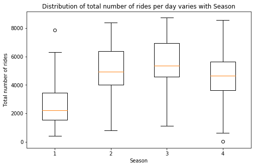


```python
print(winter.temp.mean())
print(spring.temp.mean())
winter.loc[winter['counts'].idxmax()]
```


    0.29774755724431445
    0.5444051275992435


    dteday        2012-03-17 00:00:00
    weekday                         6
    weather                         2
    season                          1
    temp                     0.514167
    atemp                    0.505046
    windspeed                0.110704
    hum                      0.755833
    casual                       3155
    registered                   4681
    counts                       7836
    Name: 441, dtype: object


```python
fall.loc[fall['counts'].idxmin()]
```


    dteday        2012-10-29 00:00:00
    weekday                         1
    weather                         3
    season                          4
    temp                         0.44
    atemp                      0.4394
    windspeed                  0.3582
    hum                          0.88
    casual                          2
    registered                     20
    counts                         22
    Name: 667, dtype: object


3/17/2012 is an outlier date to have a much larger number of rentals compared to the rest of days during the summer. However, I do not think this is an error. The tempreture of the day is 0.51 which is much warmer than the rest of the winter and close to the average temperture in the spring time. In addition, weather and the windspeed are also very nice. Especially, it is Saturday. After a long cold winter, more people would like to go out at a warm and nice Saturday.

10/29/2018 is the day Hurricane Sandy, one of the worst hurricane, landed the east coast. It makes sense people stayed home for such day.

## Question 3: Prepare the data for Regression

In order to build and evaluate our regression models, a little data cleaning is needed.  In this problem, we will explicitly create binary variables to represent the categorical predictors, set up the train-test split in a careful way, remove ancillary variables, and do a little data exploration that will be useful to consider in the regression models later.


**3.1** Using `bikes_df`, with hourly data about rentals, convert the categorical attributes ('season', 'month', 'weekday', 'weather') into multiple binary attributes using **one-hot encoding**.


```python
bikes_df_recoded = pd.get_dummies(bikes_df, columns=['season', 'month', 'weekday', 'weather'], drop_first=True)
```


```python
#your code here
bikes_df_recoded.columns
```


    Index(['dteday', 'hour', 'holiday', 'workingday', 'temp', 'atemp', 'hum',
           'windspeed', 'casual', 'registered', 'year', 'counts', 'season_2',
           'season_3', 'season_4', 'month_2', 'month_3', 'month_4', 'month_5',
           'month_6', 'month_7', 'month_8', 'month_9', 'month_10', 'month_11',
           'month_12', 'weekday_1', 'weekday_2', 'weekday_3', 'weekday_4',
           'weekday_5', 'weekday_6', 'weather_2', 'weather_3', 'weather_4'],
          dtype='object')


**3.2** Split the updated `bikes_df` dataset in a train and test part. Do this in a 'stratified' fashion, ensuring that all months are equally represented in each set. Explain your choice for a splitting algorithm.


```python
train_data, test_data = train_test_split(bikes_df_recoded, test_size = 0.2, stratify=bikes_df['month'])
```


```python
bikes_df['month'].value_counts().sort_index()
```


    1     1429
    2     1341
    3     1473
    4     1437
    5     1488
    6     1440
    7     1488
    8     1475
    9     1437
    10    1451
    11    1437
    12    1483
    Name: month, dtype: int64


```python
train_data[['month_2', 'month_3', 'month_4', 'month_5',
            'month_6', 'month_7', 'month_8', 'month_9', 
            'month_10', 'month_11', 'month_12']].apply(pd.Series.value_counts)
```


<div>
<style scoped>
    .dataframe tbody tr th:only-of-type {
        vertical-align: middle;
    }

    .dataframe tbody tr th {
        vertical-align: top;
    }

    .dataframe thead th {
        text-align: right;
    }
</style>
<table border="1" class="dataframe">
  <thead>
    <tr style="text-align: right;">
      <th></th>
      <th>month_2</th>
      <th>month_3</th>
      <th>month_4</th>
      <th>month_5</th>
      <th>month_6</th>
      <th>month_7</th>
      <th>month_8</th>
      <th>month_9</th>
      <th>month_10</th>
      <th>month_11</th>
      <th>month_12</th>
    </tr>
  </thead>
  <tbody>
    <tr>
      <th>0</th>
      <td>12830</td>
      <td>12725</td>
      <td>12753</td>
      <td>12713</td>
      <td>12751</td>
      <td>12713</td>
      <td>12723</td>
      <td>12753</td>
      <td>12742</td>
      <td>12753</td>
      <td>12717</td>
    </tr>
    <tr>
      <th>1</th>
      <td>1073</td>
      <td>1178</td>
      <td>1150</td>
      <td>1190</td>
      <td>1152</td>
      <td>1190</td>
      <td>1180</td>
      <td>1150</td>
      <td>1161</td>
      <td>1150</td>
      <td>1186</td>
    </tr>
  </tbody>
</table>
</div>


```python
test_data[['month_2', 'month_3', 'month_4', 'month_5',
           'month_6', 'month_7', 'month_8', 'month_9', 
           'month_10', 'month_11', 'month_12']].apply(pd.Series.value_counts)
```


<div>
<style scoped>
    .dataframe tbody tr th:only-of-type {
        vertical-align: middle;
    }

    .dataframe tbody tr th {
        vertical-align: top;
    }

    .dataframe thead th {
        text-align: right;
    }
</style>
<table border="1" class="dataframe">
  <thead>
    <tr style="text-align: right;">
      <th></th>
      <th>month_2</th>
      <th>month_3</th>
      <th>month_4</th>
      <th>month_5</th>
      <th>month_6</th>
      <th>month_7</th>
      <th>month_8</th>
      <th>month_9</th>
      <th>month_10</th>
      <th>month_11</th>
      <th>month_12</th>
    </tr>
  </thead>
  <tbody>
    <tr>
      <th>0</th>
      <td>3208</td>
      <td>3181</td>
      <td>3189</td>
      <td>3178</td>
      <td>3188</td>
      <td>3178</td>
      <td>3181</td>
      <td>3189</td>
      <td>3186</td>
      <td>3189</td>
      <td>3179</td>
    </tr>
    <tr>
      <th>1</th>
      <td>268</td>
      <td>295</td>
      <td>287</td>
      <td>298</td>
      <td>288</td>
      <td>298</td>
      <td>295</td>
      <td>287</td>
      <td>290</td>
      <td>287</td>
      <td>297</td>
    </tr>
  </tbody>
</table>
</div>


*your answer here*

The argument of stratify=bikes_df['month'] along with the argument of test_size = 0.2 that I passed into train_test_split function makes the test set to have 20% of the total observations within each month group. 

**3.3** Although we asked you to create your train and test set, but for consistency and easy checking, we ask that for the rest of this problem set you use the train and test set provided in the he files `data/BSS_train.csv` and `data/BSS_test.csv`. Read these two files into dataframes `BSS_train` and `BSS_test`, respectively. Remove the `dteday` column from both the train and the test dataset (its format cannot be used for analysis). Also, remove any predictors that would make predicting the `count` trivial. Note we gave more meaningful names to the one-hot encoded variables.


```python
BSS_train = pd.read_csv("data/BSS_train.csv", index_col='Unnamed: 0')
BSS_test = pd.read_csv("data/BSS_test.csv", index_col='Unnamed: 0')
```


```python
BSS_train.drop(['dteday', 'casual', 'registered'], axis=1, inplace=True)
BSS_test.drop(['dteday', 'casual', 'registered'], axis=1, inplace=True)
```


```python
BSS_test.columns
```


    Index(['hour', 'holiday', 'year', 'workingday', 'temp', 'atemp', 'hum',
           'windspeed', 'counts', 'spring', 'summer', 'fall', 'Feb', 'Mar', 'Apr',
           'May', 'Jun', 'Jul', 'Aug', 'Sept', 'Oct', 'Nov', 'Dec', 'Mon', 'Tue',
           'Wed', 'Thu', 'Fri', 'Sat', 'Cloudy', 'Snow', 'Storm'],
          dtype='object')


## Question 4: Multiple Linear Regression 

**4.1** Use statsmodels to fit a multiple linear regression model to the training set using all the predictors (no interactions or polynomial terms) to predict `counts`, and report its $R^2$ score on the train and test sets.


```python
x_train, y_train = BSS_train.drop(['counts'], axis=1), BSS_train['counts']
x_test, y_test = BSS_test.drop(['counts'], axis=1), BSS_test['counts']
```


```python
X_train = sm.add_constant(x_train)
OLSModel = sm.OLS(y_train, X_train)
ols = OLSModel.fit()
```


```python
X_test = sm.add_constant(x_test)
print("R-squared of OLS for training set: %f" % ols.rsquared)
print("R-squared of OLS for testing set: %f" % r2_score(y_test, ols.predict(X_test)))
```


    R-squared of OLS for training set: 0.406539
    R-squared of OLS for testing set: 0.406386


**4.2** Examine the estimated coefficients and report which ones are statistically significant at a significance level of 5% (p-value < 0.05). You should see some strange values, such as `July` producing 93 fewer rentals, all else equal, than January.


```python
ols.summary()
```


<table class="simpletable">
<caption>OLS Regression Results</caption>
<tr>
  <th>Dep. Variable:</th>         <td>counts</td>      <th>  R-squared:         </th> <td>   0.407</td> 
</tr>
<tr>
  <th>Model:</th>                   <td>OLS</td>       <th>  Adj. R-squared:    </th> <td>   0.405</td> 
</tr>
<tr>
  <th>Method:</th>             <td>Least Squares</td>  <th>  F-statistic:       </th> <td>   316.8</td> 
</tr>
<tr>
  <th>Date:</th>             <td>Thu, 04 Oct 2018</td> <th>  Prob (F-statistic):</th>  <td>  0.00</td>  
</tr>
<tr>
  <th>Time:</th>                 <td>23:00:03</td>     <th>  Log-Likelihood:    </th> <td> -88306.</td> 
</tr>
<tr>
  <th>No. Observations:</th>      <td> 13903</td>      <th>  AIC:               </th> <td>1.767e+05</td>
</tr>
<tr>
  <th>Df Residuals:</th>          <td> 13872</td>      <th>  BIC:               </th> <td>1.769e+05</td>
</tr>
<tr>
  <th>Df Model:</th>              <td>    30</td>      <th>                     </th>     <td> </td>    
</tr>
<tr>
  <th>Covariance Type:</th>      <td>nonrobust</td>    <th>                     </th>     <td> </td>    
</tr>
</table>
<table class="simpletable">
<tr>
       <td></td>         <th>coef</th>     <th>std err</th>      <th>t</th>      <th>P>|t|</th>  <th>[0.025</th>    <th>0.975]</th>  
</tr>
<tr>
  <th>const</th>      <td>  -21.0830</td> <td>    8.641</td> <td>   -2.440</td> <td> 0.015</td> <td>  -38.020</td> <td>   -4.146</td>
</tr>
<tr>
  <th>hour</th>       <td>    7.2214</td> <td>    0.184</td> <td>   39.144</td> <td> 0.000</td> <td>    6.860</td> <td>    7.583</td>
</tr>
<tr>
  <th>holiday</th>    <td>  -18.0958</td> <td>    6.597</td> <td>   -2.743</td> <td> 0.006</td> <td>  -31.027</td> <td>   -5.165</td>
</tr>
<tr>
  <th>year</th>       <td>   76.3519</td> <td>    2.380</td> <td>   32.084</td> <td> 0.000</td> <td>   71.687</td> <td>   81.017</td>
</tr>
<tr>
  <th>workingday</th> <td>   11.3178</td> <td>    2.751</td> <td>    4.114</td> <td> 0.000</td> <td>    5.926</td> <td>   16.710</td>
</tr>
<tr>
  <th>temp</th>       <td>  333.2482</td> <td>   44.162</td> <td>    7.546</td> <td> 0.000</td> <td>  246.684</td> <td>  419.812</td>
</tr>
<tr>
  <th>atemp</th>      <td>   74.6312</td> <td>   46.207</td> <td>    1.615</td> <td> 0.106</td> <td>  -15.940</td> <td>  165.202</td>
</tr>
<tr>
  <th>hum</th>        <td> -205.4959</td> <td>    7.801</td> <td>  -26.343</td> <td> 0.000</td> <td> -220.786</td> <td> -190.205</td>
</tr>
<tr>
  <th>windspeed</th>  <td>   22.5168</td> <td>   10.753</td> <td>    2.094</td> <td> 0.036</td> <td>    1.439</td> <td>   43.595</td>
</tr>
<tr>
  <th>spring</th>     <td>   43.1541</td> <td>    7.417</td> <td>    5.818</td> <td> 0.000</td> <td>   28.615</td> <td>   57.693</td>
</tr>
<tr>
  <th>summer</th>     <td>   29.5426</td> <td>    8.773</td> <td>    3.367</td> <td> 0.001</td> <td>   12.346</td> <td>   46.739</td>
</tr>
<tr>
  <th>fall</th>       <td>   68.5953</td> <td>    7.492</td> <td>    9.156</td> <td> 0.000</td> <td>   53.911</td> <td>   83.280</td>
</tr>
<tr>
  <th>Feb</th>        <td>   -7.6430</td> <td>    5.966</td> <td>   -1.281</td> <td> 0.200</td> <td>  -19.336</td> <td>    4.050</td>
</tr>
<tr>
  <th>Mar</th>        <td>  -11.6737</td> <td>    6.665</td> <td>   -1.752</td> <td> 0.080</td> <td>  -24.737</td> <td>    1.390</td>
</tr>
<tr>
  <th>Apr</th>        <td>  -41.5244</td> <td>    9.878</td> <td>   -4.204</td> <td> 0.000</td> <td>  -60.886</td> <td>  -22.163</td>
</tr>
<tr>
  <th>May</th>        <td>  -33.2927</td> <td>   10.543</td> <td>   -3.158</td> <td> 0.002</td> <td>  -53.958</td> <td>  -12.628</td>
</tr>
<tr>
  <th>Jun</th>        <td>  -65.8039</td> <td>   10.716</td> <td>   -6.141</td> <td> 0.000</td> <td>  -86.809</td> <td>  -44.799</td>
</tr>
<tr>
  <th>Jul</th>        <td>  -93.4805</td> <td>   12.086</td> <td>   -7.734</td> <td> 0.000</td> <td> -117.171</td> <td>  -69.789</td>
</tr>
<tr>
  <th>Aug</th>        <td>  -59.2081</td> <td>   11.832</td> <td>   -5.004</td> <td> 0.000</td> <td>  -82.401</td> <td>  -36.015</td>
</tr>
<tr>
  <th>Sept</th>       <td>  -16.0517</td> <td>   10.575</td> <td>   -1.518</td> <td> 0.129</td> <td>  -36.780</td> <td>    4.676</td>
</tr>
<tr>
  <th>Oct</th>        <td>  -16.1602</td> <td>    9.865</td> <td>   -1.638</td> <td> 0.101</td> <td>  -35.497</td> <td>    3.177</td>
</tr>
<tr>
  <th>Nov</th>        <td>  -25.8732</td> <td>    9.527</td> <td>   -2.716</td> <td> 0.007</td> <td>  -44.547</td> <td>   -7.199</td>
</tr>
<tr>
  <th>Dec</th>        <td>  -10.2043</td> <td>    7.614</td> <td>   -1.340</td> <td> 0.180</td> <td>  -25.128</td> <td>    4.719</td>
</tr>
<tr>
  <th>Mon</th>        <td>   -2.6601</td> <td>    2.978</td> <td>   -0.893</td> <td> 0.372</td> <td>   -8.498</td> <td>    3.177</td>
</tr>
<tr>
  <th>Tue</th>        <td>   -6.1425</td> <td>    3.208</td> <td>   -1.915</td> <td> 0.056</td> <td>  -12.430</td> <td>    0.145</td>
</tr>
<tr>
  <th>Wed</th>        <td>    2.2964</td> <td>    3.183</td> <td>    0.721</td> <td> 0.471</td> <td>   -3.943</td> <td>    8.536</td>
</tr>
<tr>
  <th>Thu</th>        <td>   -3.1611</td> <td>    3.185</td> <td>   -0.993</td> <td> 0.321</td> <td>   -9.404</td> <td>    3.082</td>
</tr>
<tr>
  <th>Fri</th>        <td>    2.8892</td> <td>    3.186</td> <td>    0.907</td> <td> 0.364</td> <td>   -3.355</td> <td>    9.133</td>
</tr>
<tr>
  <th>Sat</th>        <td>   14.9459</td> <td>    4.382</td> <td>    3.411</td> <td> 0.001</td> <td>    6.357</td> <td>   23.535</td>
</tr>
<tr>
  <th>Cloudy</th>     <td>    6.7868</td> <td>    2.900</td> <td>    2.341</td> <td> 0.019</td> <td>    1.103</td> <td>   12.470</td>
</tr>
<tr>
  <th>Snow</th>       <td>  -28.2859</td> <td>    4.819</td> <td>   -5.870</td> <td> 0.000</td> <td>  -37.731</td> <td>  -18.841</td>
</tr>
<tr>
  <th>Storm</th>      <td>   42.3569</td> <td>   98.377</td> <td>    0.431</td> <td> 0.667</td> <td> -150.475</td> <td>  235.189</td>
</tr>
</table>
<table class="simpletable">
<tr>
  <th>Omnibus:</th>       <td>2831.359</td> <th>  Durbin-Watson:     </th> <td>   0.755</td>
</tr>
<tr>
  <th>Prob(Omnibus):</th>  <td> 0.000</td>  <th>  Jarque-Bera (JB):  </th> <td>5657.789</td>
</tr>
<tr>
  <th>Skew:</th>           <td> 1.224</td>  <th>  Prob(JB):          </th> <td>    0.00</td>
</tr>
<tr>
  <th>Kurtosis:</th>       <td> 4.943</td>  <th>  Cond. No.          </th> <td>1.17e+16</td>
</tr>
</table><br/><br/>Warnings:<br/>[1] Standard Errors assume that the covariance matrix of the errors is correctly specified.<br/>[2] The smallest eigenvalue is 1.87e-26. This might indicate that there are<br/>strong multicollinearity problems or that the design matrix is singular.


```python
ols.pvalues[ols.pvalues < 0.05]
```


    const          1.470264e-02
    hour           0.000000e+00
    holiday        6.095043e-03
    year          6.205883e-218
    workingday     3.905740e-05
    temp           4.767468e-14
    hum           2.797780e-149
    windspeed      3.628163e-02
    spring         6.082058e-09
    summer         7.609902e-04
    fall           6.106365e-20
    Apr            2.640964e-05
    May            1.592599e-03
    Jun            8.447047e-10
    Jul            1.110753e-14
    Aug            5.685359e-07
    Nov            6.619949e-03
    Sat            6.490550e-04
    Cloudy         1.926802e-02
    Snow           4.454966e-09
    dtype: float64


July is indeed producing 93 fewer rentals, all else equal, than January.

**4.3** To diagnose the model, make two plots: first a histogram of the residuals, and second a plot of the residuals of the fitted model ${e} = y - \hat{y}$ as a function of the predicted value $\hat{y}$. Draw a horizontal line denoting the zero residual value on the Y-axis. What do the plots reveal about the OLS assumptions (linearity, constant variance, and normality)?


```python
fig, ax = plt.subplots(1, 2, figsize=(16, 5))

ax[0].grid(True, lw=1.75, ls='--', alpha=0.15)
ax[0].hist(ols.resid)
ax[0].set_title(r'Residuals Distribution')
ax[0].set_xlabel(r'Residuals')
ax[0].set_ylabel(r'Distribution')

ax[1].grid(True, lw=1.75, ls='--', alpha=0.15)
ax[1].scatter(ols.fittedvalues, ols.resid, alpha=0.15, label='Residuals')
ax[1].plot(np.linspace(-200, 500, 2), [0] * len(np.linspace(-200, 500, 2)), c='r', alpha=0.8, label='Constant Zero Residual')
ax[1].set_title(r'Residuals vs the predicted value $\hat{y}$')
ax[1].set_xlabel(r'Predicted Value $\hat{y}$')
ax[1].set_ylabel(r'Residuals')
ax[1].legend(loc='upper left')
```


    <matplotlib.legend.Legend at 0x23543f12d68>


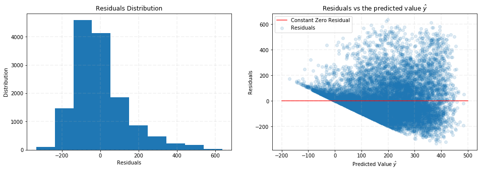


* linearity: Right plot shows clear non-linear relationship, which  constradicts the linearity assumption.
* constant variance: Right plot shows that residuals are not evenly distributed around zero, which contradicts constant variance assumption. 
* normality: Left plot shows that residual distribution is right skewed, which contradicts normality assumption. 

**4.4** Perhaps we can do better via a model with polynomial terms. Build a dataset `X_train_poly` from `X_train` with added $x^2$ terms for `temp`, `hour`, and `humidity`. Are these polynomial terms important? How does predicted ridership change as each of `temp`, `hour`, and `humidity` increase?


```python
x_train_poly = x_train.copy().reset_index(drop=True)
x_train_poly = x_train_poly.drop(['temp', 'hour', 'hum'], axis=1)
print(x_train_poly.shape)
print(x_train_poly.index)
x_train_poly.head()
```


    (13903, 28)
    RangeIndex(start=0, stop=13903, step=1)


<div>
<style scoped>
    .dataframe tbody tr th:only-of-type {
        vertical-align: middle;
    }

    .dataframe tbody tr th {
        vertical-align: top;
    }

    .dataframe thead th {
        text-align: right;
    }
</style>
<table border="1" class="dataframe">
  <thead>
    <tr style="text-align: right;">
      <th></th>
      <th>holiday</th>
      <th>year</th>
      <th>workingday</th>
      <th>atemp</th>
      <th>windspeed</th>
      <th>spring</th>
      <th>summer</th>
      <th>fall</th>
      <th>Feb</th>
      <th>Mar</th>
      <th>...</th>
      <th>Dec</th>
      <th>Mon</th>
      <th>Tue</th>
      <th>Wed</th>
      <th>Thu</th>
      <th>Fri</th>
      <th>Sat</th>
      <th>Cloudy</th>
      <th>Snow</th>
      <th>Storm</th>
    </tr>
  </thead>
  <tbody>
    <tr>
      <th>0</th>
      <td>0</td>
      <td>0</td>
      <td>0</td>
      <td>0.2879</td>
      <td>0.0</td>
      <td>0</td>
      <td>0</td>
      <td>0</td>
      <td>0</td>
      <td>0</td>
      <td>...</td>
      <td>0</td>
      <td>0</td>
      <td>0</td>
      <td>0</td>
      <td>0</td>
      <td>0</td>
      <td>1</td>
      <td>0</td>
      <td>0</td>
      <td>0</td>
    </tr>
    <tr>
      <th>1</th>
      <td>0</td>
      <td>0</td>
      <td>0</td>
      <td>0.2727</td>
      <td>0.0</td>
      <td>0</td>
      <td>0</td>
      <td>0</td>
      <td>0</td>
      <td>0</td>
      <td>...</td>
      <td>0</td>
      <td>0</td>
      <td>0</td>
      <td>0</td>
      <td>0</td>
      <td>0</td>
      <td>1</td>
      <td>0</td>
      <td>0</td>
      <td>0</td>
    </tr>
    <tr>
      <th>2</th>
      <td>0</td>
      <td>0</td>
      <td>0</td>
      <td>0.2727</td>
      <td>0.0</td>
      <td>0</td>
      <td>0</td>
      <td>0</td>
      <td>0</td>
      <td>0</td>
      <td>...</td>
      <td>0</td>
      <td>0</td>
      <td>0</td>
      <td>0</td>
      <td>0</td>
      <td>0</td>
      <td>1</td>
      <td>0</td>
      <td>0</td>
      <td>0</td>
    </tr>
    <tr>
      <th>3</th>
      <td>0</td>
      <td>0</td>
      <td>0</td>
      <td>0.2879</td>
      <td>0.0</td>
      <td>0</td>
      <td>0</td>
      <td>0</td>
      <td>0</td>
      <td>0</td>
      <td>...</td>
      <td>0</td>
      <td>0</td>
      <td>0</td>
      <td>0</td>
      <td>0</td>
      <td>0</td>
      <td>1</td>
      <td>0</td>
      <td>0</td>
      <td>0</td>
    </tr>
    <tr>
      <th>4</th>
      <td>0</td>
      <td>0</td>
      <td>0</td>
      <td>0.2879</td>
      <td>0.0</td>
      <td>0</td>
      <td>0</td>
      <td>0</td>
      <td>0</td>
      <td>0</td>
      <td>...</td>
      <td>0</td>
      <td>0</td>
      <td>0</td>
      <td>0</td>
      <td>0</td>
      <td>0</td>
      <td>1</td>
      <td>0</td>
      <td>0</td>
      <td>0</td>
    </tr>
  </tbody>
</table>
<p>5 rows × 28 columns</p>
</div>


```python
tra = PolynomialFeatures(2, include_bias=False)
```


```python
array_temp = tra.fit_transform(x_train['temp'].values.reshape(-1,1))
df_temp = pd.DataFrame(array_temp)
df_temp = df_temp.rename(columns={0: 'temp', 1: 'temp_2'})
print(df_temp.shape)
df_temp.head()
```


    (13903, 2)


<div>
<style scoped>
    .dataframe tbody tr th:only-of-type {
        vertical-align: middle;
    }

    .dataframe tbody tr th {
        vertical-align: top;
    }

    .dataframe thead th {
        text-align: right;
    }
</style>
<table border="1" class="dataframe">
  <thead>
    <tr style="text-align: right;">
      <th></th>
      <th>temp</th>
      <th>temp_2</th>
    </tr>
  </thead>
  <tbody>
    <tr>
      <th>0</th>
      <td>0.24</td>
      <td>0.0576</td>
    </tr>
    <tr>
      <th>1</th>
      <td>0.22</td>
      <td>0.0484</td>
    </tr>
    <tr>
      <th>2</th>
      <td>0.22</td>
      <td>0.0484</td>
    </tr>
    <tr>
      <th>3</th>
      <td>0.24</td>
      <td>0.0576</td>
    </tr>
    <tr>
      <th>4</th>
      <td>0.24</td>
      <td>0.0576</td>
    </tr>
  </tbody>
</table>
</div>


```python
array_hour = tra.fit_transform(x_train['hour'].values.reshape(-1,1))
df_hour = pd.DataFrame(array_hour)
df_hour = df_hour.rename(columns={0: 'hour', 1: 'hour_2'})
print(df_hour.shape)
df_hour.head()
```


    (13903, 2)


<div>
<style scoped>
    .dataframe tbody tr th:only-of-type {
        vertical-align: middle;
    }

    .dataframe tbody tr th {
        vertical-align: top;
    }

    .dataframe thead th {
        text-align: right;
    }
</style>
<table border="1" class="dataframe">
  <thead>
    <tr style="text-align: right;">
      <th></th>
      <th>hour</th>
      <th>hour_2</th>
    </tr>
  </thead>
  <tbody>
    <tr>
      <th>0</th>
      <td>0.0</td>
      <td>0.0</td>
    </tr>
    <tr>
      <th>1</th>
      <td>1.0</td>
      <td>1.0</td>
    </tr>
    <tr>
      <th>2</th>
      <td>2.0</td>
      <td>4.0</td>
    </tr>
    <tr>
      <th>3</th>
      <td>3.0</td>
      <td>9.0</td>
    </tr>
    <tr>
      <th>4</th>
      <td>4.0</td>
      <td>16.0</td>
    </tr>
  </tbody>
</table>
</div>


```python
array_hum = tra.fit_transform(x_train['hum'].values.reshape(-1,1))
df_hum = pd.DataFrame(array_hum)
df_hum = df_hum.rename(columns={0: 'hum', 1: 'hum_2'})
print(df_hum.shape)
df_hum.head()
```


    (13903, 2)


<div>
<style scoped>
    .dataframe tbody tr th:only-of-type {
        vertical-align: middle;
    }

    .dataframe tbody tr th {
        vertical-align: top;
    }

    .dataframe thead th {
        text-align: right;
    }
</style>
<table border="1" class="dataframe">
  <thead>
    <tr style="text-align: right;">
      <th></th>
      <th>hum</th>
      <th>hum_2</th>
    </tr>
  </thead>
  <tbody>
    <tr>
      <th>0</th>
      <td>0.81</td>
      <td>0.6561</td>
    </tr>
    <tr>
      <th>1</th>
      <td>0.80</td>
      <td>0.6400</td>
    </tr>
    <tr>
      <th>2</th>
      <td>0.80</td>
      <td>0.6400</td>
    </tr>
    <tr>
      <th>3</th>
      <td>0.75</td>
      <td>0.5625</td>
    </tr>
    <tr>
      <th>4</th>
      <td>0.75</td>
      <td>0.5625</td>
    </tr>
  </tbody>
</table>
</div>


```python
x_train_poly = x_train_poly.merge(df_temp, left_index=True, right_index=True)
x_train_poly = x_train_poly.merge(df_hour, left_index=True, right_index=True)
x_train_poly = x_train_poly.merge(df_hum, left_index=True, right_index=True)
```


```python
y_train_poly = y_train.copy().reset_index(drop=True)
X_train_poly = sm.add_constant(x_train_poly)
OLSModel = sm.OLS(y_train_poly, X_train_poly)
ols_poly = OLSModel.fit()
ols_poly.summary()
```


<table class="simpletable">
<caption>OLS Regression Results</caption>
<tr>
  <th>Dep. Variable:</th>         <td>counts</td>      <th>  R-squared:         </th> <td>   0.501</td> 
</tr>
<tr>
  <th>Model:</th>                   <td>OLS</td>       <th>  Adj. R-squared:    </th> <td>   0.500</td> 
</tr>
<tr>
  <th>Method:</th>             <td>Least Squares</td>  <th>  F-statistic:       </th> <td>   421.8</td> 
</tr>
<tr>
  <th>Date:</th>             <td>Thu, 04 Oct 2018</td> <th>  Prob (F-statistic):</th>  <td>  0.00</td>  
</tr>
<tr>
  <th>Time:</th>                 <td>23:00:17</td>     <th>  Log-Likelihood:    </th> <td> -87102.</td> 
</tr>
<tr>
  <th>No. Observations:</th>      <td> 13903</td>      <th>  AIC:               </th> <td>1.743e+05</td>
</tr>
<tr>
  <th>Df Residuals:</th>          <td> 13869</td>      <th>  BIC:               </th> <td>1.745e+05</td>
</tr>
<tr>
  <th>Df Model:</th>              <td>    33</td>      <th>                     </th>     <td> </td>    
</tr>
<tr>
  <th>Covariance Type:</th>      <td>nonrobust</td>    <th>                     </th>     <td> </td>    
</tr>
</table>
<table class="simpletable">
<tr>
       <td></td>         <th>coef</th>     <th>std err</th>      <th>t</th>      <th>P>|t|</th>  <th>[0.025</th>    <th>0.975]</th>  
</tr>
<tr>
  <th>const</th>      <td> -185.2131</td> <td>   14.016</td> <td>  -13.214</td> <td> 0.000</td> <td> -212.687</td> <td> -157.739</td>
</tr>
<tr>
  <th>holiday</th>    <td>  -13.0061</td> <td>    6.056</td> <td>   -2.148</td> <td> 0.032</td> <td>  -24.877</td> <td>   -1.135</td>
</tr>
<tr>
  <th>year</th>       <td>   81.0305</td> <td>    2.199</td> <td>   36.854</td> <td> 0.000</td> <td>   76.721</td> <td>   85.340</td>
</tr>
<tr>
  <th>workingday</th> <td>   13.2894</td> <td>    2.524</td> <td>    5.265</td> <td> 0.000</td> <td>    8.342</td> <td>   18.237</td>
</tr>
<tr>
  <th>atemp</th>      <td>   67.4957</td> <td>   43.532</td> <td>    1.550</td> <td> 0.121</td> <td>  -17.833</td> <td>  152.824</td>
</tr>
<tr>
  <th>windspeed</th>  <td>   -6.9100</td> <td>    9.920</td> <td>   -0.697</td> <td> 0.486</td> <td>  -26.354</td> <td>   12.534</td>
</tr>
<tr>
  <th>spring</th>     <td>   43.7116</td> <td>    6.805</td> <td>    6.424</td> <td> 0.000</td> <td>   30.374</td> <td>   57.049</td>
</tr>
<tr>
  <th>summer</th>     <td>   33.9087</td> <td>    8.066</td> <td>    4.204</td> <td> 0.000</td> <td>   18.098</td> <td>   49.720</td>
</tr>
<tr>
  <th>fall</th>       <td>   72.1937</td> <td>    6.878</td> <td>   10.497</td> <td> 0.000</td> <td>   58.712</td> <td>   85.675</td>
</tr>
<tr>
  <th>Feb</th>        <td>    1.6487</td> <td>    5.538</td> <td>    0.298</td> <td> 0.766</td> <td>   -9.207</td> <td>   12.504</td>
</tr>
<tr>
  <th>Mar</th>        <td>    9.5583</td> <td>    6.304</td> <td>    1.516</td> <td> 0.129</td> <td>   -2.798</td> <td>   21.914</td>
</tr>
<tr>
  <th>Apr</th>        <td>  -10.7152</td> <td>    9.238</td> <td>   -1.160</td> <td> 0.246</td> <td>  -28.824</td> <td>    7.393</td>
</tr>
<tr>
  <th>May</th>        <td>   -2.7388</td> <td>    9.789</td> <td>   -0.280</td> <td> 0.780</td> <td>  -21.926</td> <td>   16.449</td>
</tr>
<tr>
  <th>Jun</th>        <td>  -23.0368</td> <td>    9.922</td> <td>   -2.322</td> <td> 0.020</td> <td>  -42.485</td> <td>   -3.588</td>
</tr>
<tr>
  <th>Jul</th>        <td>  -53.5230</td> <td>   11.163</td> <td>   -4.795</td> <td> 0.000</td> <td>  -75.405</td> <td>  -31.642</td>
</tr>
<tr>
  <th>Aug</th>        <td>  -23.6944</td> <td>   10.965</td> <td>   -2.161</td> <td> 0.031</td> <td>  -45.188</td> <td>   -2.201</td>
</tr>
<tr>
  <th>Sept</th>       <td>   10.9055</td> <td>    9.887</td> <td>    1.103</td> <td> 0.270</td> <td>   -8.475</td> <td>   30.286</td>
</tr>
<tr>
  <th>Oct</th>        <td>    2.8452</td> <td>    9.262</td> <td>    0.307</td> <td> 0.759</td> <td>  -15.309</td> <td>   20.999</td>
</tr>
<tr>
  <th>Nov</th>        <td>  -16.5926</td> <td>    8.897</td> <td>   -1.865</td> <td> 0.062</td> <td>  -34.032</td> <td>    0.846</td>
</tr>
<tr>
  <th>Dec</th>        <td>   -6.9106</td> <td>    7.078</td> <td>   -0.976</td> <td> 0.329</td> <td>  -20.784</td> <td>    6.963</td>
</tr>
<tr>
  <th>Mon</th>        <td>   -2.4620</td> <td>    2.731</td> <td>   -0.901</td> <td> 0.367</td> <td>   -7.816</td> <td>    2.892</td>
</tr>
<tr>
  <th>Tue</th>        <td>   -3.8629</td> <td>    2.943</td> <td>   -1.313</td> <td> 0.189</td> <td>   -9.631</td> <td>    1.905</td>
</tr>
<tr>
  <th>Wed</th>        <td>    2.1275</td> <td>    2.920</td> <td>    0.729</td> <td> 0.466</td> <td>   -3.596</td> <td>    7.851</td>
</tr>
<tr>
  <th>Thu</th>        <td>   -0.2540</td> <td>    2.922</td> <td>   -0.087</td> <td> 0.931</td> <td>   -5.981</td> <td>    5.473</td>
</tr>
<tr>
  <th>Fri</th>        <td>    4.7347</td> <td>    2.923</td> <td>    1.620</td> <td> 0.105</td> <td>   -0.995</td> <td>   10.465</td>
</tr>
<tr>
  <th>Sat</th>        <td>   16.7983</td> <td>    4.021</td> <td>    4.178</td> <td> 0.000</td> <td>    8.917</td> <td>   24.679</td>
</tr>
<tr>
  <th>Cloudy</th>     <td>   -8.4327</td> <td>    2.680</td> <td>   -3.146</td> <td> 0.002</td> <td>  -13.687</td> <td>   -3.179</td>
</tr>
<tr>
  <th>Snow</th>       <td>  -47.3269</td> <td>    4.583</td> <td>  -10.327</td> <td> 0.000</td> <td>  -56.310</td> <td>  -38.344</td>
</tr>
<tr>
  <th>Storm</th>      <td>   35.5800</td> <td>   90.246</td> <td>    0.394</td> <td> 0.693</td> <td> -141.315</td> <td>  212.475</td>
</tr>
<tr>
  <th>temp</th>       <td>  132.7247</td> <td>   58.298</td> <td>    2.277</td> <td> 0.023</td> <td>   18.452</td> <td>  246.997</td>
</tr>
<tr>
  <th>temp_2</th>     <td>  109.4437</td> <td>   36.470</td> <td>    3.001</td> <td> 0.003</td> <td>   37.958</td> <td>  180.930</td>
</tr>
<tr>
  <th>hour</th>       <td>   39.5786</td> <td>    0.662</td> <td>   59.777</td> <td> 0.000</td> <td>   38.281</td> <td>   40.876</td>
</tr>
<tr>
  <th>hour_2</th>     <td>   -1.3570</td> <td>    0.027</td> <td>  -50.567</td> <td> 0.000</td> <td>   -1.410</td> <td>   -1.304</td>
</tr>
<tr>
  <th>hum</th>        <td>   11.8636</td> <td>   36.114</td> <td>    0.329</td> <td> 0.743</td> <td>  -58.925</td> <td>   82.652</td>
</tr>
<tr>
  <th>hum_2</th>      <td> -108.7057</td> <td>   28.944</td> <td>   -3.756</td> <td> 0.000</td> <td> -165.440</td> <td>  -51.971</td>
</tr>
</table>
<table class="simpletable">
<tr>
  <th>Omnibus:</th>       <td>2946.543</td> <th>  Durbin-Watson:     </th> <td>   0.890</td>
</tr>
<tr>
  <th>Prob(Omnibus):</th>  <td> 0.000</td>  <th>  Jarque-Bera (JB):  </th> <td>6094.033</td>
</tr>
<tr>
  <th>Skew:</th>           <td> 1.253</td>  <th>  Prob(JB):          </th> <td>    0.00</td>
</tr>
<tr>
  <th>Kurtosis:</th>       <td> 5.059</td>  <th>  Cond. No.          </th> <td>1.35e+16</td>
</tr>
</table><br/><br/>Warnings:<br/>[1] Standard Errors assume that the covariance matrix of the errors is correctly specified.<br/>[2] The smallest eigenvalue is 4.56e-24. This might indicate that there are<br/>strong multicollinearity problems or that the design matrix is singular.


```python
x_test_poly = x_test.copy().reset_index(drop=True)
x_test_poly = x_test_poly.drop(['temp', 'hour', 'hum'], axis=1)

array_temp = tra.fit_transform(x_test['temp'].values.reshape(-1,1))
df_temp = pd.DataFrame(array_temp)
df_temp = df_temp.rename(columns={0: 'temp', 1: 'temp_2'})

array_hour = tra.fit_transform(x_test['hour'].values.reshape(-1,1))
df_hour = pd.DataFrame(array_hour)
df_hour = df_hour.rename(columns={0: 'hour', 1: 'hour_2'})

array_hum = tra.fit_transform(x_test['hum'].values.reshape(-1,1))
df_hum = pd.DataFrame(array_hum)
df_hum = df_hum.rename(columns={0: 'hum', 1: 'hum_2'})

x_test_poly = x_test_poly.merge(df_temp, left_index=True, right_index=True)
x_test_poly = x_test_poly.merge(df_hour, left_index=True, right_index=True)
x_test_poly = x_test_poly.merge(df_hum, left_index=True, right_index=True)

X_test_poly = sm.add_constant(x_test_poly)
y_test_poly = y_test.copy().reset_index(drop=True)
```


```python
print("R-squared of OLS with polynomial terms for training set: %f" % ols_poly.rsquared)
print("R-squared of OLS with polynomial terms for testing set: %f" % r2_score(y_test_poly, ols_poly.predict(X_test_poly)))
```


    R-squared of OLS with polynomial terms for training set: 0.500904
    R-squared of OLS with polynomial terms for testing set: 0.496531


```python
x_vals = np.linspace(0, 1, 1000)
y_vals = ols_poly.params['temp'] * x_vals + ols_poly.params['temp_2'] * x_vals**2
plt.plot(x_vals, y_vals)
plt.title('Effect of Temperature')
plt.xlabel('Temperature')
plt.ylabel('Contribution to Number of Rental Counts')
plt.show()
```


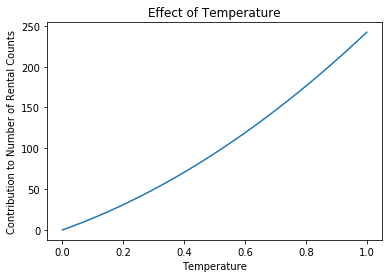


```python
x_vals = np.linspace(0, 24, 100)
y_vals = ols_poly.params['hour'] * x_vals + ols_poly.params['hour_2'] * x_vals**2
plt.plot(x_vals, y_vals)
plt.title('Effect of Hours')
plt.xlabel('Hours')
plt.ylabel('Contribution to Number of Rental Counts')
plt.show()
```


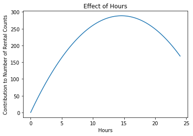


```python
x_vals = np.linspace(0, 1, 100)
y_vals = ols_poly.params['hum'] * x_vals + ols_poly.params['hum_2'] * x_vals**2
plt.plot(x_vals, y_vals)
plt.title('Effect of Humidity')
plt.xlabel('Humidity')
plt.ylabel('Contribution to Number of Rental Counts')
plt.show()
```


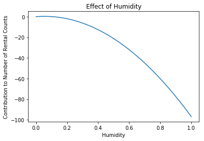


The OLS model with polynomial terms vs origial OLS model: 
* R-squared in training set: 0.500904 vs 0.406539
* R-squared in testing set: 0.496531 vs 0.406386
* AIC: 1.743e+05 vs 1.767e+05
* BIC: 1.745e+05 vs 1.769e+05

So OLS polynomil model is better. 


Predicted ridership with respect to 
* $temperature$: Statistically significant with p-value < 0.05. All else equal, 1 unit of temperature increase produces 333 more rentals.
* $temperature^2$: Statistically significant with p-value < 0.05. All else equal, 1 unit of 2nd degree polynomial in temperature increase produces 109 more rentals. We expect rentals to increase at higher pace with higher temperature. 
* $hour$: Statistically significant with p-value < 0.05. All else equal, 1 unit of hour increase produces 39 more rentals.
* $hour^2$: Statistically significant with p-value < 0.05. All else equal, 1 unit of 2nd degree polynomial in hour increase produces 1 fewer rentals. We expect rentals to increase during the day which peaks at around 3pm, but then decrease after that.  
* $humidity$: Statistically not significant with p-value > 0.05. No strong relationship can be inferred. 
* $humidity^2$: Statistically significant with p-value < 0.05. All else equal, 1 unit of 2nd degree polynomial in humidity increase produces 109 fewer rentals. 


**4.5** The strange coefficients from 4.2 could also come from _multicolinearity_, where one or more predictors capture the same information as existing predictors. Why can multicolinearity lead to erroneous coefficient values? Create a temporary dataset `X_train_drop` that drops the following 'redundant' predictors from `X_train`:  `workingday` `atemp` `spring` `summer` and `fall`. Fit a multiple linear regression model to `X_train_drop`. Are the estimates more sensible in this model?


```python
BSS_train_drop = BSS_train.drop(['workingday', 'atemp', 'spring', 'summer', 'fall'], axis=1)
BSS_test_drop = BSS_test.drop(['workingday', 'atemp', 'spring', 'summer', 'fall'], axis=1)
x_train_drop, y_train_drop = BSS_train_drop.drop(['counts'], axis=1), BSS_train_drop['counts']
x_test_drop, y_test_drop = BSS_test_drop.drop(['counts'], axis=1), BSS_test_drop['counts']
```


```python
X_train_drop = sm.add_constant(x_train_drop)
OLSModel = sm.OLS(y_train_drop, X_train_drop)
ols_drop = OLSModel.fit()
```


```python
X_test_drop = sm.add_constant(x_test_drop)
print("R-squared of OLS after dropping redundant predictors for training set: %f" % ols_drop.rsquared)
print("R-squared of OLS after dropping redundant predictors for testing set: %f" % r2_score(y_test_drop, ols_drop.predict(X_test_drop)))
```


    R-squared of OLS after dropping redundant predictors for training set: 0.401686
    R-squared of OLS after dropping redundant predictors for testing set: 0.400475


```python
ols_drop.summary()
```


<table class="simpletable">
<caption>OLS Regression Results</caption>
<tr>
  <th>Dep. Variable:</th>         <td>counts</td>      <th>  R-squared:         </th> <td>   0.402</td> 
</tr>
<tr>
  <th>Model:</th>                   <td>OLS</td>       <th>  Adj. R-squared:    </th> <td>   0.401</td> 
</tr>
<tr>
  <th>Method:</th>             <td>Least Squares</td>  <th>  F-statistic:       </th> <td>   358.3</td> 
</tr>
<tr>
  <th>Date:</th>             <td>Thu, 04 Oct 2018</td> <th>  Prob (F-statistic):</th>  <td>  0.00</td>  
</tr>
<tr>
  <th>Time:</th>                 <td>20:38:31</td>     <th>  Log-Likelihood:    </th> <td> -88363.</td> 
</tr>
<tr>
  <th>No. Observations:</th>      <td> 13903</td>      <th>  AIC:               </th> <td>1.768e+05</td>
</tr>
<tr>
  <th>Df Residuals:</th>          <td> 13876</td>      <th>  BIC:               </th> <td>1.770e+05</td>
</tr>
<tr>
  <th>Df Model:</th>              <td>    26</td>      <th>                     </th>     <td> </td>    
</tr>
<tr>
  <th>Covariance Type:</th>      <td>nonrobust</td>    <th>                     </th>     <td> </td>    
</tr>
</table>
<table class="simpletable">
<tr>
      <td></td>         <th>coef</th>     <th>std err</th>      <th>t</th>      <th>P>|t|</th>  <th>[0.025</th>    <th>0.975]</th>  
</tr>
<tr>
  <th>const</th>     <td>  -20.0627</td> <td>    8.541</td> <td>   -2.349</td> <td> 0.019</td> <td>  -36.805</td> <td>   -3.321</td>
</tr>
<tr>
  <th>hour</th>      <td>    7.2378</td> <td>    0.185</td> <td>   39.095</td> <td> 0.000</td> <td>    6.875</td> <td>    7.601</td>
</tr>
<tr>
  <th>holiday</th>   <td>  -35.8906</td> <td>    7.395</td> <td>   -4.854</td> <td> 0.000</td> <td>  -50.385</td> <td>  -21.396</td>
</tr>
<tr>
  <th>year</th>      <td>   76.3039</td> <td>    2.389</td> <td>   31.945</td> <td> 0.000</td> <td>   71.622</td> <td>   80.986</td>
</tr>
<tr>
  <th>temp</th>      <td>  406.2359</td> <td>   13.279</td> <td>   30.593</td> <td> 0.000</td> <td>  380.208</td> <td>  432.264</td>
</tr>
<tr>
  <th>hum</th>       <td> -201.5103</td> <td>    7.800</td> <td>  -25.835</td> <td> 0.000</td> <td> -216.799</td> <td> -186.221</td>
</tr>
<tr>
  <th>windspeed</th> <td>   11.9668</td> <td>   10.448</td> <td>    1.145</td> <td> 0.252</td> <td>   -8.512</td> <td>   32.446</td>
</tr>
<tr>
  <th>Feb</th>       <td>   -7.6897</td> <td>    5.986</td> <td>   -1.285</td> <td> 0.199</td> <td>  -19.422</td> <td>    4.043</td>
</tr>
<tr>
  <th>Mar</th>       <td>    2.8889</td> <td>    6.158</td> <td>    0.469</td> <td> 0.639</td> <td>   -9.182</td> <td>   14.960</td>
</tr>
<tr>
  <th>Apr</th>       <td>    1.0237</td> <td>    6.594</td> <td>    0.155</td> <td> 0.877</td> <td>  -11.902</td> <td>   13.950</td>
</tr>
<tr>
  <th>May</th>       <td>    7.2426</td> <td>    7.613</td> <td>    0.951</td> <td> 0.341</td> <td>   -7.680</td> <td>   22.165</td>
</tr>
<tr>
  <th>Jun</th>       <td>  -30.6611</td> <td>    8.346</td> <td>   -3.674</td> <td> 0.000</td> <td>  -47.020</td> <td>  -14.302</td>
</tr>
<tr>
  <th>Jul</th>       <td>  -67.7620</td> <td>    9.062</td> <td>   -7.477</td> <td> 0.000</td> <td>  -85.525</td> <td>  -49.999</td>
</tr>
<tr>
  <th>Aug</th>       <td>  -34.2712</td> <td>    8.628</td> <td>   -3.972</td> <td> 0.000</td> <td>  -51.183</td> <td>  -17.359</td>
</tr>
<tr>
  <th>Sept</th>      <td>   20.6406</td> <td>    7.882</td> <td>    2.619</td> <td> 0.009</td> <td>    5.191</td> <td>   36.090</td>
</tr>
<tr>
  <th>Oct</th>       <td>   50.7025</td> <td>    6.823</td> <td>    7.431</td> <td> 0.000</td> <td>   37.329</td> <td>   64.076</td>
</tr>
<tr>
  <th>Nov</th>       <td>   42.3211</td> <td>    6.111</td> <td>    6.926</td> <td> 0.000</td> <td>   30.344</td> <td>   54.299</td>
</tr>
<tr>
  <th>Dec</th>       <td>   34.2134</td> <td>    5.952</td> <td>    5.748</td> <td> 0.000</td> <td>   22.546</td> <td>   45.881</td>
</tr>
<tr>
  <th>Mon</th>       <td>    9.2907</td> <td>    4.570</td> <td>    2.033</td> <td> 0.042</td> <td>    0.333</td> <td>   18.248</td>
</tr>
<tr>
  <th>Tue</th>       <td>    4.7929</td> <td>    4.442</td> <td>    1.079</td> <td> 0.281</td> <td>   -3.914</td> <td>   13.500</td>
</tr>
<tr>
  <th>Wed</th>       <td>   13.2143</td> <td>    4.417</td> <td>    2.992</td> <td> 0.003</td> <td>    4.557</td> <td>   21.871</td>
</tr>
<tr>
  <th>Thu</th>       <td>    8.0051</td> <td>    4.445</td> <td>    1.801</td> <td> 0.072</td> <td>   -0.708</td> <td>   16.718</td>
</tr>
<tr>
  <th>Fri</th>       <td>   13.0474</td> <td>    4.429</td> <td>    2.946</td> <td> 0.003</td> <td>    4.367</td> <td>   21.728</td>
</tr>
<tr>
  <th>Sat</th>       <td>   14.1461</td> <td>    4.397</td> <td>    3.217</td> <td> 0.001</td> <td>    5.528</td> <td>   22.764</td>
</tr>
<tr>
  <th>Cloudy</th>    <td>    6.7192</td> <td>    2.909</td> <td>    2.310</td> <td> 0.021</td> <td>    1.018</td> <td>   12.421</td>
</tr>
<tr>
  <th>Snow</th>      <td>  -29.1668</td> <td>    4.828</td> <td>   -6.041</td> <td> 0.000</td> <td>  -38.631</td> <td>  -19.703</td>
</tr>
<tr>
  <th>Storm</th>     <td>   40.3125</td> <td>   98.759</td> <td>    0.408</td> <td> 0.683</td> <td> -153.267</td> <td>  233.893</td>
</tr>
</table>
<table class="simpletable">
<tr>
  <th>Omnibus:</th>       <td>2850.389</td> <th>  Durbin-Watson:     </th> <td>   0.749</td>
</tr>
<tr>
  <th>Prob(Omnibus):</th>  <td> 0.000</td>  <th>  Jarque-Bera (JB):  </th> <td>5702.134</td>
</tr>
<tr>
  <th>Skew:</th>           <td> 1.231</td>  <th>  Prob(JB):          </th> <td>    0.00</td>
</tr>
<tr>
  <th>Kurtosis:</th>       <td> 4.944</td>  <th>  Cond. No.          </th> <td>1.13e+03</td>
</tr>
</table><br/><br/>Warnings:<br/>[1] Standard Errors assume that the covariance matrix of the errors is correctly specified.<br/>[2] The condition number is large, 1.13e+03. This might indicate that there are<br/>strong multicollinearity or other numerical problems.


Multicolinearity can lead correlated factors to compete with each other to explain the variation in response variable, which will overestimate the standard error, and thus underestimate the t-stats of the correlated factors. 


The estimates are more sensible in the model: 
* temp vs atemp: The origianl coefficient on atemp is now added to the factor temp, which makes temp more significnt.
* workingday vs weekday: Droping workingday from the regression model makes some of the weekdays more significant. 
* season vs month: Droping season from the regression model makes some of the months more signficant.


R-squared, AIC and BIC are all comparable before and after droping the redundant variables. 

## Question 5: Subset Selection
Perhaps we can automate finding a good set of predictors. This question focuses on forward stepwise selection, where predictors are added to the model one by one.

**5.1** Implement forward step-wise selection to select a minimal subset of predictors that are related to the response variable. Run your code on the richest dataset, `X_train_poly`, and determine which predictors are selected.

We require that you implement the method **from scratch**. You may use the Bayesian Information Criterion (BIC) to choose the best subset size. 

<i>Note: Implementing from scratch means you are not allowed to use a solution provided by a Python library, such as sklearn or use a solution you found on the internet. You have to write all of the code on your own. However you MAY use the `model.bic` attribute implemented in statsmodels.</i>


```python
print(x_train_poly.shape, y_train_poly.shape)
x_train_poly.head()
```


    (13903, 34) (13903,)


<div>
<style scoped>
    .dataframe tbody tr th:only-of-type {
        vertical-align: middle;
    }

    .dataframe tbody tr th {
        vertical-align: top;
    }

    .dataframe thead th {
        text-align: right;
    }
</style>
<table border="1" class="dataframe">
  <thead>
    <tr style="text-align: right;">
      <th></th>
      <th>holiday</th>
      <th>year</th>
      <th>workingday</th>
      <th>atemp</th>
      <th>windspeed</th>
      <th>spring</th>
      <th>summer</th>
      <th>fall</th>
      <th>Feb</th>
      <th>Mar</th>
      <th>...</th>
      <th>Sat</th>
      <th>Cloudy</th>
      <th>Snow</th>
      <th>Storm</th>
      <th>temp</th>
      <th>temp_2</th>
      <th>hour</th>
      <th>hour_2</th>
      <th>hum</th>
      <th>hum_2</th>
    </tr>
  </thead>
  <tbody>
    <tr>
      <th>0</th>
      <td>0</td>
      <td>0</td>
      <td>0</td>
      <td>0.2879</td>
      <td>0.0</td>
      <td>0</td>
      <td>0</td>
      <td>0</td>
      <td>0</td>
      <td>0</td>
      <td>...</td>
      <td>1</td>
      <td>0</td>
      <td>0</td>
      <td>0</td>
      <td>0.24</td>
      <td>0.0576</td>
      <td>0.0</td>
      <td>0.0</td>
      <td>0.81</td>
      <td>0.6561</td>
    </tr>
    <tr>
      <th>1</th>
      <td>0</td>
      <td>0</td>
      <td>0</td>
      <td>0.2727</td>
      <td>0.0</td>
      <td>0</td>
      <td>0</td>
      <td>0</td>
      <td>0</td>
      <td>0</td>
      <td>...</td>
      <td>1</td>
      <td>0</td>
      <td>0</td>
      <td>0</td>
      <td>0.22</td>
      <td>0.0484</td>
      <td>1.0</td>
      <td>1.0</td>
      <td>0.80</td>
      <td>0.6400</td>
    </tr>
    <tr>
      <th>2</th>
      <td>0</td>
      <td>0</td>
      <td>0</td>
      <td>0.2727</td>
      <td>0.0</td>
      <td>0</td>
      <td>0</td>
      <td>0</td>
      <td>0</td>
      <td>0</td>
      <td>...</td>
      <td>1</td>
      <td>0</td>
      <td>0</td>
      <td>0</td>
      <td>0.22</td>
      <td>0.0484</td>
      <td>2.0</td>
      <td>4.0</td>
      <td>0.80</td>
      <td>0.6400</td>
    </tr>
    <tr>
      <th>3</th>
      <td>0</td>
      <td>0</td>
      <td>0</td>
      <td>0.2879</td>
      <td>0.0</td>
      <td>0</td>
      <td>0</td>
      <td>0</td>
      <td>0</td>
      <td>0</td>
      <td>...</td>
      <td>1</td>
      <td>0</td>
      <td>0</td>
      <td>0</td>
      <td>0.24</td>
      <td>0.0576</td>
      <td>3.0</td>
      <td>9.0</td>
      <td>0.75</td>
      <td>0.5625</td>
    </tr>
    <tr>
      <th>4</th>
      <td>0</td>
      <td>0</td>
      <td>0</td>
      <td>0.2879</td>
      <td>0.0</td>
      <td>0</td>
      <td>0</td>
      <td>0</td>
      <td>0</td>
      <td>0</td>
      <td>...</td>
      <td>1</td>
      <td>0</td>
      <td>0</td>
      <td>0</td>
      <td>0.24</td>
      <td>0.0576</td>
      <td>4.0</td>
      <td>16.0</td>
      <td>0.75</td>
      <td>0.5625</td>
    </tr>
  </tbody>
</table>
<p>5 rows × 34 columns</p>
</div>


```python
def find_best_subset(x, y, best_subset):
    best_bic = np.inf
    best_model_data = None

    predictors = x.columns
    candidates = set(best_subset) ^ set(predictors)
    subsets = [best_subset + [c] for c in candidates]

    # Inner loop: iterate through subsets
    for subset in subsets:
        
        # Fit regression model using ‘subset’ 
        # Keep track of subset with lowest BIC
        features = list(subset)
        x_subset = sm.add_constant(x[features])

        model = sm.OLS(y, x_subset).fit()
        bic = model.bic

        # Check if we get a lower BIC value than than current min BIC.
        # If so, update our best subset 
        if bic < best_bic:
            best_bic = bic
            best_model_data = {
                'subset': features,
                'model': model
            }
    return best_model_data
```


```python
def forward_step_wise_selection(x, y):
    """Forward step wise predictor combinations

    Parameters:
    -----------
    x : DataFrame of predictors/features
    y : response varible 
    
    
    Returns:
    -----------
    
    Dataframe of model comparisons and OLS Model with 
    lowest BIC for subset with the lowest BIC
    
    """
    
    predictors = x.columns
    
    stats = []
    models = dict()
    best_subset = []
    
    # Outer loop: iterate over sizes 1, 2 .... d
    for k in range(1, len(predictors)):       
        best_size_k_model = find_best_subset(x, y, best_subset)
        best_subset = best_size_k_model['subset']
        best_model = best_size_k_model['model']
        
        stats.append({
            'k': k,
            'formula': "y ~ {}".format(' + '.join(best_subset)),
            'bic': best_model.bic,
            'features': best_subset,
            'model': best_model
        })
        models[k] = best_model
        
    return pd.DataFrame(stats), models
```


```python
stats, models = forward_step_wise_selection(x_train_poly, y_train_poly)
```


```python
stats[['k', 'bic', 'features']]
```


<div>
<style scoped>
    .dataframe tbody tr th:only-of-type {
        vertical-align: middle;
    }

    .dataframe tbody tr th {
        vertical-align: top;
    }

    .dataframe thead th {
        text-align: right;
    }
</style>
<table border="1" class="dataframe">
  <thead>
    <tr style="text-align: right;">
      <th></th>
      <th>k</th>
      <th>bic</th>
      <th>features</th>
    </tr>
  </thead>
  <tbody>
    <tr>
      <th>0</th>
      <td>1</td>
      <td>181379.567621</td>
      <td>[temp]</td>
    </tr>
    <tr>
      <th>1</th>
      <td>2</td>
      <td>179312.318838</td>
      <td>[temp, hour]</td>
    </tr>
    <tr>
      <th>2</th>
      <td>3</td>
      <td>176822.942085</td>
      <td>[temp, hour, hour_2]</td>
    </tr>
    <tr>
      <th>3</th>
      <td>4</td>
      <td>175475.152084</td>
      <td>[temp, hour, hour_2, year]</td>
    </tr>
    <tr>
      <th>4</th>
      <td>5</td>
      <td>175050.969747</td>
      <td>[temp, hour, hour_2, year, hum_2]</td>
    </tr>
    <tr>
      <th>5</th>
      <td>6</td>
      <td>174691.049974</td>
      <td>[temp, hour, hour_2, year, hum_2, fall]</td>
    </tr>
    <tr>
      <th>6</th>
      <td>7</td>
      <td>174595.468053</td>
      <td>[temp, hour, hour_2, year, hum_2, fall, Jul]</td>
    </tr>
    <tr>
      <th>7</th>
      <td>8</td>
      <td>174500.568450</td>
      <td>[temp, hour, hour_2, year, hum_2, fall, Jul, S...</td>
    </tr>
    <tr>
      <th>8</th>
      <td>9</td>
      <td>174457.138957</td>
      <td>[temp, hour, hour_2, year, hum_2, fall, Jul, S...</td>
    </tr>
    <tr>
      <th>9</th>
      <td>10</td>
      <td>174420.945354</td>
      <td>[temp, hour, hour_2, year, hum_2, fall, Jul, S...</td>
    </tr>
    <tr>
      <th>10</th>
      <td>11</td>
      <td>174412.175681</td>
      <td>[temp, hour, hour_2, year, hum_2, fall, Jul, S...</td>
    </tr>
    <tr>
      <th>11</th>
      <td>12</td>
      <td>174411.588858</td>
      <td>[temp, hour, hour_2, year, hum_2, fall, Jul, S...</td>
    </tr>
    <tr>
      <th>12</th>
      <td>13</td>
      <td>174411.851241</td>
      <td>[temp, hour, hour_2, year, hum_2, fall, Jul, S...</td>
    </tr>
    <tr>
      <th>13</th>
      <td>14</td>
      <td>174413.244261</td>
      <td>[temp, hour, hour_2, year, hum_2, fall, Jul, S...</td>
    </tr>
    <tr>
      <th>14</th>
      <td>15</td>
      <td>174414.014055</td>
      <td>[temp, hour, hour_2, year, hum_2, fall, Jul, S...</td>
    </tr>
    <tr>
      <th>15</th>
      <td>16</td>
      <td>174415.376751</td>
      <td>[temp, hour, hour_2, year, hum_2, fall, Jul, S...</td>
    </tr>
    <tr>
      <th>16</th>
      <td>17</td>
      <td>174417.944690</td>
      <td>[temp, hour, hour_2, year, hum_2, fall, Jul, S...</td>
    </tr>
    <tr>
      <th>17</th>
      <td>18</td>
      <td>174422.737349</td>
      <td>[temp, hour, hour_2, year, hum_2, fall, Jul, S...</td>
    </tr>
    <tr>
      <th>18</th>
      <td>19</td>
      <td>174415.093484</td>
      <td>[temp, hour, hour_2, year, hum_2, fall, Jul, S...</td>
    </tr>
    <tr>
      <th>19</th>
      <td>20</td>
      <td>174420.804369</td>
      <td>[temp, hour, hour_2, year, hum_2, fall, Jul, S...</td>
    </tr>
    <tr>
      <th>20</th>
      <td>21</td>
      <td>174427.379862</td>
      <td>[temp, hour, hour_2, year, hum_2, fall, Jul, S...</td>
    </tr>
    <tr>
      <th>21</th>
      <td>22</td>
      <td>174434.833497</td>
      <td>[temp, hour, hour_2, year, hum_2, fall, Jul, S...</td>
    </tr>
    <tr>
      <th>22</th>
      <td>23</td>
      <td>174442.340363</td>
      <td>[temp, hour, hour_2, year, hum_2, fall, Jul, S...</td>
    </tr>
    <tr>
      <th>23</th>
      <td>24</td>
      <td>174449.298473</td>
      <td>[temp, hour, hour_2, year, hum_2, fall, Jul, S...</td>
    </tr>
    <tr>
      <th>24</th>
      <td>25</td>
      <td>174457.016553</td>
      <td>[temp, hour, hour_2, year, hum_2, fall, Jul, S...</td>
    </tr>
    <tr>
      <th>25</th>
      <td>26</td>
      <td>174465.504295</td>
      <td>[temp, hour, hour_2, year, hum_2, fall, Jul, S...</td>
    </tr>
    <tr>
      <th>26</th>
      <td>27</td>
      <td>174473.659632</td>
      <td>[temp, hour, hour_2, year, hum_2, fall, Jul, S...</td>
    </tr>
    <tr>
      <th>27</th>
      <td>28</td>
      <td>174482.492449</td>
      <td>[temp, hour, hour_2, year, hum_2, fall, Jul, S...</td>
    </tr>
    <tr>
      <th>28</th>
      <td>29</td>
      <td>174491.549111</td>
      <td>[temp, hour, hour_2, year, hum_2, fall, Jul, S...</td>
    </tr>
    <tr>
      <th>29</th>
      <td>30</td>
      <td>174500.941093</td>
      <td>[temp, hour, hour_2, year, hum_2, fall, Jul, S...</td>
    </tr>
    <tr>
      <th>30</th>
      <td>31</td>
      <td>174510.368271</td>
      <td>[temp, hour, hour_2, year, hum_2, fall, Jul, S...</td>
    </tr>
    <tr>
      <th>31</th>
      <td>32</td>
      <td>174510.368271</td>
      <td>[temp, hour, hour_2, year, hum_2, fall, Jul, S...</td>
    </tr>
    <tr>
      <th>32</th>
      <td>33</td>
      <td>174519.802374</td>
      <td>[temp, hour, hour_2, year, hum_2, fall, Jul, S...</td>
    </tr>
  </tbody>
</table>
</div>


```python
stats.plot(x='k', y='bic', marker='*')
```


    <matplotlib.axes._subplots.AxesSubplot at 0x235467515f8>


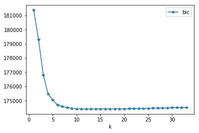


```python
stats.info()
```


    <class 'pandas.core.frame.DataFrame'>
    RangeIndex: 33 entries, 0 to 32
    Data columns (total 5 columns):
    bic         33 non-null float64
    features    33 non-null object
    formula     33 non-null object
    k           33 non-null int64
    model       33 non-null object
    dtypes: float64(1), int64(1), object(3)
    memory usage: 1.4+ KB


```python
best_stat = stats.iloc[stats.bic.idxmin()]
print(best_stat.model.summary())
```


                                OLS Regression Results                            
    ==============================================================================
    Dep. Variable:                 counts   R-squared:                       0.498
    Model:                            OLS   Adj. R-squared:                  0.497
    Method:                 Least Squares   F-statistic:                     1148.
    Date:                Thu, 04 Oct 2018   Prob (F-statistic):               0.00
    Time:                        23:01:03   Log-Likelihood:                -87144.
    No. Observations:               13903   AIC:                         1.743e+05
    Df Residuals:                   13890   BIC:                         1.744e+05
    Df Model:                          12                                         
    Covariance Type:            nonrobust                                         
    ==============================================================================
                     coef    std err          t      P>|t|      [0.025      0.975]
    ------------------------------------------------------------------------------
    const       -189.1223      5.283    -35.795      0.000    -199.479    -178.766
    temp         310.9097      6.890     45.125      0.000     297.404     324.415
    hour          39.5749      0.647     61.177      0.000      38.307      40.843
    hour_2        -1.3582      0.026    -51.420      0.000      -1.410      -1.306
    year          80.3153      2.182     36.804      0.000      76.038      84.593
    hum_2        -97.3713      5.534    -17.595      0.000    -108.219     -86.524
    fall          56.0162      2.797     20.026      0.000      50.533      61.499
    Jul          -25.6107      4.679     -5.473      0.000     -34.783     -16.438
    Snow         -48.1081      4.447    -10.819      0.000     -56.824     -39.392
    spring        25.8171      2.910      8.873      0.000      20.114      31.520
    Sept          29.2489      4.302      6.798      0.000      20.816      37.682
    holiday      -27.4291      6.432     -4.265      0.000     -40.037     -14.822
    Cloudy        -8.4814      2.666     -3.181      0.001     -13.707      -3.256
    ==============================================================================
    Omnibus:                     2990.921   Durbin-Watson:                   0.884
    Prob(Omnibus):                  0.000   Jarque-Bera (JB):             6264.394
    Skew:                           1.265   Prob(JB):                         0.00
    Kurtosis:                       5.102   Cond. No.                     1.85e+03
    ==============================================================================
    
    Warnings:
    [1] Standard Errors assume that the covariance matrix of the errors is correctly specified.
    [2] The condition number is large, 1.85e+03. This might indicate that there are
    strong multicollinearity or other numerical problems.


```python
fig, ax = plt.subplots(1, 1, figsize=(8,5))

x_vals_hour = np.linspace(0, 24, 100)
y_vals_hour = best_stat.model.params['hour'] * x_vals_hour + best_stat.model.params['hour_2'] * x_vals_hour**2
ax.grid(True, lw=1.75, ls='--', alpha=0.15)
ax.plot(x_vals_hour, y_vals_hour)
ax.set_title('Effect of Hours')
ax.set_xlabel('Hours')
ax.set_ylabel('Contribution to Number of Rental Counts')
fig.savefig("fig/hours.png")
```


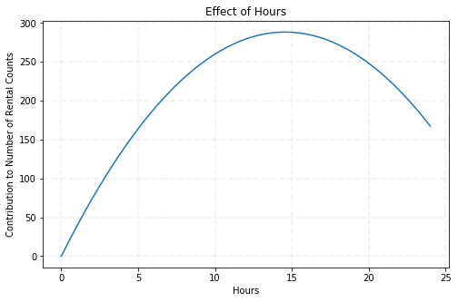


```python
fig, ax = plt.subplots(1, 1, figsize=(8, 5))

x_vals_hum = np.linspace(0, 1, 100)
y_vals_hum = best_stat.model.params['hum_2'] * x_vals_hour**2
ax.grid(True, lw=1.75, ls='--', alpha=0.15)
ax.plot(x_vals_hum, y_vals_hum)
ax.set_title('Effect of Humidity')
ax.set_xlabel('Humidity')
ax.set_ylabel('Contribution to Number of Rental Counts')
fig.savefig("fig/humidity.png")
```


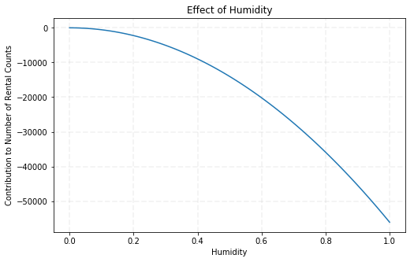


**5.2** Does forward selection eliminate one or more of the colinear predictors we dropped in Question  4.5 (`workingday` `atemp` `spring` `summer` and `fall`)? If any of the five predictors are not dropped, explain why.

Yes, forward selection method eliminated workingday, atemp, and summer, but kept spring and fall. 

Spring includes March, April, and May. It's not surprising that Spring is kept since none of the March, April, or May is included in the model. There is no perfect collinearity in the model that can replace Spring. 

Fall includes September, October, and November. Even though September is included, Fall still includes information about October and November. There is no perfect collinearity in the model that can replace Fall.

**5.3** Fit the linear regression model using the identified subset of predictors to the training set. How do the train and test $R^2$ scores for this fitted step-wise model compare with the train and test $R^2$ scores from the polynomial model fitted in Question 4.4?


```python
x_test_step = x_test_poly[best_stat.features]
X_test_step = sm.add_constant(x_test_step)
print("R-squared of OLS step-wise model for training set: %f" % best_stat.model.rsquared)
print("Adjusted R-squared of OLS step-wise model for training set: %f" % best_stat.model.rsquared_adj)
print("R-squared of OLS step-wise model for testing set: %f" % r2_score(y_test_poly, best_stat.model.predict(X_test_step)))

print("R-squared of OLS polynomial model for training set: %f" % ols_poly.rsquared)
print("Adjusted R-squared of OLS polynomial model for training set: %f" % ols_poly.rsquared_adj)
print("R-squared of OLS polynomial model for testing set: %f" % r2_score(y_test_poly, ols_poly.predict(X_test_poly)))
```


    R-squared of OLS step-wise model for training set: 0.497927
    Adjusted R-squared of OLS step-wise model for training set: 0.497494
    R-squared of OLS step-wise model for testing set: 0.494310
    R-squared of OLS polynomial model for training set: 0.500904
    Adjusted R-squared of OLS polynomial model for training set: 0.499717
    R-squared of OLS polynomial model for testing set: 0.496531


```python
print("BIC of OLS step-wise model: %f" % best_stat.model.bic)
print("BIC of OLS polynomial model: %f" % ols_poly.bic)
```


    BIC of OLS step-wise model: 174411.588858
    BIC of OLS polynomial model: 174529.253392


The polynomial model is slightly better than the step-wise model in terms of R-squared in training and testing set, but step-wise model is better in terms of BIC.

## Question 6: Written Report to the Administrators

Write a short repost stating some of your findings on how the administrators can increase the bike share system's revenue. You might want to include suggestions such as what model to use to predict ridership, what additional services to provide, or when to give discounts, etc. Include your report as a pdf file in canvas. The report should not be longer than one page (300 words) and should include a maximum of 5 figures. 

After our exploratory data analysis and modeling, we would like to recommend the following model to predict the hourly demand for rental bikes: 

$$Rentals = -189+310Temp+39Hour-Hour^2+80Year-97Hum^2+56Fall-26July-48Snow+25Spring+29Sept-27Holi-8Cloudy $$

The model performs reasonably well, which can explain around 50% of the variation in the hourly demand all significant predictors. The prediction power is very close to the polynomial model, but with less predictors. 

Regarding the operating hours, we found that ridership quickly becomes higher from midnight till peaks around 3pm in the afternoon, and dramatically decreases after 8pm in the night. Based on this pattern, we would like to recommend differentiating rental fare by hours, for example, 30% discount rate before 8am and after 8pm. 


Regarding the humidity and weather, we found high humidity has a quadratic negative impact on the ridership, since fewer people would  ride in the rain. Of couse, people also don't like to ride in the snow or cloudy days. Luckily, weather prediction might be helpful for us to give a discount rates beforehand. In the meanwhile, we should warn the danger of riding during snowing or raining days to potential riders.


Regarding riders, we found that registered riders are more consistent than casual riders. We should have more promotion events in good weather and good season to attract more people to register for the program for revenue growth.  


Regarding seasonality, we found that riders prefer spring and fall seasons, like September but don't like July and holidays. Accordingly, we would suggest dicsounts event during holidays to attract price-sensitive customers, hold community events like riding competitions to let more people know the healthy aspect of riding during spring and fall season.    


Overall, we love this program, and firmly believe our recommendations would help for revenue growth. 
