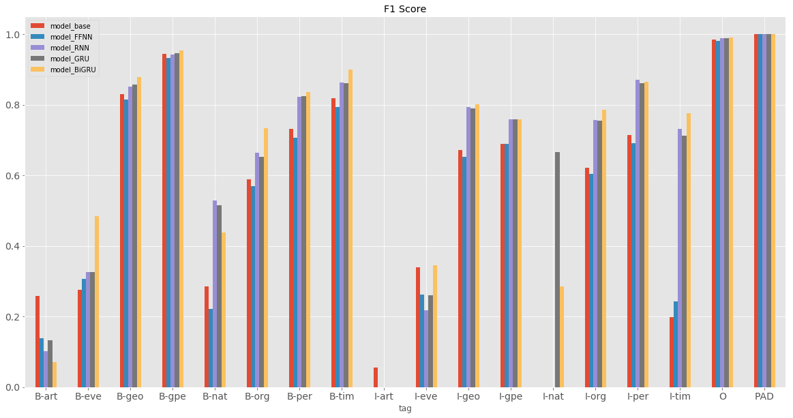

## Contents
{:.no_toc}
*  
{: toc}


```python
import requests
from IPython.core.display import HTML
styles = requests.get("https://raw.githubusercontent.com/Harvard-IACS/2018-CS109A/master/content/styles/cs109.css").text
HTML(styles)
```


<style>
blockquote { background: #AEDE94; }
h1 { 
    padding-top: 25px;
    padding-bottom: 25px;
    text-align: left; 
    padding-left: 10px;
    background-color: #DDDDDD; 
    color: black;
}
h2 { 
    padding-top: 10px;
    padding-bottom: 10px;
    text-align: left; 
    padding-left: 5px;
    background-color: #EEEEEE; 
    color: black;
}

div.exercise {
	background-color: #ffcccc;
	border-color: #E9967A; 	
	border-left: 5px solid #800080; 
	padding: 0.5em;
}

span.sub-q {
	font-weight: bold;
}
div.theme {
	background-color: #DDDDDD;
	border-color: #E9967A; 	
	border-left: 5px solid #800080; 
	padding: 0.5em;
	font-size: 18pt;
}
div.gc { 
	background-color: #AEDE94;
	border-color: #E9967A; 	 
	border-left: 5px solid #800080; 
	padding: 0.5em;
	font-size: 12pt;
}
p.q1 { 
    padding-top: 5px;
    padding-bottom: 5px;
    text-align: left; 
    padding-left: 5px;
    background-color: #EEEEEE; 
    color: black;
}
header {
   padding-top: 35px;
    padding-bottom: 35px;
    text-align: left; 
    padding-left: 10px;
    background-color: #DDDDDD; 
    color: black;
}
</style>


```python
```


Overview: Named Entity Recognition Challenge

Named entity recognition (NER) seeks to locate and classify named entities present in unstructured text into predefined categories such as organizations, locations, expressions of times, names of persons, etc. This technique is often used in real use cases such as classifying content for news providers, efficient search algorithms over large corpora and content-based recommendation systems. 

This represents an interesting "many-to-many" problem, allowing us to experiment with recurrent architectures and compare their performances against other models.


```python
import pandas as pd
import numpy as np

from sklearn.metrics import f1_score, confusion_matrix, precision_recall_fscore_support
from sklearn.model_selection import train_test_split
from sklearn.decomposition import PCA

import matplotlib.pyplot as plt
plt.style.use("ggplot")
import seaborn as sns

import warnings
warnings.filterwarnings('ignore')
```


```python
import keras
import tensorflow as tf

from keras.preprocessing.sequence import pad_sequences
from keras.utils import to_categorical,np_utils
from keras import backend

from keras.models import Model, Input, Sequential,model_from_json
from keras.layers import SimpleRNN, Embedding, Dense, TimeDistributed, GRU, \
                         Dropout, Bidirectional, Conv1D, MaxPooling1D,Flatten, BatchNormalization
from keras.optimizers import SGD, Adam

print(keras.__version__)
print(tf.__version__)
```


    2.2.4
    1.12.0


```python
np.random.seed(123)
tf.set_random_seed(456)
```


## Part 1: Read the data

Read in data ```HW4_data.csv``` and use the  code below to open the csv as a pandas dataframe.

As you can see, we have a dataset with sentences (```Sentence #``` column), each composed of words (```Word``` column) with part-of-speech tagging (```POS``` tagging) and inside–outside–beginning (IOB) named entity tags (```Tag``` column) attached. ```POS``` will not be used for this homework. We will predict ```Tag``` using only the words themselves.

Essential info about entities:
* geo = Geographical Entity
* org = Organization
* per = Person
* gpe = Geopolitical Entity
* tim = Time indicator
* art = Artifact
* eve = Event
* nat = Natural Phenomenon

IOB prefix:
* B: beginning of named entity
* I: inside of named entity
* O: outside of named entity


```python
path_dataset = './data/HW4_data.csv'
data = pd.read_csv(path_dataset, encoding="latin1")
data = data.fillna(method="ffill")
data.head()
```


<div>
<style scoped>
    .dataframe tbody tr th:only-of-type {
        vertical-align: middle;
    }

    .dataframe tbody tr th {
        vertical-align: top;
    }

    .dataframe thead th {
        text-align: right;
    }
</style>
<table border="1" class="dataframe">
  <thead>
    <tr style="text-align: right;">
      <th></th>
      <th>Sentence #</th>
      <th>Word</th>
      <th>POS</th>
      <th>Tag</th>
    </tr>
  </thead>
  <tbody>
    <tr>
      <th>0</th>
      <td>Sentence: 1</td>
      <td>Thousands</td>
      <td>NNS</td>
      <td>O</td>
    </tr>
    <tr>
      <th>1</th>
      <td>Sentence: 1</td>
      <td>of</td>
      <td>IN</td>
      <td>O</td>
    </tr>
    <tr>
      <th>2</th>
      <td>Sentence: 1</td>
      <td>demonstrators</td>
      <td>NNS</td>
      <td>O</td>
    </tr>
    <tr>
      <th>3</th>
      <td>Sentence: 1</td>
      <td>have</td>
      <td>VBP</td>
      <td>O</td>
    </tr>
    <tr>
      <th>4</th>
      <td>Sentence: 1</td>
      <td>marched</td>
      <td>VBN</td>
      <td>O</td>
    </tr>
  </tbody>
</table>
</div>


<span class='sub-q'> **Question 1.1**</span> 
* (1) Create a list of unique words found in column 'Word'
* (2) Sort the list in alphabetic order
* (3) Append the special word "ENDPAD" to the end of the list, and store it to a variable ```words```
* (4) Store the length of this list to a variable ```n_words```


```python
words = sorted(list(data['Word'].unique()))
words.append('ENDPAD')
n_words = len(words)
print("Number of unique words: %d" % (n_words))
```


    Number of unique words: 35179


<span class='sub-q'>**Question 1.2**</span>
* (1) Store a list of unique tags into a variable ```tags```, paying attention to sort the list in alphabetic order
* (2) Append the special tag "PAD" to the end of the list
* (3) Store the length of this list to a variable ```n_tags```


```python
tags = sorted(list(data['Tag'].unique()))
tags.append('PAD')
n_tags = len(tags)
print("Number of unique tags: %d" % (n_tags))
```


    Number of unique tags: 18


<span class='sub-q'>**Question 1.3**</span>
* (1) Process data into a list of sentences, each sentence is a list of (word, tag) tuples.

**Example**

First sentence in the list of sentences:

[('Thousands', 'O'),
 ('of',  'O'),
 ('demonstrators', 'O'),
 ('have', 'O'),
 ('marched', 'O'),
 ('through', 'O'),
 ('London', 'B-geo'),
 ('to', 'O'),
 ('protest', 'O'),
 ('the', 'O'),
 ('war', 'O'),
 ('in', 'O'),
 ('Iraq', 'B-geo'),
 ('and', 'O'),
 ('demand', 'O'),
 ('the', 'O'),
 ('withdrawal', 'O'),
 ('of', 'O'),
 ('British', 'B-gpe'),
 ('troops', 'O'),
 ('from', 'O'),
 ('that', 'O'),
 ('country', 'O'),
 ('.', 'O')]
* (2) Find out the number of words in the longest sentence, and store it to variable ```max_len```


```python
data['word_tuple'] = [tuple(x) for x in data[['Word','Tag']].values]
data_sentences = data.groupby('Sentence #')['word_tuple'].apply(list).tolist()

max_len = max(len(elem) for elem in data_sentences)
print("Number of words in the longest sentence: %d" % max_len)
```


    Number of words in the longest sentence: 104


<span class='sub-q'>**Question 1.4**</span>

It's now time to convert the sentences data in a suitable format for the RNNs training/evaluation procedures. To this end, you are required to:
* (1) Create a ```word2idx``` dictionary mapping distinct words from the dataset into distinct integers. Also create a ```idx2word``` dictionary. 
* (2) Prepare the predictors matrix ```X```, as a list of lists, where each inner list is a sequence of words mapped into integers accordly to the ```word2idx``` dictionary. 
* (3) Apply the keras ```pad_sequences``` function to standardize the predictors. You should retrieve a matrix with all padded sentences and length equal to ```max_len``` previously computed. The dimensionality should therefore be equal to ```[# of sentences, max_len]```

Your ```X[i]``` now should be something similar to this:

```[ 8193 27727 31033 33289 22577 33464 23723 16665 33464 31142 31319 28267
 27700 33246 28646 16052    21 16915 17349  7924 32879 32985 18238 23555
    24 35178 35178 35178 35178 35178 35178 35178 35178 35178 35178 35178
 35178 35178 35178 35178 35178 35178 35178 35178 35178 35178 35178 35178
 35178 35178 35178 35178 35178 35178 35178 35178 35178 35178 35178 35178
 35178 35178 35178 35178 35178 35178 35178 35178 35178 35178 35178 35178
 35178 35178 35178 35178 35178 35178 35178 35178 35178 35178 35178 35178
 35178 35178 35178 35178 35178 35178 35178 35178 35178 35178 35178 35178
 35178 35178 35178 35178 35178 35178 35178 35178]```
 
* (4) Create a ```tag2idx``` dictionary mapping distinct named entity tags from the dataset into distinct integers. Also create a ```idx2tag``` dictionary.

* (5) Prepare targets matrix ```Y```, as a list of lists,where each inner list is a sequence of tags mapped into integers accordly to the ```tag2idx``` dictionary.
* (6) apply the keras ```pad_sequences``` function to standardize the targets. Inject the ```PAD``` tag for the padding words. You should retrieve a matrix with all padded sentences'tags and length equal to ```max_length``` previously computed. 

* (7) Use the ```to_categorical``` keras function to one-hot encode the tags.

Now your ```Y``` should have dimension ```[# of sentences, max_len, n_tags]```

* (8) Split the dataset in train and test datasets (test 10%).


```python
word2idx = dict(zip(words, range(n_words)))
idx2word = dict(zip(range(n_words), words))
```


```python
data['word_idx'] = data['Word'].apply(lambda x: word2idx[x])
X = data.groupby('Sentence #')['word_idx'].apply(list).tolist()
```


```python
X = pad_sequences(X, maxlen=max_len, value=word2idx['ENDPAD'])
```


```python
tag2idx = dict(zip(tags, range(n_tags)))
idx2tag = dict(zip(range(n_tags), tags))
```


```python
data['tag_idx'] = data['Tag'].apply(lambda x: tag2idx[x])
Y = data.groupby('Sentence #')['tag_idx'].apply(list).tolist()
```


```python
y = pad_sequences(Y, maxlen=max_len, value=tag2idx['PAD'])
```


```python
y = to_categorical(y, n_tags)
```


```python
X_tr, X_test, y_tr, y_test = train_test_split(X, y, test_size=0.1)
```


```python
print("The index of word 'Harvard' is: {}\n".format(word2idx["Harvard"]))
print("Sentence 1: {}\n".format(X[1]))
print(X.shape)
```


    The index of word 'Harvard' is: 7506
    
    Sentence 1: [35178 35178 35178 35178 35178 35178 35178 35178 35178 35178 35178 35178
     35178 35178 35178 35178 35178 35178 35178 35178 35178 35178 35178 35178
     35178 35178 35178 35178 35178 35178 35178 35178 35178 35178 35178 35178
     35178 35178 35178 35178 35178 35178 35178 35178 35178 35178 35178 35178
     35178 35178 35178 35178 35178 35178 35178 35178 35178 35178 35178 35178
     35178 35178 35178 35178 35178 35178 35178 35178 35178 35178 35178 35178
     35178 35178 35178 35178 35178 35178 35178  8193 27727 31033 33289 22577
     33464 23723 16665 33464 31142 31319 28267 27700 33246 28646 16052    21
     16915 17349  7924 32879 32985 18238 23555    24]
    
    (47959, 104)


```python
print("The index of tag 'B-gpe' is: {}\n".format(tag2idx["B-gpe"]))
print("The tag of the last word in Sentence 1: {}\n".format(y[0][-1]))
print(np.array(y).shape)
```


    The index of tag 'B-gpe' is: 3
    
    The tag of the last word in Sentence 1: [0. 0. 0. 0. 0. 0. 0. 0. 0. 0. 0. 0. 0. 0. 0. 0. 1. 0.]
    
    (47959, 104, 18)


## Part 2: Modelling

After preparing the train and test sets, we are ready to build five models: 
* frequency-based baseline 
* vanilla feedforward neural network
* recurrent neural network
* gated recurrent neural network
* bidirectional gated recurrent neural network

More details are given about architecture in each model's section. The input/output dimensionalities will be the same for all models:
* input: ```[# of sentences, max_len]```
* output: ```[# of sentences, max_len, n_tags]```

Follow the information in each model's section to set up the architecture of each model. And the end of each training, use the given ```store_model``` function to store the weights and architectures in the ```./models``` path for later testing;```load_keras_model()``` is also provided to you

A further ```plot_training_history``` helper function is given in case you need to check the training history.


```python
def store_keras_model(model, model_name):
    model_json = model.to_json() # serialize model to JSON
    with open("./models/{}.json".format(model_name), "w") as json_file:
        json_file.write(model_json)
    model.save_weights("./models/{}.h5".format(model_name)) # serialize weights to HDF5
    print("Saved model to disk")
    
def plot_training_history(history):
    loss = history.history['loss']
    val_loss = history.history['val_loss']
    epochs = range(1,len(loss)+1)

    plt.figure()
    plt.plot(epochs, loss, 'bo', label='Training loss')
    plt.plot(epochs, val_loss, 'b', label='Validation loss')
    plt.title('Training and validation loss')
    plt.xlabel('epoch')
    plt.legend()
    plt.show()
```


```python
def load_keras_model(model_name):
    # Load json and create model
    json_file = open('./models/{}.json'.format(model_name), 'r')
    loaded_model_json = json_file.read()
    json_file.close()
    model = model_from_json(loaded_model_json)
    # Load weights into new model
    model.load_weights("./models/{}.h5".format(model_name))
    return model
```


<span class='sub-q'>**Question 2.1**</span>

### Model 1: Baseline Model ###

Predict the tag of a word simply with the most frequently-seen named entity tag of this word from the training set.

e.g. word "Apple" appears 10 times in the training set; 7 times it was tagged as "Corporate" and 3 times it was tagged as "Fruit". If we encounter the word "Apple" in the test set, we predict it as "Corporate".

**Create an np.array ```baseline``` of length [n_words]**
where the ith element   ```baseline[i]``` is the index of the most commonly seen named entity tag of word i summarised from training set.   (e.g. [16, 16, 16, ..., 0, 16, 16])


```python
y_tr_re = np.argmax(y_tr, axis=-1)
X_tr_1d = X_tr.reshape(-1)
y_tr_re_1d = y_tr_re.reshape(-1)

base_freq = {'word_idx': list(X_tr_1d),
             'tag_idx': list(y_tr_re_1d)}
base_freq = pd.DataFrame(base_freq)

base_freq = base_freq.groupby(["word_idx", "tag_idx"]).size().unstack()
base_freq['tag'] = base_freq.idxmax(axis=1)
base_freq = base_freq[['tag']]
```


```python
temp_df = {'word_idx': range(n_words), 'tag_idx': 16}
temp_df = pd.DataFrame(temp_df)
temp_df.set_index('word_idx', inplace=True)

base_freq_final = pd.merge(base_freq, temp_df, how='outer', left_index=True, right_index=True, indicator=True)

base_freq_final['tag'] = base_freq_final.apply(lambda x: x['tag_idx'] 
                                               if x['_merge'] == 'right_only' 
                                               else x['tag'], 
                                               axis=1)

base_freq_final = base_freq_final[['tag']]

baseline = np.array(base_freq_final.tag)
baseline = to_categorical(baseline, n_tags)
print(baseline.shape)
```


    (35179, 18)


```python
print(baseline[X].shape,'\n')
print('Sentence:\n {}\n'.format([idx2word[w] for w in X[0]]))
print('Predicted Tags:\n {}'.format([idx2tag[i] for i in np.argmax(baseline[X[0]],axis=-1)]))
```


    (47959, 104, 18) 
    
    Sentence:
     ['ENDPAD', 'ENDPAD', 'ENDPAD', 'ENDPAD', 'ENDPAD', 'ENDPAD', 'ENDPAD', 'ENDPAD', 'ENDPAD', 'ENDPAD', 'ENDPAD', 'ENDPAD', 'ENDPAD', 'ENDPAD', 'ENDPAD', 'ENDPAD', 'ENDPAD', 'ENDPAD', 'ENDPAD', 'ENDPAD', 'ENDPAD', 'ENDPAD', 'ENDPAD', 'ENDPAD', 'ENDPAD', 'ENDPAD', 'ENDPAD', 'ENDPAD', 'ENDPAD', 'ENDPAD', 'ENDPAD', 'ENDPAD', 'ENDPAD', 'ENDPAD', 'ENDPAD', 'ENDPAD', 'ENDPAD', 'ENDPAD', 'ENDPAD', 'ENDPAD', 'ENDPAD', 'ENDPAD', 'ENDPAD', 'ENDPAD', 'ENDPAD', 'ENDPAD', 'ENDPAD', 'ENDPAD', 'ENDPAD', 'ENDPAD', 'ENDPAD', 'ENDPAD', 'ENDPAD', 'ENDPAD', 'ENDPAD', 'ENDPAD', 'ENDPAD', 'ENDPAD', 'ENDPAD', 'ENDPAD', 'ENDPAD', 'ENDPAD', 'ENDPAD', 'ENDPAD', 'ENDPAD', 'ENDPAD', 'ENDPAD', 'ENDPAD', 'ENDPAD', 'ENDPAD', 'ENDPAD', 'ENDPAD', 'ENDPAD', 'ENDPAD', 'ENDPAD', 'ENDPAD', 'ENDPAD', 'ENDPAD', 'ENDPAD', 'ENDPAD', 'Thousands', 'of', 'demonstrators', 'have', 'marched', 'through', 'London', 'to', 'protest', 'the', 'war', 'in', 'Iraq', 'and', 'demand', 'the', 'withdrawal', 'of', 'British', 'troops', 'from', 'that', 'country', '.']
    
    Predicted Tags:
     ['PAD', 'PAD', 'PAD', 'PAD', 'PAD', 'PAD', 'PAD', 'PAD', 'PAD', 'PAD', 'PAD', 'PAD', 'PAD', 'PAD', 'PAD', 'PAD', 'PAD', 'PAD', 'PAD', 'PAD', 'PAD', 'PAD', 'PAD', 'PAD', 'PAD', 'PAD', 'PAD', 'PAD', 'PAD', 'PAD', 'PAD', 'PAD', 'PAD', 'PAD', 'PAD', 'PAD', 'PAD', 'PAD', 'PAD', 'PAD', 'PAD', 'PAD', 'PAD', 'PAD', 'PAD', 'PAD', 'PAD', 'PAD', 'PAD', 'PAD', 'PAD', 'PAD', 'PAD', 'PAD', 'PAD', 'PAD', 'PAD', 'PAD', 'PAD', 'PAD', 'PAD', 'PAD', 'PAD', 'PAD', 'PAD', 'PAD', 'PAD', 'PAD', 'PAD', 'PAD', 'PAD', 'PAD', 'PAD', 'PAD', 'PAD', 'PAD', 'PAD', 'PAD', 'PAD', 'PAD', 'O', 'O', 'O', 'O', 'O', 'O', 'B-geo', 'O', 'O', 'O', 'O', 'O', 'B-geo', 'O', 'O', 'O', 'O', 'O', 'B-gpe', 'O', 'O', 'O', 'O', 'O']


### Model 2: Vanilla Feed Forward Neural Network ###

This model is provided to you. Please pay attention to the architecture of this neural network, especially the input/output dimensionalities and the Embedding layer.


<span class='sub-q'>**Question 2.2**</span>

(1) Explain what is embedding layer and why we need it here.

(2) Explain why the Param # of Embedding layer is 1758950 (as shown in ```print(model.summary())```).

### Hyperparameters shared with other NN models


```python
n_units = 100
drop_rate = .1
dim_embed = 50

optimizer = "rmsprop"
loss = "categorical_crossentropy"
metrics = ["accuracy"]

batch_size = 32
epochs = 10
validation_split = 0.1
verbose = 1
```


```python
backend.clear_session()

model = Sequential()
model.add(Embedding(input_dim=n_words, output_dim=dim_embed, input_length=max_len))
model.add(Dropout(drop_rate))
model.add(Dense(n_tags, activation="softmax"))

model.compile(optimizer=optimizer, loss=loss, metrics=metrics)
```


```python
print(model.summary())
```


    _________________________________________________________________
    Layer (type)                 Output Shape              Param #   
    =================================================================
    embedding_1 (Embedding)      (None, 104, 50)           1758950   
    _________________________________________________________________
    dropout_1 (Dropout)          (None, 104, 50)           0         
    _________________________________________________________________
    dense_1 (Dense)              (None, 104, 18)           918       
    =================================================================
    Total params: 1,759,868
    Trainable params: 1,759,868
    Non-trainable params: 0
    _________________________________________________________________
    None


```python
history = model.fit(X_tr, y_tr, batch_size=batch_size, epochs=epochs, 
                    validation_split=validation_split, verbose=verbose)
```


    Train on 38846 samples, validate on 4317 samples
    Epoch 1/10
    38846/38846 [==============================] - 8s 193us/step - loss: 0.3246 - acc: 0.9774 - val_loss: 0.0604 - val_acc: 0.9858
    Epoch 2/10
    38846/38846 [==============================] - 6s 166us/step - loss: 0.0515 - acc: 0.9863 - val_loss: 0.0477 - val_acc: 0.9869
    Epoch 3/10
    38846/38846 [==============================] - 6s 165us/step - loss: 0.0451 - acc: 0.9872 - val_loss: 0.0448 - val_acc: 0.9874
    Epoch 4/10
    38846/38846 [==============================] - 6s 165us/step - loss: 0.0428 - acc: 0.9877 - val_loss: 0.0435 - val_acc: 0.9877
    Epoch 5/10
    38846/38846 [==============================] - 7s 172us/step - loss: 0.0414 - acc: 0.9880 - val_loss: 0.0428 - val_acc: 0.9880
    Epoch 6/10
    38846/38846 [==============================] - 6s 165us/step - loss: 0.0406 - acc: 0.9883 - val_loss: 0.0422 - val_acc: 0.9882
    Epoch 7/10
    38846/38846 [==============================] - 6s 165us/step - loss: 0.0401 - acc: 0.9885 - val_loss: 0.0419 - val_acc: 0.9883
    Epoch 8/10
    38846/38846 [==============================] - 7s 171us/step - loss: 0.0396 - acc: 0.9887 - val_loss: 0.0417 - val_acc: 0.9884
    Epoch 9/10
    38846/38846 [==============================] - 7s 172us/step - loss: 0.0392 - acc: 0.9888 - val_loss: 0.0416 - val_acc: 0.9884
    Epoch 10/10
    38846/38846 [==============================] - 6s 165us/step - loss: 0.0390 - acc: 0.9889 - val_loss: 0.0415 - val_acc: 0.9885


```python
store_keras_model(model, 'model_FFNN')
```


    Saved model to disk


```python
plot_training_history(history)
```


In addition to the final result, we also want to see the intermediate results from hidden layers. Below is an example showing how to get outputs from a hidden layer, and visualize them on the reduced dimension of 2D by PCA. (**Please note that these codes and parameters cannot be simply copied and pasted for other questions; some adjustments need to be made**) 


```python
X_te = X_test
y_te = y_test

backend.clear_session()
FFNN = load_keras_model('model_FFNN')

def create_truncated_model_FFNN(trained_model):
    model=Sequential()
    model.add(Embedding(input_dim=n_words, output_dim=dim_embed, input_length=max_len))
    model.add(Dropout(drop_rate))
    
    # set weights of first few layers using the weights of trained model
    for i, layer in enumerate(model.layers):
        layer.set_weights(trained_model.layers[i].get_weights())
    model.compile(optimizer=optimizer, loss=loss, metrics=metrics)
    return model

truncated_model = create_truncated_model_FFNN(FFNN)
hidden_features = truncated_model.predict(X_te)

hidden_features=hidden_features.reshape(-1,50)
y_te = y_te.reshape(-1,18)
 
pca = PCA(n_components=2)
pca_result = pca.fit_transform(hidden_features)
print('Variance explained by PCA: {}'.format(np.sum(pca.explained_variance_ratio_)))
```


    Variance explained by PCA: 0.9369789132384772


```python
def visualize_hidden_features(pca_result):
    color = ['r', 'C1', 'y', 'C3', 'b', 'g', 'm', 'orange', 
             'r', 'C1', 'y', 'C3', 'b', 'g', 'm', 'orange']
    
    category = np.argmax(y_te, axis=1)
    f, ax = plt.subplots(1, 2, figsize=(16,8))
    
    for cat in range(8):
        indices = np.where(category==cat)[0]
        ax[0].scatter(pca_result[indices,0], pca_result[indices, 1], label=idx2tag[cat],s=2,color=color[cat],alpha=0.5)
        legend = ax[0].legend(markerscale=3)
        legend.get_frame().set_facecolor('w')  
        ax[0].set_title("B-Tags")
        
    for cat in range(8, 16):
        indices = np.where(category==cat)[0]
        ax[1].scatter(pca_result[indices,0], pca_result[indices, 1], label=idx2tag[cat],s=2,color=color[cat],alpha=0.5)
        legend = ax[1].legend(markerscale=3)
        legend.get_frame().set_facecolor('w')  
        ax[1].set_title("I-Tags")
    
visualize_hidden_features(pca_result)
```


(1) Explain what is embedding layer and why we need it here.

- An embedding is a linear projection from one vector space to another. We usually use embeddings to project the one-hot encodings of words on to a lower-dimensional continuous space so that the input surface is dense and possibly smooth. According to the model, an embedding layer is just a transformation from $\mathbb{R}^{inp}$ to $\mathbb{R}^{emb}$


(2) Explain why the Param # of Embedding layer is 1758950 (as shown in ```print(model.summary())```).
- Param # of the embedding layer equals number of unique words (35,179) times number of dimensions of the embedding layer (50).

### Model 3: RNN ###
<span class='sub-q'>**Question 2.3**</span>

(1) Set up a simple RNN model by stacking the following layers in sequence:
* an input layer
* a simple Embedding layer transforming integer words into vectors 
* a dropout layer to regularize the model
* a SimpleRNN layer 
* a TimeDistributed layer with an inner Dense layer which output dimensionality is equal to n_tag

(2) Compile the model

(3) Train the model and plot the training history

(4) Visualize outputs from SimpleRNN layer, one subplot for **B-tags** and one subplot for **I-tags**, comment on the patterns you observed.

For hyperparameters use those provided in Model 2


```python
backend.clear_session()

model = Sequential()
model.add(Embedding(input_dim=n_words, output_dim=dim_embed, input_length=max_len))
model.add(Dropout(drop_rate))
model.add(SimpleRNN(n_units, return_sequences=True))
model.add(TimeDistributed(Dense(n_tags, activation='softmax')))

model.compile(optimizer=optimizer, loss=loss, metrics=metrics)
```


```python
print(model.summary())
```


    _________________________________________________________________
    Layer (type)                 Output Shape              Param #   
    =================================================================
    embedding_1 (Embedding)      (None, 104, 50)           1758950   
    _________________________________________________________________
    dropout_1 (Dropout)          (None, 104, 50)           0         
    _________________________________________________________________
    simple_rnn_1 (SimpleRNN)     (None, 104, 100)          15100     
    _________________________________________________________________
    time_distributed_1 (TimeDist (None, 104, 18)           1818      
    =================================================================
    Total params: 1,775,868
    Trainable params: 1,775,868
    Non-trainable params: 0
    _________________________________________________________________
    None


```python
history = model.fit(X_tr, y_tr, batch_size=batch_size, epochs=epochs, 
                    validation_split=validation_split, verbose=verbose)
```


    Train on 38846 samples, validate on 4317 samples
    Epoch 1/10
    38846/38846 [==============================] - 86s 2ms/step - loss: 0.0986 - acc: 0.9759 - val_loss: 0.0320 - val_acc: 0.9905
    Epoch 2/10
    38846/38846 [==============================] - 85s 2ms/step - loss: 0.0295 - acc: 0.9911 - val_loss: 0.0284 - val_acc: 0.9914
    Epoch 3/10
    38846/38846 [==============================] - 85s 2ms/step - loss: 0.0261 - acc: 0.9922 - val_loss: 0.0273 - val_acc: 0.9917
    Epoch 4/10
    38846/38846 [==============================] - 85s 2ms/step - loss: 0.0244 - acc: 0.9927 - val_loss: 0.0267 - val_acc: 0.9920
    Epoch 5/10
    38846/38846 [==============================] - 85s 2ms/step - loss: 0.0232 - acc: 0.9930 - val_loss: 0.0265 - val_acc: 0.9921
    Epoch 6/10
    38846/38846 [==============================] - 85s 2ms/step - loss: 0.0223 - acc: 0.9934 - val_loss: 0.0267 - val_acc: 0.9920
    Epoch 7/10
    38846/38846 [==============================] - 85s 2ms/step - loss: 0.0215 - acc: 0.9936 - val_loss: 0.0261 - val_acc: 0.9922
    Epoch 8/10
    38846/38846 [==============================] - 85s 2ms/step - loss: 0.0207 - acc: 0.9938 - val_loss: 0.0264 - val_acc: 0.9921
    Epoch 9/10
    38846/38846 [==============================] - 85s 2ms/step - loss: 0.0200 - acc: 0.9940 - val_loss: 0.0271 - val_acc: 0.9919
    Epoch 10/10
    38846/38846 [==============================] - 85s 2ms/step - loss: 0.0194 - acc: 0.9942 - val_loss: 0.0266 - val_acc: 0.9920


```python
store_keras_model(model, 'model_RNN')
```


    Saved model to disk


```python
plot_training_history(history)
```


```python
X_te = X_test
y_te = y_test

backend.clear_session()
model_RNN = load_keras_model('model_RNN')

def create_truncated_model_RNN(trained_model):
    model = Sequential()
    model.add(Embedding(input_dim=n_words, output_dim=dim_embed, input_length=max_len))
    model.add(Dropout(drop_rate))
    model.add(SimpleRNN(n_units, return_sequences=True))
    
    # set weights of first few layers using the weights of trained model
    for i, layer in enumerate(model.layers):
        layer.set_weights(trained_model.layers[i].get_weights())
    
    model.compile(optimizer=optimizer, loss=loss, metrics=metrics)
    
    return model

truncated_model = create_truncated_model_RNN(model_RNN)
hidden_features = truncated_model.predict(X_te)

hidden_features=hidden_features.reshape(-1,50)
y_te = y_te.reshape(-1,18)
 
pca = PCA(n_components=2)
pca_result = pca.fit_transform(hidden_features)
print('Variance explained by PCA: {}'.format(np.sum(pca.explained_variance_ratio_)))
```


    Variance explained by PCA: 0.800634018892626


```python
def visualize_hidden_features(pca_result):
    color = ['r', 'C1', 'y', 'C3', 'b', 'g', 'm', 'orange', 
             'r', 'C1', 'y', 'C3', 'b', 'g', 'm', 'orange']
    
    category = np.argmax(y_te, axis=1)
    f, ax = plt.subplots(1, 2, figsize=(16,8))
    
    for cat in range(8):
        indices = np.where(category==cat)[0]
        ax[0].scatter(pca_result[indices,0], pca_result[indices, 1], label=idx2tag[cat],s=2,color=color[cat],alpha=0.5)
        legend = ax[0].legend(markerscale=3)
        legend.get_frame().set_facecolor('w')  
        ax[0].set_title("B-Tags")
        
    for cat in range(8, 16):
        indices = np.where(category==cat)[0]
        ax[1].scatter(pca_result[indices,0], pca_result[indices, 1], label=idx2tag[cat],s=2,color=color[cat],alpha=0.5)
        legend = ax[1].legend(markerscale=3)
        legend.get_frame().set_facecolor('w')  
        ax[1].set_title("I-Tags")
    
visualize_hidden_features(pca_result)
```


Comment on the patterns you observed:
- The top 2 PCA components can explain more than 80% of variation of the hidden features after the SimpleRNN layer. The figures above also show clear patterns that different categories of tags form perpendicular clusters along the top 2 PCA components, which is a clear evidence that the SimpleRNN is very effective. 
- The clusters are typically all less than 0 or larger than 0, so biased towards one side.

### Model 4: GRU ###

<span class='sub-q'>**Question 2.4**</span>


(1) Briefly explain what is GRU and how it is different from simple RNN

(2) build a GRU architecture by replacing the SimpleRNN cell with a GRU one. 

(3) Compile the model

(4) Train the model and plot the training history

(5) Visualize outputs from GRU layer, one subplot for **B-tags** and one subplot for **I-tags**, comment on the patterns you observed.


```python
backend.clear_session()

model = Sequential()
model.add(Embedding(input_dim=n_words, output_dim=dim_embed, input_length=max_len))
model.add(Dropout(drop_rate))
model.add(GRU(n_units, return_sequences=True))
model.add(TimeDistributed(Dense(n_tags, activation='softmax')))

model.compile(optimizer=optimizer, loss=loss, metrics=metrics)
```


```python
print(model.summary())
```


    _________________________________________________________________
    Layer (type)                 Output Shape              Param #   
    =================================================================
    embedding_1 (Embedding)      (None, 104, 50)           1758950   
    _________________________________________________________________
    dropout_1 (Dropout)          (None, 104, 50)           0         
    _________________________________________________________________
    gru_1 (GRU)                  (None, 104, 100)          45300     
    _________________________________________________________________
    time_distributed_1 (TimeDist (None, 104, 18)           1818      
    =================================================================
    Total params: 1,806,068
    Trainable params: 1,806,068
    Non-trainable params: 0
    _________________________________________________________________
    None


```python
history = model.fit(X_tr, y_tr, batch_size=batch_size, epochs=epochs, 
                    validation_split=validation_split, verbose=verbose)
```


    Train on 38846 samples, validate on 4317 samples
    Epoch 1/10
    38846/38846 [==============================] - 182s 5ms/step - loss: 0.0918 - acc: 0.9777 - val_loss: 0.0325 - val_acc: 0.9903
    Epoch 2/10
    38846/38846 [==============================] - 181s 5ms/step - loss: 0.0289 - acc: 0.9913 - val_loss: 0.0280 - val_acc: 0.9916
    Epoch 3/10
    38846/38846 [==============================] - 182s 5ms/step - loss: 0.0255 - acc: 0.9923 - val_loss: 0.0270 - val_acc: 0.9919
    Epoch 4/10
    38846/38846 [==============================] - 182s 5ms/step - loss: 0.0238 - acc: 0.9929 - val_loss: 0.0269 - val_acc: 0.9919
    Epoch 5/10
    38846/38846 [==============================] - 181s 5ms/step - loss: 0.0226 - acc: 0.9932 - val_loss: 0.0258 - val_acc: 0.9922
    Epoch 6/10
    38846/38846 [==============================] - 180s 5ms/step - loss: 0.0216 - acc: 0.9935 - val_loss: 0.0258 - val_acc: 0.9923
    Epoch 7/10
    38846/38846 [==============================] - 181s 5ms/step - loss: 0.0208 - acc: 0.9937 - val_loss: 0.0256 - val_acc: 0.9924
    Epoch 8/10
    38846/38846 [==============================] - 180s 5ms/step - loss: 0.0200 - acc: 0.9940 - val_loss: 0.0257 - val_acc: 0.9924
    Epoch 9/10
    38846/38846 [==============================] - 180s 5ms/step - loss: 0.0193 - acc: 0.9942 - val_loss: 0.0257 - val_acc: 0.9922
    Epoch 10/10
    38846/38846 [==============================] - 180s 5ms/step - loss: 0.0186 - acc: 0.9944 - val_loss: 0.0262 - val_acc: 0.9922


```python
store_keras_model(model, 'model_GRU')
```


    Saved model to disk


```python
plot_training_history(history)
```


```python
X_te = X_test
y_te = y_test

backend.clear_session()
model_GRU = load_keras_model('model_GRU')

def create_truncated_model_GRU(trained_model):
    model=Sequential()
    model.add(Embedding(input_dim=n_words, output_dim=dim_embed, input_length=max_len))
    model.add(Dropout(drop_rate))
    model.add(GRU(n_units, return_sequences=True))
    
    # set weights of first few layers using the weights of trained model
    for i, layer in enumerate(model.layers):
        layer.set_weights(trained_model.layers[i].get_weights())
    
    model.compile(optimizer=optimizer, loss=loss, metrics=metrics)
    
    return model

truncated_model = create_truncated_model_GRU(model_GRU)
hidden_features = truncated_model.predict(X_te)

hidden_features=hidden_features.reshape(-1,50)
y_te = y_te.reshape(-1,18)
 
pca = PCA(n_components=2)
pca_result = pca.fit_transform(hidden_features)
print('Variance explained by PCA: {}'.format(np.sum(pca.explained_variance_ratio_)))
```


    Variance explained by PCA: 0.8425548298385505


```python
def visualize_hidden_features(pca_result):
    color = ['r', 'C1', 'y', 'C3', 'b', 'g', 'm', 'orange', 
             'r', 'C1', 'y', 'C3', 'b', 'g', 'm', 'orange']
    
    category = np.argmax(y_te, axis=1)
    f, ax = plt.subplots(1, 2, figsize=(16,8))
    
    for cat in range(8):
        indices = np.where(category==cat)[0]
        ax[0].scatter(pca_result[indices,0], pca_result[indices, 1], label=idx2tag[cat],s=2,color=color[cat],alpha=0.5)
        legend = ax[0].legend(markerscale=3)
        legend.get_frame().set_facecolor('w')  
        ax[0].set_title("B-Tags")
        
    for cat in range(8, 16):
        indices = np.where(category==cat)[0]
        ax[1].scatter(pca_result[indices,0], pca_result[indices, 1], label=idx2tag[cat],s=2,color=color[cat],alpha=0.5)
        legend = ax[1].legend(markerscale=3)
        legend.get_frame().set_facecolor('w')  
        ax[1].set_title("I-Tags")
    
visualize_hidden_features(pca_result)
```


Briefly explain what is GRU and how it is different from simple RNN
- GRU, Gated Recurrent Unit, is a variant of the simple RNN. Versus simple RNN, GRU has a key idea of `gate`, which is used to decide whether or how much to pass previous value to next neuron, and how much to remember new value. 

Comment on the patterns you observed.
- The top 2 PCA components can explain more than 84% of variation of the hidden features after the GRU layer. The figures above also show clear patterns that different categories of tags form perpendicular clusters along the top 2 PCA components, which is a clear evidence that the GRU is very effective.
- The centers of clusters are are around zero on the x-axis.

### Model 5: Bidirectional GRU ###
<span class='sub-q'>**Question 2.5**</span>


(1) Explain what is Bidirectional GRU and how it is different from GRU model above.

(2) Then build a bidirectional GRU by wrapping your GRU layer into a Bidirectional one

(3) Compile the model

(4) Train the model and plot the training history

(5) Visualize outputs from bidirectional GRU layer, one subplot for **B-tags** and one subplot for **I-tags**, comment on the patterns you observed.


```python
backend.clear_session()

model = Sequential()
model.add(Embedding(input_dim=n_words, output_dim=dim_embed, input_length=max_len))
model.add(Dropout(drop_rate))
model.add(Bidirectional(GRU(n_units, return_sequences=True)))
model.add(TimeDistributed(Dense(n_tags, activation='softmax')))

model.compile(optimizer=optimizer, loss=loss, metrics=metrics)
```


```python
print(model.summary())
```


    _________________________________________________________________
    Layer (type)                 Output Shape              Param #   
    =================================================================
    embedding_1 (Embedding)      (None, 104, 50)           1758950   
    _________________________________________________________________
    dropout_1 (Dropout)          (None, 104, 50)           0         
    _________________________________________________________________
    bidirectional_1 (Bidirection (None, 104, 200)          90600     
    _________________________________________________________________
    time_distributed_1 (TimeDist (None, 104, 18)           3618      
    =================================================================
    Total params: 1,853,168
    Trainable params: 1,853,168
    Non-trainable params: 0
    _________________________________________________________________
    None


```python
history = model.fit(X_tr, y_tr, batch_size=batch_size, epochs=epochs, 
                    validation_split=validation_split, verbose=verbose)
```


    Train on 38846 samples, validate on 4317 samples
    Epoch 1/10
    38846/38846 [==============================] - 372s 10ms/step - loss: 0.0748 - acc: 0.9813 - val_loss: 0.0286 - val_acc: 0.9916
    Epoch 2/10
    38846/38846 [==============================] - 371s 10ms/step - loss: 0.0243 - acc: 0.9928 - val_loss: 0.0236 - val_acc: 0.9930
    Epoch 3/10
    38846/38846 [==============================] - 371s 10ms/step - loss: 0.0208 - acc: 0.9938 - val_loss: 0.0224 - val_acc: 0.9934
    Epoch 4/10
    38846/38846 [==============================] - 371s 10ms/step - loss: 0.0189 - acc: 0.9944 - val_loss: 0.0220 - val_acc: 0.9934
    Epoch 5/10
    38846/38846 [==============================] - 371s 10ms/step - loss: 0.0175 - acc: 0.9948 - val_loss: 0.0216 - val_acc: 0.9936
    Epoch 6/10
    38846/38846 [==============================] - 370s 10ms/step - loss: 0.0164 - acc: 0.9951 - val_loss: 0.0215 - val_acc: 0.9936
    Epoch 7/10
    38846/38846 [==============================] - 370s 10ms/step - loss: 0.0154 - acc: 0.9954 - val_loss: 0.0216 - val_acc: 0.9937
    Epoch 8/10
    38846/38846 [==============================] - 371s 10ms/step - loss: 0.0144 - acc: 0.9957 - val_loss: 0.0219 - val_acc: 0.9935
    Epoch 9/10
    38846/38846 [==============================] - 369s 9ms/step - loss: 0.0135 - acc: 0.9959 - val_loss: 0.0221 - val_acc: 0.9935
    Epoch 10/10
    38846/38846 [==============================] - 368s 9ms/step - loss: 0.0127 - acc: 0.9962 - val_loss: 0.0229 - val_acc: 0.9932


```python
store_keras_model(model, 'model_BiGRU')
```


    Saved model to disk


```python
plot_training_history(history)
```


```python
X_te = X_test
y_te = y_test

backend.clear_session()
model_BiGRU = load_keras_model('model_BiGRU')

def create_truncated_model_BiGRU(trained_model):
    model = Sequential()
    model.add(Embedding(input_dim=n_words, output_dim=dim_embed, input_length=max_len))
    model.add(Dropout(drop_rate))
    model.add(Bidirectional(GRU(n_units, return_sequences=True)))
    
    # set weights of first few layers using the weights of trained model
    for i, layer in enumerate(model.layers):
        layer.set_weights(trained_model.layers[i].get_weights())
    
    model.compile(optimizer=optimizer, loss=loss, metrics=metrics)
    
    return model

truncated_model = create_truncated_model_BiGRU(model_BiGRU)
hidden_features = truncated_model.predict(X_te)

hidden_features=hidden_features.reshape(-1,50)
y_te = y_te.reshape(-1,18)
 
pca = PCA(n_components=2)
pca_result = pca.fit_transform(hidden_features)
print('Variance explained by PCA: {}'.format(np.sum(pca.explained_variance_ratio_)))
```


    Variance explained by PCA: 0.6173420841378777


```python
def visualize_hidden_features(pca_result):
    color = ['r', 'C1', 'y', 'C3', 'b', 'g', 'm', 'orange', 
             'r', 'C1', 'y', 'C3', 'b', 'g', 'm', 'orange']
    
    category = np.argmax(y_te, axis=1)
    f, ax = plt.subplots(1, 2, figsize=(16,8))
    
    for cat in range(8):
        indices = np.where(category==cat)[0]
        ax[0].scatter(pca_result[indices,0], pca_result[indices, 1], label=idx2tag[cat],s=2,color=color[cat],alpha=0.5)
        legend = ax[0].legend(markerscale=3)
        legend.get_frame().set_facecolor('w')  
        ax[0].set_title("B-Tags")
        
    for cat in range(8, 16):
        indices = np.where(category==cat)[0]
        ax[1].scatter(pca_result[indices,0], pca_result[indices, 1], label=idx2tag[cat],s=2,color=color[cat],alpha=0.5)
        legend = ax[1].legend(markerscale=3)
        legend.get_frame().set_facecolor('w')  
        ax[1].set_title("I-Tags")
    
visualize_hidden_features(pca_result)
```


Explain what is Bidirectional GRU and how it is different from GRU model above.
- Bidirectional GRU is really just putting two independent GRUs together. The input sequence is fed in normal time order for one network, and in reverse time order for another. The outputs of the two networks are usually concatenated at each time step, though there are other options. This structure allows the networks to have both backward and forward information about the sequence at every time step. 

Comment on the patterns you observed.
- The top 2 PCA components can explain more than 60% of variation of the hidden features after the BiGRU layer. The figures above also show clear patterns that different categories of tags form perpendicular clusters along the top 2 PCA components, which is a clear evidence that the BiGRU is very effective.
- Interestingly, some clusters are very far from the zero centers, which clearly separates from other crowds.

<span class='sub-q'>**Question 3.1**</span>


For each model iteratively:

(1) Load the model using the given function ```load_keras_model```

(2) Apply the model to the test dataset

(3) Compute an F1 score for each ```Tag``` and store it 

(4) Plot the F1 score per Tag and per model making use of a grouped barplot.

(5) Briefly discuss the performance of each model


```python
models = ['model_base', 'model_FFNN', 'model_RNN', 'model_GRU', 'model_BiGRU']   
results = pd.DataFrame()
```


```python
for m in models: 
    if m == 'model_base':
        # (2) Prediction on test set
        y_pred_1d = baseline[X_test].argmax(axis=-1).reshape(-1)
        y_test_1d = y_test.argmax(axis=-1).reshape(-1)
        
    else: 
        # (1) Load the model
        backend.clear_session()
        model = load_keras_model(m)

        # (2) Prediction on test set
        y_pred = model.predict(X_test)
        y_pred_1d = y_pred.argmax(axis=-1).reshape(-1)
        y_test_1d = y_test.argmax(axis=-1).reshape(-1)

    # (3) F1
    precision, recall, F1, _ = precision_recall_fscore_support(y_test_1d, y_pred_1d, labels=list(range(18)))
    results[m] = F1    
```


```python
results['tag'] = results.index.map(idx2tag)
```


```python
f, ax = plt.subplots(1, 5, figsize=(30,8))

i = 0 
for m in models: 
    g = sns.barplot(results['tag'], results[m], data=results, ax=ax[i])
    g.set_title(m, fontsize=16)
    g.set_xlabel('Tags', fontsize=16)
    g.set_ylabel('F1', fontsize=16)
    g.tick_params(labelsize=14, rotation=90)

    i += 1
```


```python
results.plot.bar(x='tag', rot=0, figsize=(20,10), title='F1 Score', fontsize=14)
plt.show()
```





```python
results.mean()
```


    model_base     0.555998
    model_FFNN     0.534045
    model_RNN      0.623300
    model_GRU      0.661639
    model_BiGRU    0.661187
    dtype: float64


Briefly discuss the performance of each model:
- `Base Model`: The second worst models among the five candidate models. Base model predicts the tag of a word simply with the most frequently-seen named entity tag of this word from the training set. This is the benchmark model that we want to beat for sure. It only preforms better predicting entities like 'I-art' and 'B-art' vs other models.
- `FFNN`: The worst model amongh the five candidate models. This model doesn't consider the previous and forward information for predictions. 
- `RNN`: The third good model among the five candidate models. Prediction of this model is better than the predictions from Base model and FFNN in almost all entities. 
- `GRU`: One of the two best models among the five candidate models. GRU performs even better than RNN in most entities. 
- `BiGRU`: One of the two best models among the five candidate models. BiGRU outperforms GRU in most entities, while underperforms GRU in 'I-nat' and 'B-art'.

<span class='sub-q'>**Question 3.2**</span>

(1) Which tags have the lowest f1 score? 

For instance, you may find from the plot above that the test accuracy on "B-art" and "I-art" are very low (just an example, your case maybe different). Here is an example when models failed to predict these tags right


From the plot above, the test accuracy on "I-art" and "B-art"  are the lowest among all tags, followed by "I-eve"/"B-eve" and "I-nat"/"B-nat".

(2) Write functions to output another example in which the tags of the lowest accuracy was predicted wrong in a sentence (include both "B-xxx" and "I-xxx" tags). Store the results in a DataFrame (same format as the above example) and use styling functions below to print out your df.


```python
results_words = pd.DataFrame()
results_words['word_idx'] = X_test.reshape(-1)
results_words['Word'] = results_words['word_idx'].map(idx2word)
results_words['tag_idx'] = y_test.argmax(axis=-1).reshape(-1)
results_words['y_true'] = results_words['tag_idx'].map(idx2tag)
```


```python
models = ['model_base', 'model_FFNN', 'model_RNN', 'model_GRU', 'model_BiGRU']   

for m in models: 
    if m == 'model_base':
        y_pred_1d = baseline[X_test].argmax(axis=-1).reshape(-1)                
    else: 
        backend.clear_session()
        model = load_keras_model(m)
        y_pred_1d = model.predict(X_test).argmax(axis=-1).reshape(-1)
    
    results_words[m] = y_pred_1d
    
for m in models: 
    results_words[m] = results_words[m].map(idx2tag)
```


```python
results_words[results_words['y_true']=='I-art'].head()
```


<div>
<style scoped>
    .dataframe tbody tr th:only-of-type {
        vertical-align: middle;
    }

    .dataframe tbody tr th {
        vertical-align: top;
    }

    .dataframe thead th {
        text-align: right;
    }
</style>
<table border="1" class="dataframe">
  <thead>
    <tr style="text-align: right;">
      <th></th>
      <th>word_idx</th>
      <th>Word</th>
      <th>tag_idx</th>
      <th>y_true</th>
      <th>model_base</th>
      <th>model_FFNN</th>
      <th>model_RNN</th>
      <th>model_GRU</th>
      <th>model_BiGRU</th>
    </tr>
  </thead>
  <tbody>
    <tr>
      <th>69042</th>
      <td>10570</td>
      <td>Minutes</td>
      <td>8</td>
      <td>I-art</td>
      <td>O</td>
      <td>O</td>
      <td>O</td>
      <td>O</td>
      <td>O</td>
    </tr>
    <tr>
      <th>96812</th>
      <td>12413</td>
      <td>Prize</td>
      <td>8</td>
      <td>I-art</td>
      <td>I-org</td>
      <td>I-org</td>
      <td>I-org</td>
      <td>I-org</td>
      <td>I-org</td>
    </tr>
    <tr>
      <th>192502</th>
      <td>10711</td>
      <td>Monument</td>
      <td>8</td>
      <td>I-art</td>
      <td>I-art</td>
      <td>O</td>
      <td>I-geo</td>
      <td>I-geo</td>
      <td>I-geo</td>
    </tr>
    <tr>
      <th>257171</th>
      <td>7823</td>
      <td>House</td>
      <td>8</td>
      <td>I-art</td>
      <td>I-org</td>
      <td>I-org</td>
      <td>I-org</td>
      <td>I-org</td>
      <td>I-org</td>
    </tr>
    <tr>
      <th>257172</th>
      <td>13145</td>
      <td>Rose</td>
      <td>8</td>
      <td>I-art</td>
      <td>I-org</td>
      <td>O</td>
      <td>I-org</td>
      <td>I-org</td>
      <td>I-org</td>
    </tr>
  </tbody>
</table>
</div>


Pick index 257,171 as an exmaple.


```python
example_df = results_words.iloc[257171-8: 257171+5]
example_df.drop(['word_idx', 'tag_idx'], inplace=True, axis=1)
example_df.reset_index(inplace=True, drop=True)
```


```python
def highlight_errors(s):
    is_max = s == s.y_true
    return ['' if v or key=='Word' else 'color: red' for key,v in is_max.iteritems()]
```


```python
example_df.style.apply(highlight_errors, axis=1)
```


<style  type="text/css" >
    #T_36981924_45fa_11e9_8415_a9ece1db6058row7_col2 {
            color:  red;
        }    #T_36981924_45fa_11e9_8415_a9ece1db6058row7_col3 {
            color:  red;
        }    #T_36981924_45fa_11e9_8415_a9ece1db6058row7_col4 {
            color:  red;
        }    #T_36981924_45fa_11e9_8415_a9ece1db6058row7_col5 {
            color:  red;
        }    #T_36981924_45fa_11e9_8415_a9ece1db6058row7_col6 {
            color:  red;
        }    #T_36981924_45fa_11e9_8415_a9ece1db6058row8_col2 {
            color:  red;
        }    #T_36981924_45fa_11e9_8415_a9ece1db6058row8_col3 {
            color:  red;
        }    #T_36981924_45fa_11e9_8415_a9ece1db6058row8_col4 {
            color:  red;
        }    #T_36981924_45fa_11e9_8415_a9ece1db6058row8_col5 {
            color:  red;
        }    #T_36981924_45fa_11e9_8415_a9ece1db6058row8_col6 {
            color:  red;
        }    #T_36981924_45fa_11e9_8415_a9ece1db6058row9_col2 {
            color:  red;
        }    #T_36981924_45fa_11e9_8415_a9ece1db6058row9_col3 {
            color:  red;
        }    #T_36981924_45fa_11e9_8415_a9ece1db6058row9_col4 {
            color:  red;
        }    #T_36981924_45fa_11e9_8415_a9ece1db6058row9_col5 {
            color:  red;
        }    #T_36981924_45fa_11e9_8415_a9ece1db6058row9_col6 {
            color:  red;
        }    #T_36981924_45fa_11e9_8415_a9ece1db6058row10_col2 {
            color:  red;
        }    #T_36981924_45fa_11e9_8415_a9ece1db6058row10_col3 {
            color:  red;
        }    #T_36981924_45fa_11e9_8415_a9ece1db6058row10_col4 {
            color:  red;
        }    #T_36981924_45fa_11e9_8415_a9ece1db6058row10_col5 {
            color:  red;
        }    #T_36981924_45fa_11e9_8415_a9ece1db6058row10_col6 {
            color:  red;
        }</style>  
<table id="T_36981924_45fa_11e9_8415_a9ece1db6058" > 
<thead>    <tr> 
        <th class="blank level0" ></th> 
        <th class="col_heading level0 col0" >Word</th> 
        <th class="col_heading level0 col1" >y_true</th> 
        <th class="col_heading level0 col2" >model_base</th> 
        <th class="col_heading level0 col3" >model_FFNN</th> 
        <th class="col_heading level0 col4" >model_RNN</th> 
        <th class="col_heading level0 col5" >model_GRU</th> 
        <th class="col_heading level0 col6" >model_BiGRU</th> 
    </tr></thead> 
<tbody>    <tr> 
        <th id="T_36981924_45fa_11e9_8415_a9ece1db6058level0_row0" class="row_heading level0 row0" >0</th> 
        <td id="T_36981924_45fa_11e9_8415_a9ece1db6058row0_col0" class="data row0 col0" >Mr.</td> 
        <td id="T_36981924_45fa_11e9_8415_a9ece1db6058row0_col1" class="data row0 col1" >B-per</td> 
        <td id="T_36981924_45fa_11e9_8415_a9ece1db6058row0_col2" class="data row0 col2" >B-per</td> 
        <td id="T_36981924_45fa_11e9_8415_a9ece1db6058row0_col3" class="data row0 col3" >B-per</td> 
        <td id="T_36981924_45fa_11e9_8415_a9ece1db6058row0_col4" class="data row0 col4" >B-per</td> 
        <td id="T_36981924_45fa_11e9_8415_a9ece1db6058row0_col5" class="data row0 col5" >B-per</td> 
        <td id="T_36981924_45fa_11e9_8415_a9ece1db6058row0_col6" class="data row0 col6" >B-per</td> 
    </tr>    <tr> 
        <th id="T_36981924_45fa_11e9_8415_a9ece1db6058level0_row1" class="row_heading level0 row1" >1</th> 
        <td id="T_36981924_45fa_11e9_8415_a9ece1db6058row1_col0" class="data row1 col0" >Obama</td> 
        <td id="T_36981924_45fa_11e9_8415_a9ece1db6058row1_col1" class="data row1 col1" >I-per</td> 
        <td id="T_36981924_45fa_11e9_8415_a9ece1db6058row1_col2" class="data row1 col2" >I-per</td> 
        <td id="T_36981924_45fa_11e9_8415_a9ece1db6058row1_col3" class="data row1 col3" >I-per</td> 
        <td id="T_36981924_45fa_11e9_8415_a9ece1db6058row1_col4" class="data row1 col4" >I-per</td> 
        <td id="T_36981924_45fa_11e9_8415_a9ece1db6058row1_col5" class="data row1 col5" >I-per</td> 
        <td id="T_36981924_45fa_11e9_8415_a9ece1db6058row1_col6" class="data row1 col6" >I-per</td> 
    </tr>    <tr> 
        <th id="T_36981924_45fa_11e9_8415_a9ece1db6058level0_row2" class="row_heading level0 row2" >2</th> 
        <td id="T_36981924_45fa_11e9_8415_a9ece1db6058row2_col0" class="data row2 col0" >made</td> 
        <td id="T_36981924_45fa_11e9_8415_a9ece1db6058row2_col1" class="data row2 col1" >O</td> 
        <td id="T_36981924_45fa_11e9_8415_a9ece1db6058row2_col2" class="data row2 col2" >O</td> 
        <td id="T_36981924_45fa_11e9_8415_a9ece1db6058row2_col3" class="data row2 col3" >O</td> 
        <td id="T_36981924_45fa_11e9_8415_a9ece1db6058row2_col4" class="data row2 col4" >O</td> 
        <td id="T_36981924_45fa_11e9_8415_a9ece1db6058row2_col5" class="data row2 col5" >O</td> 
        <td id="T_36981924_45fa_11e9_8415_a9ece1db6058row2_col6" class="data row2 col6" >O</td> 
    </tr>    <tr> 
        <th id="T_36981924_45fa_11e9_8415_a9ece1db6058level0_row3" class="row_heading level0 row3" >3</th> 
        <td id="T_36981924_45fa_11e9_8415_a9ece1db6058row3_col0" class="data row3 col0" >his</td> 
        <td id="T_36981924_45fa_11e9_8415_a9ece1db6058row3_col1" class="data row3 col1" >O</td> 
        <td id="T_36981924_45fa_11e9_8415_a9ece1db6058row3_col2" class="data row3 col2" >O</td> 
        <td id="T_36981924_45fa_11e9_8415_a9ece1db6058row3_col3" class="data row3 col3" >O</td> 
        <td id="T_36981924_45fa_11e9_8415_a9ece1db6058row3_col4" class="data row3 col4" >O</td> 
        <td id="T_36981924_45fa_11e9_8415_a9ece1db6058row3_col5" class="data row3 col5" >O</td> 
        <td id="T_36981924_45fa_11e9_8415_a9ece1db6058row3_col6" class="data row3 col6" >O</td> 
    </tr>    <tr> 
        <th id="T_36981924_45fa_11e9_8415_a9ece1db6058level0_row4" class="row_heading level0 row4" >4</th> 
        <td id="T_36981924_45fa_11e9_8415_a9ece1db6058row4_col0" class="data row4 col0" >comments</td> 
        <td id="T_36981924_45fa_11e9_8415_a9ece1db6058row4_col1" class="data row4 col1" >O</td> 
        <td id="T_36981924_45fa_11e9_8415_a9ece1db6058row4_col2" class="data row4 col2" >O</td> 
        <td id="T_36981924_45fa_11e9_8415_a9ece1db6058row4_col3" class="data row4 col3" >O</td> 
        <td id="T_36981924_45fa_11e9_8415_a9ece1db6058row4_col4" class="data row4 col4" >O</td> 
        <td id="T_36981924_45fa_11e9_8415_a9ece1db6058row4_col5" class="data row4 col5" >O</td> 
        <td id="T_36981924_45fa_11e9_8415_a9ece1db6058row4_col6" class="data row4 col6" >O</td> 
    </tr>    <tr> 
        <th id="T_36981924_45fa_11e9_8415_a9ece1db6058level0_row5" class="row_heading level0 row5" >5</th> 
        <td id="T_36981924_45fa_11e9_8415_a9ece1db6058row5_col0" class="data row5 col0" >in</td> 
        <td id="T_36981924_45fa_11e9_8415_a9ece1db6058row5_col1" class="data row5 col1" >O</td> 
        <td id="T_36981924_45fa_11e9_8415_a9ece1db6058row5_col2" class="data row5 col2" >O</td> 
        <td id="T_36981924_45fa_11e9_8415_a9ece1db6058row5_col3" class="data row5 col3" >O</td> 
        <td id="T_36981924_45fa_11e9_8415_a9ece1db6058row5_col4" class="data row5 col4" >O</td> 
        <td id="T_36981924_45fa_11e9_8415_a9ece1db6058row5_col5" class="data row5 col5" >O</td> 
        <td id="T_36981924_45fa_11e9_8415_a9ece1db6058row5_col6" class="data row5 col6" >O</td> 
    </tr>    <tr> 
        <th id="T_36981924_45fa_11e9_8415_a9ece1db6058level0_row6" class="row_heading level0 row6" >6</th> 
        <td id="T_36981924_45fa_11e9_8415_a9ece1db6058row6_col0" class="data row6 col0" >the</td> 
        <td id="T_36981924_45fa_11e9_8415_a9ece1db6058row6_col1" class="data row6 col1" >O</td> 
        <td id="T_36981924_45fa_11e9_8415_a9ece1db6058row6_col2" class="data row6 col2" >O</td> 
        <td id="T_36981924_45fa_11e9_8415_a9ece1db6058row6_col3" class="data row6 col3" >O</td> 
        <td id="T_36981924_45fa_11e9_8415_a9ece1db6058row6_col4" class="data row6 col4" >O</td> 
        <td id="T_36981924_45fa_11e9_8415_a9ece1db6058row6_col5" class="data row6 col5" >O</td> 
        <td id="T_36981924_45fa_11e9_8415_a9ece1db6058row6_col6" class="data row6 col6" >O</td> 
    </tr>    <tr> 
        <th id="T_36981924_45fa_11e9_8415_a9ece1db6058level0_row7" class="row_heading level0 row7" >7</th> 
        <td id="T_36981924_45fa_11e9_8415_a9ece1db6058row7_col0" class="data row7 col0" >White</td> 
        <td id="T_36981924_45fa_11e9_8415_a9ece1db6058row7_col1" class="data row7 col1" >B-art</td> 
        <td id="T_36981924_45fa_11e9_8415_a9ece1db6058row7_col2" class="data row7 col2" >B-org</td> 
        <td id="T_36981924_45fa_11e9_8415_a9ece1db6058row7_col3" class="data row7 col3" >B-org</td> 
        <td id="T_36981924_45fa_11e9_8415_a9ece1db6058row7_col4" class="data row7 col4" >B-org</td> 
        <td id="T_36981924_45fa_11e9_8415_a9ece1db6058row7_col5" class="data row7 col5" >B-org</td> 
        <td id="T_36981924_45fa_11e9_8415_a9ece1db6058row7_col6" class="data row7 col6" >B-org</td> 
    </tr>    <tr> 
        <th id="T_36981924_45fa_11e9_8415_a9ece1db6058level0_row8" class="row_heading level0 row8" >8</th> 
        <td id="T_36981924_45fa_11e9_8415_a9ece1db6058row8_col0" class="data row8 col0" >House</td> 
        <td id="T_36981924_45fa_11e9_8415_a9ece1db6058row8_col1" class="data row8 col1" >I-art</td> 
        <td id="T_36981924_45fa_11e9_8415_a9ece1db6058row8_col2" class="data row8 col2" >I-org</td> 
        <td id="T_36981924_45fa_11e9_8415_a9ece1db6058row8_col3" class="data row8 col3" >I-org</td> 
        <td id="T_36981924_45fa_11e9_8415_a9ece1db6058row8_col4" class="data row8 col4" >I-org</td> 
        <td id="T_36981924_45fa_11e9_8415_a9ece1db6058row8_col5" class="data row8 col5" >I-org</td> 
        <td id="T_36981924_45fa_11e9_8415_a9ece1db6058row8_col6" class="data row8 col6" >I-org</td> 
    </tr>    <tr> 
        <th id="T_36981924_45fa_11e9_8415_a9ece1db6058level0_row9" class="row_heading level0 row9" >9</th> 
        <td id="T_36981924_45fa_11e9_8415_a9ece1db6058row9_col0" class="data row9 col0" >Rose</td> 
        <td id="T_36981924_45fa_11e9_8415_a9ece1db6058row9_col1" class="data row9 col1" >I-art</td> 
        <td id="T_36981924_45fa_11e9_8415_a9ece1db6058row9_col2" class="data row9 col2" >I-org</td> 
        <td id="T_36981924_45fa_11e9_8415_a9ece1db6058row9_col3" class="data row9 col3" >O</td> 
        <td id="T_36981924_45fa_11e9_8415_a9ece1db6058row9_col4" class="data row9 col4" >I-org</td> 
        <td id="T_36981924_45fa_11e9_8415_a9ece1db6058row9_col5" class="data row9 col5" >I-org</td> 
        <td id="T_36981924_45fa_11e9_8415_a9ece1db6058row9_col6" class="data row9 col6" >I-org</td> 
    </tr>    <tr> 
        <th id="T_36981924_45fa_11e9_8415_a9ece1db6058level0_row10" class="row_heading level0 row10" >10</th> 
        <td id="T_36981924_45fa_11e9_8415_a9ece1db6058row10_col0" class="data row10 col0" >Garden</td> 
        <td id="T_36981924_45fa_11e9_8415_a9ece1db6058row10_col1" class="data row10 col1" >I-art</td> 
        <td id="T_36981924_45fa_11e9_8415_a9ece1db6058row10_col2" class="data row10 col2" >I-org</td> 
        <td id="T_36981924_45fa_11e9_8415_a9ece1db6058row10_col3" class="data row10 col3" >I-org</td> 
        <td id="T_36981924_45fa_11e9_8415_a9ece1db6058row10_col4" class="data row10 col4" >I-org</td> 
        <td id="T_36981924_45fa_11e9_8415_a9ece1db6058row10_col5" class="data row10 col5" >I-org</td> 
        <td id="T_36981924_45fa_11e9_8415_a9ece1db6058row10_col6" class="data row10 col6" >I-org</td> 
    </tr>    <tr> 
        <th id="T_36981924_45fa_11e9_8415_a9ece1db6058level0_row11" class="row_heading level0 row11" >11</th> 
        <td id="T_36981924_45fa_11e9_8415_a9ece1db6058row11_col0" class="data row11 col0" >Monday</td> 
        <td id="T_36981924_45fa_11e9_8415_a9ece1db6058row11_col1" class="data row11 col1" >B-tim</td> 
        <td id="T_36981924_45fa_11e9_8415_a9ece1db6058row11_col2" class="data row11 col2" >B-tim</td> 
        <td id="T_36981924_45fa_11e9_8415_a9ece1db6058row11_col3" class="data row11 col3" >B-tim</td> 
        <td id="T_36981924_45fa_11e9_8415_a9ece1db6058row11_col4" class="data row11 col4" >B-tim</td> 
        <td id="T_36981924_45fa_11e9_8415_a9ece1db6058row11_col5" class="data row11 col5" >B-tim</td> 
        <td id="T_36981924_45fa_11e9_8415_a9ece1db6058row11_col6" class="data row11 col6" >B-tim</td> 
    </tr>    <tr> 
        <th id="T_36981924_45fa_11e9_8415_a9ece1db6058level0_row12" class="row_heading level0 row12" >12</th> 
        <td id="T_36981924_45fa_11e9_8415_a9ece1db6058row12_col0" class="data row12 col0" >as</td> 
        <td id="T_36981924_45fa_11e9_8415_a9ece1db6058row12_col1" class="data row12 col1" >O</td> 
        <td id="T_36981924_45fa_11e9_8415_a9ece1db6058row12_col2" class="data row12 col2" >O</td> 
        <td id="T_36981924_45fa_11e9_8415_a9ece1db6058row12_col3" class="data row12 col3" >O</td> 
        <td id="T_36981924_45fa_11e9_8415_a9ece1db6058row12_col4" class="data row12 col4" >O</td> 
        <td id="T_36981924_45fa_11e9_8415_a9ece1db6058row12_col5" class="data row12 col5" >O</td> 
        <td id="T_36981924_45fa_11e9_8415_a9ece1db6058row12_col6" class="data row12 col6" >O</td> 
    </tr></tbody> 
</table> 


<span class='sub-q'>**Question 3.3**</span>

(1) Choose one of the most promising models you have built, improve this model to achieve the f1 score higher than 0.8 for as many tags as possible ( you have lots of options here, e.g. data balancing, hyperparameter tuning, changing the structure of NN, a different optimizer, ... )

(2) Explain why you choose to change certain elements of the model and how effective those adjustments are.


GRU gives the one of the highest F1 scores among the five candidate models, so I chose it as my base model for this question.


```python
import keras.backend as K

def f1(y_true, y_pred):
    y_pred = K.round(y_pred)
    tp = K.sum(K.cast(y_true*y_pred, 'float'), axis=0)
    tn = K.sum(K.cast((1-y_true)*(1-y_pred), 'float'), axis=0)
    fp = K.sum(K.cast((1-y_true)*y_pred, 'float'), axis=0)
    fn = K.sum(K.cast(y_true*(1-y_pred), 'float'), axis=0)

    p = tp / (tp + fp + K.epsilon())
    r = tp / (tp + fn + K.epsilon())

    f1 = 2*p*r / (p+r+K.epsilon())
    f1 = tf.where(tf.is_nan(f1), tf.zeros_like(f1), f1)
    return K.mean(f1)

def f1_loss(y_true, y_pred):
    
    tp = K.sum(K.cast(y_true*y_pred, 'float'), axis=0)
    tn = K.sum(K.cast((1-y_true)*(1-y_pred), 'float'), axis=0)
    fp = K.sum(K.cast((1-y_true)*y_pred, 'float'), axis=0)
    fn = K.sum(K.cast(y_true*(1-y_pred), 'float'), axis=0)

    p = tp / (tp + fp + K.epsilon())
    r = tp / (tp + fn + K.epsilon())

    f1 = 2*p*r / (p+r+K.epsilon())
    f1 = tf.where(tf.is_nan(f1), tf.zeros_like(f1), f1)
    return 1 - K.mean(f1)

```


```python
n_units = 200
drop_rate = .25
dim_embed = 100

optimizer = "rmsprop"
loss = "categorical_crossentropy"
metrics = ["accuracy"]

batch_size = 128
epochs = 20
validation_split = 0.3
verbose = 1
```


```python
backend.clear_session()

model = Sequential()
model.add(Embedding(input_dim=n_words, output_dim=dim_embed, input_length=max_len))
model.add(Dropout(.2))
model.add(Dense(259, activation='relu'))
model.add(Dropout(.4))
model.add(GRU(n_units, return_sequences=True))
model.add(TimeDistributed(Dense(n_tags, activation='softmax')))

model.compile(optimizer=optimizer, loss=loss, metrics = metrics)


```


```python
print(model.summary())
```


    _________________________________________________________________
    Layer (type)                 Output Shape              Param #   
    =================================================================
    embedding_1 (Embedding)      (None, 104, 100)          3517900   
    _________________________________________________________________
    dropout_1 (Dropout)          (None, 104, 100)          0         
    _________________________________________________________________
    dense_1 (Dense)              (None, 104, 259)          26159     
    _________________________________________________________________
    dropout_2 (Dropout)          (None, 104, 259)          0         
    _________________________________________________________________
    gru_1 (GRU)                  (None, 104, 200)          276000    
    _________________________________________________________________
    time_distributed_1 (TimeDist (None, 104, 18)           3618      
    =================================================================
    Total params: 3,823,677
    Trainable params: 3,823,677
    Non-trainable params: 0
    _________________________________________________________________
    None


```python
history = model.fit(X_tr, y_tr, batch_size=batch_size, epochs=epochs, 
                    validation_split=validation_split, verbose=verbose)
```


    Train on 30214 samples, validate on 12949 samples
    Epoch 1/20
    30214/30214 [==============================] - 44s 1ms/step - loss: 0.1338 - acc: 0.9702 - val_loss: 0.0421 - val_acc: 0.9874
    Epoch 2/20
    30214/30214 [==============================] - 43s 1ms/step - loss: 0.0320 - acc: 0.9906 - val_loss: 0.0334 - val_acc: 0.9903
    Epoch 3/20
    30214/30214 [==============================] - 43s 1ms/step - loss: 0.0261 - acc: 0.9921 - val_loss: 0.0296 - val_acc: 0.9912
    Epoch 4/20
    30214/30214 [==============================] - 43s 1ms/step - loss: 0.0233 - acc: 0.9929 - val_loss: 0.0279 - val_acc: 0.9913
    Epoch 5/20
    30214/30214 [==============================] - 43s 1ms/step - loss: 0.0215 - acc: 0.9933 - val_loss: 0.0288 - val_acc: 0.9911
    Epoch 6/20
    30214/30214 [==============================] - 43s 1ms/step - loss: 0.0203 - acc: 0.9937 - val_loss: 0.0296 - val_acc: 0.9905
    Epoch 7/20
    30214/30214 [==============================] - 43s 1ms/step - loss: 0.0194 - acc: 0.9939 - val_loss: 0.0295 - val_acc: 0.9907
    Epoch 8/20
    30214/30214 [==============================] - 43s 1ms/step - loss: 0.0186 - acc: 0.9941 - val_loss: 0.0294 - val_acc: 0.9906
    Epoch 9/20
    30214/30214 [==============================] - 43s 1ms/step - loss: 0.0179 - acc: 0.9944 - val_loss: 0.0285 - val_acc: 0.9910
    Epoch 10/20
    30214/30214 [==============================] - 43s 1ms/step - loss: 0.0173 - acc: 0.9945 - val_loss: 0.0293 - val_acc: 0.9908
    Epoch 11/20
    30214/30214 [==============================] - 43s 1ms/step - loss: 0.0167 - acc: 0.9947 - val_loss: 0.0290 - val_acc: 0.9910
    Epoch 12/20
    30214/30214 [==============================] - 43s 1ms/step - loss: 0.0162 - acc: 0.9949 - val_loss: 0.0308 - val_acc: 0.9905
    Epoch 13/20
    30214/30214 [==============================] - 43s 1ms/step - loss: 0.0156 - acc: 0.9950 - val_loss: 0.0294 - val_acc: 0.9911
    Epoch 14/20
    30214/30214 [==============================] - 43s 1ms/step - loss: 0.0152 - acc: 0.9952 - val_loss: 0.0321 - val_acc: 0.9901
    Epoch 15/20
    30214/30214 [==============================] - 43s 1ms/step - loss: 0.0147 - acc: 0.9953 - val_loss: 0.0305 - val_acc: 0.9910
    Epoch 16/20
    30214/30214 [==============================] - 43s 1ms/step - loss: 0.0142 - acc: 0.9955 - val_loss: 0.0317 - val_acc: 0.9905
    Epoch 17/20
    30214/30214 [==============================] - 43s 1ms/step - loss: 0.0138 - acc: 0.9956 - val_loss: 0.0312 - val_acc: 0.9909
    Epoch 18/20
    30214/30214 [==============================] - 43s 1ms/step - loss: 0.0133 - acc: 0.9957 - val_loss: 0.0342 - val_acc: 0.9898
    Epoch 19/20
    30214/30214 [==============================] - 43s 1ms/step - loss: 0.0130 - acc: 0.9958 - val_loss: 0.0324 - val_acc: 0.9906
    Epoch 20/20
    30214/30214 [==============================] - 43s 1ms/step - loss: 0.0126 - acc: 0.9959 - val_loss: 0.0335 - val_acc: 0.9905


```python
store_keras_model(model, 'model_GRU_F1')
```


    Saved model to disk


```python
results_F1.mean()
```


    model_GRU_F1    0.604582
    dtype: float64


```python
models = ['model_base', 'model_FFNN', 'model_RNN', 'model_GRU', 'model_BiGRU', 'model_GRU_F1']   
results_F1 = pd.DataFrame()

for m in models: 
    if m == 'model_base':
        y_pred_1d = baseline[X_test].argmax(axis=-1).reshape(-1)
        y_test_1d = y_test.argmax(axis=-1).reshape(-1)
        
    else: 
        backend.clear_session()
        model = load_keras_model(m)
        y_pred = model.predict(X_test)
        y_pred_1d = y_pred.argmax(axis=-1).reshape(-1)
        y_test_1d = y_test.argmax(axis=-1).reshape(-1)

    precision, recall, F1, _ = precision_recall_fscore_support(y_test_1d, y_pred_1d, labels=list(range(18)))
    results_F1[m] = F1    
    
results_F1['tag'] = results_F1.index.map(idx2tag)
results_F1.plot.bar(x='tag', rot=0, figsize=(20,10), title='F1 Score', fontsize=14)
plt.show()

print(results.mean())
```


Explain why you choose to change certain elements of the model and how effective those adjustments are.
- We decide to directly change the loss function to minimize F1, as that's the most direct way of achieving the goal.
- In addition, after the initial epoch, the model start to converage very slowlly so that we incrase the number of batch size to make it run faster. This gives us the opportunity to add more parameters to our model given we have a very sparse data set. Adding more dense layers and dimension of the emedding and n_units of GNU help increasing the parameters of the model.
- In order to avoid overfitting with more model parameters, we also increase the percentage of dropourts and increase the percentage of the validation sets

However, after all the changes, the mean value of the f1 score of all the tags did not improve much. Because training is very time consuming, we can only run with 10 epochs. Adding ore epochs coulld potentially improve the result since the validation accuracy still improved for each epochs.


