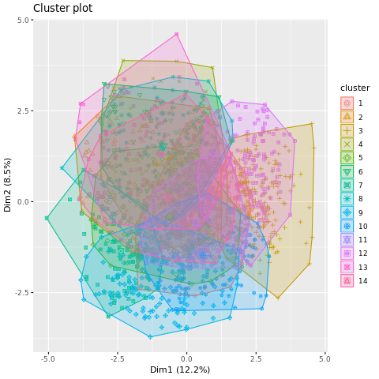
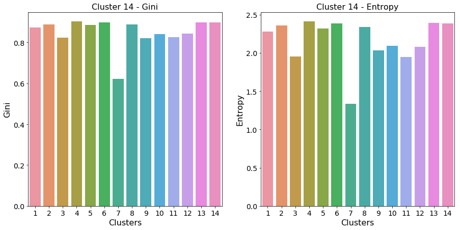
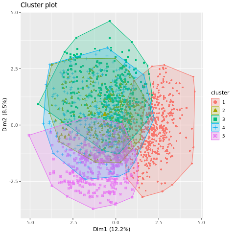
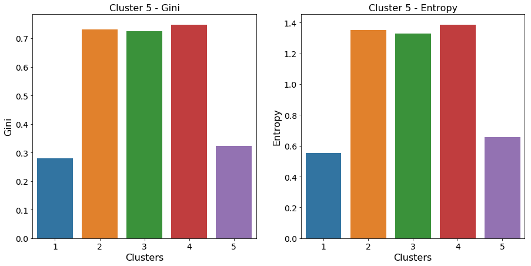
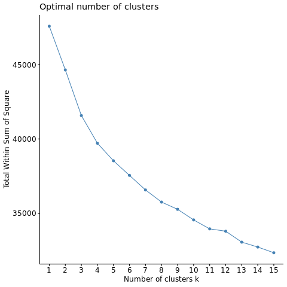
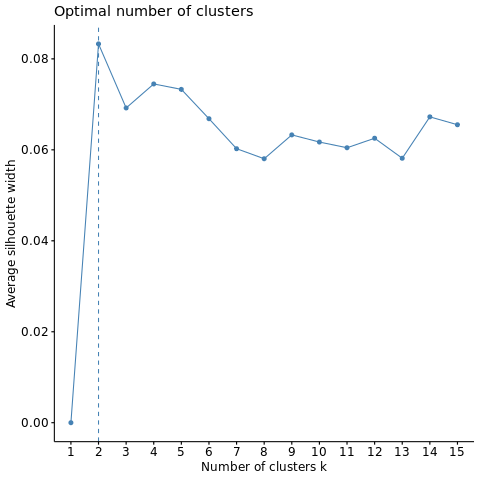
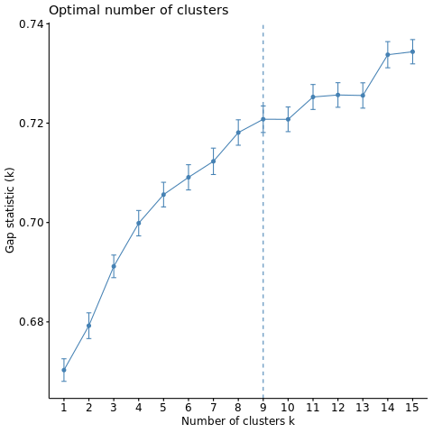
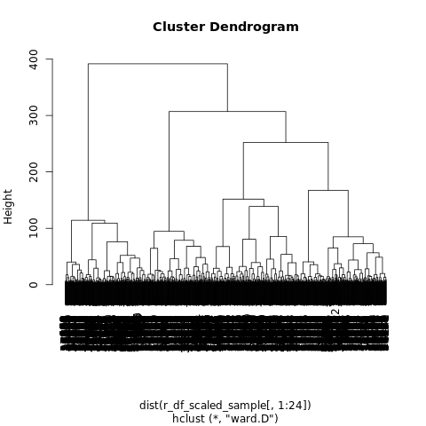

## Contents
{:.no_toc}
*  
{: toc}


```python
import requests
from IPython.core.display import HTML
styles = requests.get("https://raw.githubusercontent.com/Harvard-IACS/2018-CS109A/master/content/styles/cs109.css").text
HTML(styles)
```


<style>
blockquote { background: #AEDE94; }
h1 { 
    padding-top: 25px;
    padding-bottom: 25px;
    text-align: left; 
    padding-left: 10px;
    background-color: #DDDDDD; 
    color: black;
}
h2 { 
    padding-top: 10px;
    padding-bottom: 10px;
    text-align: left; 
    padding-left: 5px;
    background-color: #EEEEEE; 
    color: black;
}

div.exercise {
	background-color: #ffcccc;
	border-color: #E9967A; 	
	border-left: 5px solid #800080; 
	padding: 0.5em;
}

span.sub-q {
	font-weight: bold;
}
div.theme {
	background-color: #DDDDDD;
	border-color: #E9967A; 	
	border-left: 5px solid #800080; 
	padding: 0.5em;
	font-size: 18pt;
}
div.gc { 
	background-color: #AEDE94;
	border-color: #E9967A; 	 
	border-left: 5px solid #800080; 
	padding: 0.5em;
	font-size: 12pt;
}
p.q1 { 
    padding-top: 5px;
    padding-bottom: 5px;
    text-align: left; 
    padding-left: 5px;
    background-color: #EEEEEE; 
    color: black;
}
header {
   padding-top: 35px;
    padding-bottom: 35px;
    text-align: left; 
    padding-left: 10px;
    background-color: #DDDDDD; 
    color: black;
}
</style>


```python
import warnings
warnings.filterwarnings('ignore')

import os
os.environ['R_HOME'] = "/usr/share/anaconda3/lib/R"

import pandas as pd
from rpy2.robjects.packages import importr
r_utils = importr('utils')
import numpy as np
%matplotlib inline 
import matplotlib.pyplot as plt
r_ggplot2 = importr('ggplot2')
import IPython
import rpy2
from rpy2.robjects.lib.grdevices import render_to_bytesio
from rpy2.robjects import pandas2ri
pandas2ri.activate()
import rpy2.robjects.lib.ggplot2 as ggplot2
r_stats = importr('stats')
r_factoextra = importr('factoextra')
r_base = importr('base')
import scipy.cluster.hierarchy as hac
from scipy.spatial.distance import pdist
from sklearn.preprocessing import StandardScaler
```


```python
#RL
import gym
from gym.envs.registration import register
import seaborn as sns
import matplotlib.pyplot as plt
%matplotlib inline 
import sys
import pylab
import random
import numpy as np
from collections import deque
from keras.layers import Dense
from keras.optimizers import Adam
from keras.models import Sequential
#from tqdm import tqdm
from copy import deepcopy
import numpy.linalg as LA
```


    Using TensorFlow backend.


```python
pd.set_option('display.width', 500)
pd.set_option('display.max_columns', 100)
pd.set_option('display.notebook_repr_html', True)
import seaborn as sns
import math
```


In this assignment, you will be working with data collected from a motion capture camera system. The system was used to record 14 different users performing 5 distinct hand postures with markers attached to a left-handed glove. A set of markers on the back of the glove was used to establish a local coordinate system for the hand, and 8 additional markers were attached to the thumb and fingers of the glove. A total of 24 features were collected based on observations from the camera system. Two other variables in the dataset were the ID of the user and the posture that the user made.

These data have been preprocessed, including transformation to the local coordinate system of the record, removal of outliers, and removal of missing data.

The dataset `postures_clean.csv` contains 38,943 rows and 26 columns. Each row corresponds to a single frame as captured by the camera system. The data are represented in the following manner:

`Class (type: Integer). The hand posture of the given observation, with`

`1 = Fist (with thumb out)`

`2 = Stop (hand flat)`

`3 = Point1 (point with index finger)`

`4 = Point2 (point with index and middle fingers)`

`5 = Grab (fingers curled as if to grab)`

`User (type: Integer). The ID of the user that contributed the record.`

`X0, Y0, Z0, X1, Y1, Z1,..., X7, Y7, Z7 (type: Real). The x-coordinate, y-coordinate, and z-coordinate of the eight unlabeled marker positions.`


Start by reading the dataset into a pandas data frame.


```python
df = pd.read_csv("data/postures_clean.csv")
```


```python
df.shape
```


    (38943, 26)


```python
df.head()
```


<div>
<style scoped>
    .dataframe tbody tr th:only-of-type {
        vertical-align: middle;
    }

    .dataframe tbody tr th {
        vertical-align: top;
    }

    .dataframe thead th {
        text-align: right;
    }
</style>
<table border="1" class="dataframe">
  <thead>
    <tr style="text-align: right;">
      <th></th>
      <th>Class</th>
      <th>User</th>
      <th>X0</th>
      <th>Y0</th>
      <th>Z0</th>
      <th>X1</th>
      <th>Y1</th>
      <th>Z1</th>
      <th>X2</th>
      <th>Y2</th>
      <th>Z2</th>
      <th>X3</th>
      <th>Y3</th>
      <th>Z3</th>
      <th>X4</th>
      <th>Y4</th>
      <th>Z4</th>
      <th>X5</th>
      <th>Y5</th>
      <th>Z5</th>
      <th>X6</th>
      <th>Y6</th>
      <th>Z6</th>
      <th>X7</th>
      <th>Y7</th>
      <th>Z7</th>
    </tr>
  </thead>
  <tbody>
    <tr>
      <th>0</th>
      <td>1</td>
      <td>0</td>
      <td>72.692270</td>
      <td>50.023771</td>
      <td>-72.963253</td>
      <td>-11.593076</td>
      <td>81.234142</td>
      <td>-28.450210</td>
      <td>51.729995</td>
      <td>82.844469</td>
      <td>-55.674024</td>
      <td>86.175444</td>
      <td>74.250346</td>
      <td>-69.734298</td>
      <td>30.760697</td>
      <td>90.449170</td>
      <td>-47.909511</td>
      <td>10.028439</td>
      <td>88.967979</td>
      <td>-32.045120</td>
      <td>7.732511</td>
      <td>25.135415</td>
      <td>10.723395</td>
      <td>55.943868</td>
      <td>19.513363</td>
      <td>-70.380124</td>
    </tr>
    <tr>
      <th>1</th>
      <td>1</td>
      <td>0</td>
      <td>85.648015</td>
      <td>73.561022</td>
      <td>-71.838316</td>
      <td>31.595034</td>
      <td>90.217896</td>
      <td>-47.246688</td>
      <td>52.230858</td>
      <td>82.361548</td>
      <td>-55.975665</td>
      <td>74.817984</td>
      <td>50.129965</td>
      <td>-70.111828</td>
      <td>-8.906288</td>
      <td>81.516793</td>
      <td>-25.243914</td>
      <td>10.277516</td>
      <td>88.607958</td>
      <td>-32.037539</td>
      <td>56.308829</td>
      <td>18.774768</td>
      <td>-70.996523</td>
      <td>6.913199</td>
      <td>24.967750</td>
      <td>9.697553</td>
    </tr>
    <tr>
      <th>2</th>
      <td>1</td>
      <td>0</td>
      <td>-10.346977</td>
      <td>81.751331</td>
      <td>-25.587870</td>
      <td>33.414886</td>
      <td>91.985986</td>
      <td>-41.364447</td>
      <td>5.625100</td>
      <td>24.523349</td>
      <td>8.120352</td>
      <td>52.961965</td>
      <td>83.665278</td>
      <td>-52.519090</td>
      <td>75.209547</td>
      <td>52.059365</td>
      <td>-67.660208</td>
      <td>87.019172</td>
      <td>75.505188</td>
      <td>-67.462052</td>
      <td>56.807276</td>
      <td>20.950953</td>
      <td>-68.375831</td>
      <td>11.602112</td>
      <td>89.400536</td>
      <td>-29.062279</td>
    </tr>
    <tr>
      <th>3</th>
      <td>2</td>
      <td>0</td>
      <td>63.554969</td>
      <td>98.490988</td>
      <td>11.165920</td>
      <td>49.159831</td>
      <td>154.330730</td>
      <td>32.004168</td>
      <td>92.793124</td>
      <td>137.143202</td>
      <td>1.064904</td>
      <td>80.854870</td>
      <td>93.689656</td>
      <td>-5.062411</td>
      <td>95.207049</td>
      <td>73.672282</td>
      <td>-74.307346</td>
      <td>58.421362</td>
      <td>27.499634</td>
      <td>-71.713081</td>
      <td>12.660462</td>
      <td>95.077144</td>
      <td>29.664434</td>
      <td>84.110115</td>
      <td>151.545456</td>
      <td>16.891147</td>
    </tr>
    <tr>
      <th>4</th>
      <td>2</td>
      <td>0</td>
      <td>80.873812</td>
      <td>93.722537</td>
      <td>-4.988816</td>
      <td>63.572103</td>
      <td>98.476638</td>
      <td>11.242908</td>
      <td>49.142700</td>
      <td>154.347050</td>
      <td>32.076937</td>
      <td>95.211973</td>
      <td>73.665367</td>
      <td>-74.252339</td>
      <td>58.455933</td>
      <td>27.476873</td>
      <td>-71.629823</td>
      <td>20.573646</td>
      <td>132.913455</td>
      <td>35.349247</td>
      <td>92.942044</td>
      <td>137.182817</td>
      <td>1.297511</td>
      <td>35.480104</td>
      <td>99.739019</td>
      <td>22.802243</td>
    </tr>
  </tbody>
</table>
</div>


```python
df.describe()
```


<div>
<style scoped>
    .dataframe tbody tr th:only-of-type {
        vertical-align: middle;
    }

    .dataframe tbody tr th {
        vertical-align: top;
    }

    .dataframe thead th {
        text-align: right;
    }
</style>
<table border="1" class="dataframe">
  <thead>
    <tr style="text-align: right;">
      <th></th>
      <th>Class</th>
      <th>User</th>
      <th>X0</th>
      <th>Y0</th>
      <th>Z0</th>
      <th>X1</th>
      <th>Y1</th>
      <th>Z1</th>
      <th>X2</th>
      <th>Y2</th>
      <th>Z2</th>
      <th>X3</th>
      <th>Y3</th>
      <th>Z3</th>
      <th>X4</th>
      <th>Y4</th>
      <th>Z4</th>
      <th>X5</th>
      <th>Y5</th>
      <th>Z5</th>
      <th>X6</th>
      <th>Y6</th>
      <th>Z6</th>
      <th>X7</th>
      <th>Y7</th>
      <th>Z7</th>
    </tr>
  </thead>
  <tbody>
    <tr>
      <th>count</th>
      <td>38943.000000</td>
      <td>38943.000000</td>
      <td>38943.000000</td>
      <td>38943.000000</td>
      <td>38943.000000</td>
      <td>38943.000000</td>
      <td>38943.000000</td>
      <td>38943.000000</td>
      <td>38943.000000</td>
      <td>38943.000000</td>
      <td>38943.000000</td>
      <td>38943.000000</td>
      <td>38943.000000</td>
      <td>38943.000000</td>
      <td>38943.000000</td>
      <td>38943.000000</td>
      <td>38943.000000</td>
      <td>38943.000000</td>
      <td>38943.000000</td>
      <td>38943.000000</td>
      <td>38943.000000</td>
      <td>38943.000000</td>
      <td>38943.000000</td>
      <td>38943.000000</td>
      <td>38943.000000</td>
      <td>38943.000000</td>
    </tr>
    <tr>
      <th>mean</th>
      <td>3.533986</td>
      <td>8.149501</td>
      <td>51.392252</td>
      <td>93.748418</td>
      <td>-18.956761</td>
      <td>48.644293</td>
      <td>97.228337</td>
      <td>-16.921813</td>
      <td>46.432265</td>
      <td>97.351512</td>
      <td>-16.904324</td>
      <td>45.711065</td>
      <td>96.185464</td>
      <td>-17.168105</td>
      <td>45.228325</td>
      <td>95.137392</td>
      <td>-18.446645</td>
      <td>45.392642</td>
      <td>93.295433</td>
      <td>-19.125065</td>
      <td>45.201114</td>
      <td>90.839851</td>
      <td>-19.920157</td>
      <td>44.463433</td>
      <td>88.463343</td>
      <td>-20.368719</td>
    </tr>
    <tr>
      <th>std</th>
      <td>1.332452</td>
      <td>4.587195</td>
      <td>34.070402</td>
      <td>40.145995</td>
      <td>34.976568</td>
      <td>34.922596</td>
      <td>38.076977</td>
      <td>34.671422</td>
      <td>36.395332</td>
      <td>37.470755</td>
      <td>34.913639</td>
      <td>36.920362</td>
      <td>38.079625</td>
      <td>35.175585</td>
      <td>37.062802</td>
      <td>39.067869</td>
      <td>35.597032</td>
      <td>37.104094</td>
      <td>39.746619</td>
      <td>35.602273</td>
      <td>37.556616</td>
      <td>40.227409</td>
      <td>34.827888</td>
      <td>38.378395</td>
      <td>40.503378</td>
      <td>33.943957</td>
    </tr>
    <tr>
      <th>min</th>
      <td>1.000000</td>
      <td>0.000000</td>
      <td>-108.552738</td>
      <td>-67.157904</td>
      <td>-120.284665</td>
      <td>-111.685241</td>
      <td>-65.758453</td>
      <td>-120.290858</td>
      <td>-99.917453</td>
      <td>-64.830342</td>
      <td>-121.106421</td>
      <td>-111.761053</td>
      <td>-65.370078</td>
      <td>-118.154497</td>
      <td>-99.107635</td>
      <td>-64.843724</td>
      <td>-157.199089</td>
      <td>-99.014815</td>
      <td>-64.282645</td>
      <td>-118.328399</td>
      <td>-100.084275</td>
      <td>-67.283707</td>
      <td>-153.449813</td>
      <td>-108.605639</td>
      <td>-64.972157</td>
      <td>-113.733105</td>
    </tr>
    <tr>
      <th>25%</th>
      <td>2.000000</td>
      <td>5.000000</td>
      <td>28.169252</td>
      <td>74.946345</td>
      <td>-43.598807</td>
      <td>22.574182</td>
      <td>79.747406</td>
      <td>-41.210343</td>
      <td>17.617698</td>
      <td>81.302159</td>
      <td>-41.938023</td>
      <td>16.154549</td>
      <td>80.399014</td>
      <td>-43.171364</td>
      <td>15.711050</td>
      <td>78.918900</td>
      <td>-45.169035</td>
      <td>15.849890</td>
      <td>76.376404</td>
      <td>-46.363837</td>
      <td>15.132050</td>
      <td>68.915784</td>
      <td>-46.547792</td>
      <td>13.081363</td>
      <td>63.541846</td>
      <td>-45.676522</td>
    </tr>
    <tr>
      <th>50%</th>
      <td>4.000000</td>
      <td>9.000000</td>
      <td>54.596564</td>
      <td>93.966079</td>
      <td>-15.041397</td>
      <td>52.960933</td>
      <td>96.690641</td>
      <td>-12.046916</td>
      <td>51.184849</td>
      <td>97.222693</td>
      <td>-12.133026</td>
      <td>50.458306</td>
      <td>97.243531</td>
      <td>-12.799918</td>
      <td>50.099394</td>
      <td>97.515842</td>
      <td>-14.823751</td>
      <td>50.160084</td>
      <td>97.040377</td>
      <td>-16.010237</td>
      <td>49.968499</td>
      <td>95.562441</td>
      <td>-17.101080</td>
      <td>49.601058</td>
      <td>93.796334</td>
      <td>-19.428819</td>
    </tr>
    <tr>
      <th>75%</th>
      <td>5.000000</td>
      <td>12.000000</td>
      <td>77.390834</td>
      <td>130.932659</td>
      <td>7.998678</td>
      <td>75.560564</td>
      <td>131.729311</td>
      <td>9.065824</td>
      <td>74.435194</td>
      <td>130.794462</td>
      <td>9.781498</td>
      <td>74.229806</td>
      <td>129.222213</td>
      <td>9.926760</td>
      <td>73.093324</td>
      <td>128.292543</td>
      <td>9.382799</td>
      <td>73.761617</td>
      <td>126.844621</td>
      <td>9.031498</td>
      <td>74.558859</td>
      <td>123.069653</td>
      <td>7.767866</td>
      <td>75.721811</td>
      <td>119.188963</td>
      <td>6.591351</td>
    </tr>
    <tr>
      <th>max</th>
      <td>5.000000</td>
      <td>14.000000</td>
      <td>160.850926</td>
      <td>169.175464</td>
      <td>113.345119</td>
      <td>158.783454</td>
      <td>170.209350</td>
      <td>104.697852</td>
      <td>163.547310</td>
      <td>168.186466</td>
      <td>104.590879</td>
      <td>146.986668</td>
      <td>168.292018</td>
      <td>114.624261</td>
      <td>172.275978</td>
      <td>168.258643</td>
      <td>119.237203</td>
      <td>180.563322</td>
      <td>167.926171</td>
      <td>110.898899</td>
      <td>176.409004</td>
      <td>168.598384</td>
      <td>117.914907</td>
      <td>189.221529</td>
      <td>169.127359</td>
      <td>117.815967</td>
    </tr>
  </tbody>
</table>
</div>


## k-means

(a) After appropriate pre-processing, run the k-means clustering algorithm, using the function `r_stats.kmeans`, with the number of clusters corresponding to the number of users, `n_start` of 46, and 109 as the random seed. Add the result as a new column called `Cluster14` to your data frame.


```python
## Standardize features
scaler = StandardScaler()
df_scaled = scaler.fit_transform(df.iloc[:,2:26])
df_scaled = pd.DataFrame(df_scaled)
df_scaled.describe()
```


<div>
<style scoped>
    .dataframe tbody tr th:only-of-type {
        vertical-align: middle;
    }

    .dataframe tbody tr th {
        vertical-align: top;
    }

    .dataframe thead th {
        text-align: right;
    }
</style>
<table border="1" class="dataframe">
  <thead>
    <tr style="text-align: right;">
      <th></th>
      <th>0</th>
      <th>1</th>
      <th>2</th>
      <th>3</th>
      <th>4</th>
      <th>5</th>
      <th>6</th>
      <th>7</th>
      <th>8</th>
      <th>9</th>
      <th>10</th>
      <th>11</th>
      <th>12</th>
      <th>13</th>
      <th>14</th>
      <th>15</th>
      <th>16</th>
      <th>17</th>
      <th>18</th>
      <th>19</th>
      <th>20</th>
      <th>21</th>
      <th>22</th>
      <th>23</th>
    </tr>
  </thead>
  <tbody>
    <tr>
      <th>count</th>
      <td>3.894300e+04</td>
      <td>3.894300e+04</td>
      <td>3.894300e+04</td>
      <td>3.894300e+04</td>
      <td>3.894300e+04</td>
      <td>3.894300e+04</td>
      <td>3.894300e+04</td>
      <td>3.894300e+04</td>
      <td>3.894300e+04</td>
      <td>3.894300e+04</td>
      <td>3.894300e+04</td>
      <td>3.894300e+04</td>
      <td>3.894300e+04</td>
      <td>3.894300e+04</td>
      <td>3.894300e+04</td>
      <td>3.894300e+04</td>
      <td>3.894300e+04</td>
      <td>3.894300e+04</td>
      <td>3.894300e+04</td>
      <td>3.894300e+04</td>
      <td>3.894300e+04</td>
      <td>3.894300e+04</td>
      <td>3.894300e+04</td>
      <td>3.894300e+04</td>
    </tr>
    <tr>
      <th>mean</th>
      <td>2.015467e-16</td>
      <td>-6.143673e-17</td>
      <td>3.177405e-16</td>
      <td>-3.673090e-17</td>
      <td>-1.722196e-16</td>
      <td>-3.843577e-16</td>
      <td>1.415981e-16</td>
      <td>-4.217610e-17</td>
      <td>-2.537437e-16</td>
      <td>-1.182643e-16</td>
      <td>6.086370e-17</td>
      <td>-2.291519e-16</td>
      <td>-3.631068e-16</td>
      <td>-1.343718e-16</td>
      <td>-2.843509e-16</td>
      <td>-2.246304e-16</td>
      <td>-6.313016e-17</td>
      <td>-5.918310e-17</td>
      <td>2.033256e-16</td>
      <td>2.352286e-16</td>
      <td>4.820004e-17</td>
      <td>-3.537373e-16</td>
      <td>3.806226e-17</td>
      <td>-2.299430e-16</td>
    </tr>
    <tr>
      <th>std</th>
      <td>1.000013e+00</td>
      <td>1.000013e+00</td>
      <td>1.000013e+00</td>
      <td>1.000013e+00</td>
      <td>1.000013e+00</td>
      <td>1.000013e+00</td>
      <td>1.000013e+00</td>
      <td>1.000013e+00</td>
      <td>1.000013e+00</td>
      <td>1.000013e+00</td>
      <td>1.000013e+00</td>
      <td>1.000013e+00</td>
      <td>1.000013e+00</td>
      <td>1.000013e+00</td>
      <td>1.000013e+00</td>
      <td>1.000013e+00</td>
      <td>1.000013e+00</td>
      <td>1.000013e+00</td>
      <td>1.000013e+00</td>
      <td>1.000013e+00</td>
      <td>1.000013e+00</td>
      <td>1.000013e+00</td>
      <td>1.000013e+00</td>
      <td>1.000013e+00</td>
    </tr>
    <tr>
      <th>min</th>
      <td>-4.694604e+00</td>
      <td>-4.008081e+00</td>
      <td>-2.897060e+00</td>
      <td>-4.591056e+00</td>
      <td>-4.280510e+00</td>
      <td>-2.981429e+00</td>
      <td>-4.021164e+00</td>
      <td>-4.328281e+00</td>
      <td>-2.984605e+00</td>
      <td>-4.265238e+00</td>
      <td>-4.242626e+00</td>
      <td>-2.870960e+00</td>
      <td>-3.894412e+00</td>
      <td>-4.095006e+00</td>
      <td>-3.897916e+00</td>
      <td>-3.892005e+00</td>
      <td>-3.964616e+00</td>
      <td>-2.786468e+00</td>
      <td>-3.868486e+00</td>
      <td>-3.930792e+00</td>
      <td>-3.834036e+00</td>
      <td>-3.988469e+00</td>
      <td>-3.788264e+00</td>
      <td>-2.750580e+00</td>
    </tr>
    <tr>
      <th>25%</th>
      <td>-6.816268e-01</td>
      <td>-4.683485e-01</td>
      <td>-7.045392e-01</td>
      <td>-7.465208e-01</td>
      <td>-4.591004e-01</td>
      <td>-7.005436e-01</td>
      <td>-7.917207e-01</td>
      <td>-4.283223e-01</td>
      <td>-7.170270e-01</td>
      <td>-8.005581e-01</td>
      <td>-4.145696e-01</td>
      <td>-7.392512e-01</td>
      <td>-7.964226e-01</td>
      <td>-4.151417e-01</td>
      <td>-7.507012e-01</td>
      <td>-7.962230e-01</td>
      <td>-4.256776e-01</td>
      <td>-7.650950e-01</td>
      <td>-8.006432e-01</td>
      <td>-5.450102e-01</td>
      <td>-7.645590e-01</td>
      <td>-8.177120e-01</td>
      <td>-6.153022e-01</td>
      <td>-7.455857e-01</td>
    </tr>
    <tr>
      <th>50%</th>
      <td>9.405094e-02</td>
      <td>5.421821e-03</td>
      <td>1.119439e-01</td>
      <td>1.236075e-01</td>
      <td>-1.412148e-02</td>
      <td>1.406046e-01</td>
      <td>1.305839e-01</td>
      <td>-3.437901e-03</td>
      <td>1.366618e-01</td>
      <td>1.285822e-01</td>
      <td>2.778599e-02</td>
      <td>1.241840e-01</td>
      <td>1.314291e-01</td>
      <td>6.088072e-02</td>
      <td>1.017765e-01</td>
      <td>1.284899e-01</td>
      <td>9.422165e-02</td>
      <td>8.749071e-02</td>
      <td>1.269402e-01</td>
      <td>1.173988e-01</td>
      <td>8.094412e-02</td>
      <td>1.338694e-01</td>
      <td>1.316695e-01</td>
      <td>2.769013e-02</td>
    </tr>
    <tr>
      <th>75%</th>
      <td>7.630939e-01</td>
      <td>9.262373e-01</td>
      <td>7.706813e-01</td>
      <td>7.707507e-01</td>
      <td>9.060965e-01</td>
      <td>7.495502e-01</td>
      <td>7.694198e-01</td>
      <td>8.925195e-01</td>
      <td>7.643478e-01</td>
      <td>7.724493e-01</td>
      <td>8.675814e-01</td>
      <td>7.702847e-01</td>
      <td>7.518416e-01</td>
      <td>8.486661e-01</td>
      <td>7.818011e-01</td>
      <td>7.645879e-01</td>
      <td>8.440873e-01</td>
      <td>7.908744e-01</td>
      <td>7.817031e-01</td>
      <td>8.012004e-01</td>
      <td>7.950059e-01</td>
      <td>8.144890e-01</td>
      <td>7.586037e-01</td>
      <td>7.942627e-01</td>
    </tr>
    <tr>
      <th>max</th>
      <td>3.212762e+00</td>
      <td>1.878843e+00</td>
      <td>3.782635e+00</td>
      <td>3.153848e+00</td>
      <td>1.916695e+00</td>
      <td>3.507823e+00</td>
      <td>3.217900e+00</td>
      <td>1.890431e+00</td>
      <td>3.479923e+00</td>
      <td>2.743118e+00</td>
      <td>1.893597e+00</td>
      <td>3.746748e+00</td>
      <td>3.427946e+00</td>
      <td>1.871671e+00</td>
      <td>3.867896e+00</td>
      <td>3.643059e+00</td>
      <td>1.877687e+00</td>
      <td>3.652172e+00</td>
      <td>3.493647e+00</td>
      <td>1.932999e+00</td>
      <td>3.957657e+00</td>
      <td>3.771913e+00</td>
      <td>1.991564e+00</td>
      <td>4.071018e+00</td>
    </tr>
  </tbody>
</table>
</div>


```python
## R dataframe
r_df_scaled = pandas2ri.py2ri(df_scaled)
r_df_scaled
```


    <span>R/rpy2 DataFrame (38943 x 24)</span>
    <table>
      <thead>
        <tr>
        
          <th>X0</th>
        
          <th>X1</th>
        
          <th>X2</th>
        
          <th>...</th>
        
          <th>X21</th>
        
          <th>X22</th>
        
          <th>X23</th>
        
        </tr>
      </thead>
      <tbody>
      
      <tr>
      
      <td>
        0.625185
      </td>
      
      <td>
        -1.089155
      </td>
      
      <td>
        -1.544096
      </td>
      
      <td>
        ...
      </td>
      
      <td>
        0.299142
      </td>
      
      <td>
        -1.702348
      </td>
      
      <td>
        -1.473371
      </td>
      
      </tr>
      
      <tr>
      
      <td>
        1.005453
      </td>
      
      <td>
        -0.502856
      </td>
      
      <td>
        -1.511933
      </td>
      
      <td>
        ...
      </td>
      
      <td>
        -0.978434
      </td>
      
      <td>
        -1.567682
      </td>
      
      <td>
        0.885774
      </td>
      
      </tr>
      
      <tr>
      
      <td>
        -1.812131
      </td>
      
      <td>
        -0.298840
      </td>
      
      <td>
        -0.189590
      </td>
      
      <td>
        ...
      </td>
      
      <td>
        -0.856256
      </td>
      
      <td>
        0.023139
      </td>
      
      <td>
        -0.256118
      </td>
      
      </tr>
      
      <tr>
      
      <td>
        0.356992
      </td>
      
      <td>
        0.118135
      </td>
      
      <td>
        0.861236
      </td>
      
      <td>
        ...
      </td>
      
      <td>
        1.033060
      </td>
      
      <td>
        1.557473
      </td>
      
      <td>
        1.097702
      </td>
      
      </tr>
      
      <tr>
      
      <td>
        ...
      </td>
      
      <td>
        ...
      </td>
      
      <td>
        ...
      </td>
      
      <td>
        ...
      </td>
      
      <td>
        ...
      </td>
      
      <td>
        ...
      </td>
      
      <td>
        ...
      </td>
      
      </tr>
      
      <tr>
      
      <td>
        0.086370
      </td>
      
      <td>
        0.884419
      </td>
      
      <td>
        -0.716476
      </td>
      
      <td>
        ...
      </td>
      
      <td>
        0.441050
      </td>
      
      <td>
        0.321087
      </td>
      
      <td>
        0.423744
      </td>
      
      </tr>
      
      <tr>
      
      <td>
        0.080989
      </td>
      
      <td>
        0.884809
      </td>
      
      <td>
        -0.720964
      </td>
      
      <td>
        ...
      </td>
      
      <td>
        1.142001
      </td>
      
      <td>
        -0.693792
      </td>
      
      <td>
        -1.247661
      </td>
      
      </tr>
      
      <tr>
      
      <td>
        -0.689080
      </td>
      
      <td>
        0.355183
      </td>
      
      <td>
        0.851201
      </td>
      
      <td>
        ...
      </td>
      
      <td>
        -1.199775
      </td>
      
      <td>
        0.235886
      </td>
      
      <td>
        0.700075
      </td>
      
      </tr>
      
      <tr>
      
      <td>
        -0.689568
      </td>
      
      <td>
        0.357312
      </td>
      
      <td>
        0.859576
      </td>
      
      <td>
        ...
      </td>
      
      <td>
        0.442723
      </td>
      
      <td>
        0.321039
      </td>
      
      <td>
        0.413228
      </td>
      
      </tr>
      
      </tbody>
    </table>
    


```python
## Random seed: 109
r_base.set_seed(109)

## n_start: 46
n_start = 46

## Number of clusters = number of users
num_clusters = len(df.User.unique())

## K-means clustering
r_km_out = r_stats.kmeans(r_df_scaled, centers=num_clusters, nstart=n_start)
display(r_km_out)
```


    <span>ListVector with 9 elements.</span>
    <table>
      <tbody>
      
      <tr>
      <th>
        cluster
      </th>
      <td>
        
    <span>IntVector with 38943 elements.</span>
    <table>
      <tbody>
      <tr>
      
      <td>
        7
      </td>
      
      <td>
        7
      </td>
      
      <td>
        13
      </td>
      
      <td>
        14
      </td>
      
      <td>
        ...
      </td>
      
      <td>
        11
      </td>
      
      <td>
        11
      </td>
      
      <td>
        11
      </td>
      
      <td>
        11
      </td>
      
      </tr>
      </tbody>
    </table>
    
      </td>
      </tr>
      
      <tr>
      <th>
        centers
      </th>
      <td>
        
    <span>Matrix with 336 elements.</span>
    <table>
      <tbody>
      <tr>
      
      <td>
        0.081509
      </td>
      
      <td>
        -0.086356
      </td>
      
      <td>
        -0.106401
      </td>
      
      <td>
        -0.055932
      </td>
      
      <td>
        ...
      </td>
      
      <td>
        -0.186538
      </td>
      
      <td>
        -0.705165
      </td>
      
      <td>
        0.042306
      </td>
      
      <td>
        0.425519
      </td>
      
      </tr>
      </tbody>
    </table>
    
      </td>
      </tr>
      
      <tr>
      <th>
        totss
      </th>
      <td>
        
    <span>FloatVector with 1 elements.</span>
    <table>
      <tbody>
      <tr>
      
      <td>
        934632.000000
      </td>
      
      </tr>
      </tbody>
    </table>
    
      </td>
      </tr>
      
      <tr>
      <th>
        ...
      </th>
      <td>
        ...
      </td>
      </tr>
      
      <tr>
      <th>
        size
      </th>
      <td>
        
    <span>IntVector with 14 elements.</span>
    <table>
      <tbody>
      <tr>
      
      <td>
        2,716
      </td>
      
      <td>
        1,939
      </td>
      
      <td>
        4,305
      </td>
      
      <td>
        2,698
      </td>
      
      <td>
        ...
      </td>
      
      <td>
        3,775
      </td>
      
      <td>
        3,014
      </td>
      
      <td>
        2,410
      </td>
      
      <td>
        2,870
      </td>
      
      </tr>
      </tbody>
    </table>
    
      </td>
      </tr>
      
      <tr>
      <th>
        iter
      </th>
      <td>
        
    <span>IntVector with 1 elements.</span>
    <table>
      <tbody>
      <tr>
      
      <td>
        7
      </td>
      
      </tr>
      </tbody>
    </table>
    
      </td>
      </tr>
      
      <tr>
      <th>
        ifault
      </th>
      <td>
        
    <span>IntVector with 1 elements.</span>
    <table>
      <tbody>
      <tr>
      
      <td>
        0
      </td>
      
      </tr>
      </tbody>
    </table>
    
      </td>
      </tr>
      
      </tbody>
    </table>
    


```python
## Add label column Cluster14 to data frame
df_scaled['Cluster14'] = list(r_km_out.rx2("cluster"))
```


(b) Now visualize the results for k-means on a random sample of 2,000 observations without replacement (setting 109 as the random seed when sampling), using the function `r_factoextra.fviz_cluster`. Does 14 clusters seem to make sense?


```python
## 2000 observations without replacement 
df_scaled_sample = df_scaled.sample(n=2000, replace=False, random_state=109)

## R dataframe
r_df_scaled_sample = pandas2ri.py2ri(df_scaled_sample)
r_df_scaled_sample
```


    <span>R/rpy2 DataFrame (2000 x 25)</span>
    <table>
      <thead>
        <tr>
        
          <th>X0</th>
        
          <th>X1</th>
        
          <th>X2</th>
        
          <th>...</th>
        
          <th>X22</th>
        
          <th>X23</th>
        
          <th>Cluster14</th>
        
        </tr>
      </thead>
      <tbody>
      
      <tr>
      
      <td>
        0.985718
      </td>
      
      <td>
        1.031487
      </td>
      
      <td>
        0.547087
      </td>
      
      <td>
        ...
      </td>
      
      <td>
        1.446258
      </td>
      
      <td>
        1.217986
      </td>
      
      <td>
        5
      </td>
      
      </tr>
      
      <tr>
      
      <td>
        1.351375
      </td>
      
      <td>
        -0.509183
      </td>
      
      <td>
        -1.483759
      </td>
      
      <td>
        ...
      </td>
      
      <td>
        1.095285
      </td>
      
      <td>
        1.630480
      </td>
      
      <td>
        10
      </td>
      
      </tr>
      
      <tr>
      
      <td>
        0.445920
      </td>
      
      <td>
        -1.179817
      </td>
      
      <td>
        -1.893615
      </td>
      
      <td>
        ...
      </td>
      
      <td>
        -1.650509
      </td>
      
      <td>
        -1.679090
      </td>
      
      <td>
        8
      </td>
      
      </tr>
      
      <tr>
      
      <td>
        0.278724
      </td>
      
      <td>
        0.121627
      </td>
      
      <td>
        0.590800
      </td>
      
      <td>
        ...
      </td>
      
      <td>
        0.365422
      </td>
      
      <td>
        0.776165
      </td>
      
      <td>
        11
      </td>
      
      </tr>
      
      <tr>
      
      <td>
        ...
      </td>
      
      <td>
        ...
      </td>
      
      <td>
        ...
      </td>
      
      <td>
        ...
      </td>
      
      <td>
        ...
      </td>
      
      <td>
        ...
      </td>
      
      <td>
        ...
      </td>
      
      </tr>
      
      <tr>
      
      <td>
        0.275549
      </td>
      
      <td>
        0.134500
      </td>
      
      <td>
        0.538127
      </td>
      
      <td>
        ...
      </td>
      
      <td>
        1.171161
      </td>
      
      <td>
        -0.003651
      </td>
      
      <td>
        1
      </td>
      
      </tr>
      
      <tr>
      
      <td>
        -2.071662
      </td>
      
      <td>
        -0.195068
      </td>
      
      <td>
        -0.183773
      </td>
      
      <td>
        ...
      </td>
      
      <td>
        -0.555706
      </td>
      
      <td>
        -0.824556
      </td>
      
      <td>
        8
      </td>
      
      </tr>
      
      <tr>
      
      <td>
        0.921307
      </td>
      
      <td>
        -3.208581
      </td>
      
      <td>
        -0.765252
      </td>
      
      <td>
        ...
      </td>
      
      <td>
        -0.373317
      </td>
      
      <td>
        -1.111531
      </td>
      
      <td>
        7
      </td>
      
      </tr>
      
      <tr>
      
      <td>
        0.617466
      </td>
      
      <td>
        -0.184004
      </td>
      
      <td>
        0.303573
      </td>
      
      <td>
        ...
      </td>
      
      <td>
        -1.739946
      </td>
      
      <td>
        -1.163062
      </td>
      
      <td>
        1
      </td>
      
      </tr>
      
      </tbody>
    </table>
    


```python
%load_ext rpy2.ipython
```


```python
%%R -i r_df_scaled_sample
fviz_cluster(object = list(data = r_df_scaled_sample[,1:24], cluster = r_df_scaled_sample[,25]), geom = "point")
```





- Q: Does 14 clusters seem to make sense?
- A: It does not make much sense. There is no visible data seperation by running the clustering analysis. Since the data has 5 distinct hand postures, 5 clusters might make more sense, instead of 14 users.

(c) Compare the results from your clustering algorithm to the actual users for the entire dataset. To do this :

(i) calculate the Gini coefficient for each cluster, and also report the average Gini coefficient for the clustering method. For $K$ total labels, the Gini coefficient for each cluster is given by $$1 - \sum_{i=1}^K p_i^2,$$ where $p_i$ is the proportion of data point with label $i$ in the cluster (given that there are also $K$ clusters, e.g., 14 people and 14 clusters). 

(ii) calculate the entropy of each cluster, where entropy is defined as $$-\sum_{i=1}^K p_i \log p_i,$$ and also report the average entropy.

Hint: be careful, because r_stats.kmeans returns cluster numbers beginning with 1.


```python
## Results for 14 clusters 
df_km_14 = df[['User']].merge(df_scaled[['Cluster14']], left_index=True, right_index=True)
```


```python
## Gini function 
def gini(df, label_col, cluster_col):
    # return a list of gini coefficient per cluster 
    cluster_list = df[cluster_col].unique()
    results = [None] * len(cluster_list)
    
    # loop through each cluster
    for cluster in cluster_list:
        # cluster filter
        df_temp = df[df[cluster_col] == cluster]
        
        # sum up squared portion per label
        sum_pi = 0
        for label in df[label_col].unique():
            pi = df_temp[df_temp[label_col]==label].shape[0] / df_temp.shape[0]         
            sum_pi += pi**2
        
        results[cluster - 1] = 1 - sum_pi
    
    return results
```


```python
## Gini coefficient for cluster 14
km_14_gini = gini(df_km_14, label_col='User', cluster_col='Cluster14')

## Average Gini
print("The average Gini coefficient for 14 clusters: %.4f" % np.mean(km_14_gini))
```


    The average Gini coefficient for 14 clusters: 0.8507


```python
## Entropy function 
def entropy(df, label_col, cluster_col):
    # return a list of gini coefficient per cluster 
    cluster_list = df[cluster_col].unique()
    results = [None] * len(cluster_list)
    
    # loop through each cluster
    for cluster in cluster_list:
        # cluster filter
        df_temp = df[df[cluster_col] == cluster]
        
        # sum up squared portion per label
        sum_pi = 0
        for label in df[label_col].unique():
            pi = df_temp[df_temp[label_col]==label].shape[0] / df_temp.shape[0]  
            
            if pi != 0: 
                sum_pi += pi*(np.log(pi))
        
        results[cluster - 1] = -sum_pi
    
    return results
```


```python
## Entropy coefficient for cluster 14
km_14_entropy = entropy(df_km_14, label_col='User', cluster_col='Cluster14')

## Average Entropy
print("The average Entropy for 14 clusters: %.4f" % np.mean(km_14_entropy))
```


    The average Entropy for 14 clusters: 2.1669


```python
## Prepare for plot
km_14_gini_df = pd.DataFrame({'Gini': km_14_gini})
km_14_gini_df['Cluster'] = range(1, 15)
km_14_entropy_df = pd.DataFrame({'Entropy': km_14_entropy})
km_14_entropy_df['Cluster'] = range(1, 15)

## Plot Gini and Entropy for cluster 14
fig, ax = plt.subplots(1, 2, figsize=(15,7))

g1 = sns.barplot(km_14_gini_df['Cluster'], km_14_gini_df['Gini'], data=km_14_gini_df, ax=ax[0])
g1.set_title('Cluster 14 - Gini', fontsize=16)
g1.set_xlabel('Clusters', fontsize=16)
g1.set_ylabel('Gini', fontsize=16)
g1.tick_params(labelsize=14)

g2 = sns.barplot(km_14_entropy_df['Cluster'], km_14_entropy_df['Entropy'], data=km_14_entropy_df, ax=ax[1])
g2.set_title('Cluster 14 - Entropy', fontsize=16)
g2.set_xlabel('Clusters', fontsize=16)
g2.set_ylabel('Entropy', fontsize=16)
g2.tick_params(labelsize=14)
```





As we can see from above two bar charts of Gini coefficient and Entropy, most clusters can't separate the data well, except for cluster 7. 

(d) Repeat all of the above steps, but group by posture rather than by user. That is : 

(i) Run the k-means algorithm with 5 centroids instead of 14, creating a variable named `Cluster5` and adding it to the dataset. 

(ii) Visualize the results for k-means on a random sample of 2,000 observations without replacement (setting 109 as the random seed when sampling), using the function `r_factoextra.fviz_cluster`. Does 5 clusters seem to make sense?

(iii) Calculate the Gini coefficient for each cluster, and also report the average Gini coefficient.

(iv) Calculate the entropy of each cluster, and also report the average entropy. 


```python
## Random seed: 109
r_base.set_seed(109)

## n_start: 46
n_start = 46

## Number of clusters = number of users
num_clusters = len(df.Class.unique())

## K-means clustering
r_km_out = r_stats.kmeans(r_df_scaled, centers=num_clusters, nstart=n_start)
display(r_km_out)
```


    <span>ListVector with 9 elements.</span>
    <table>
      <tbody>
      
      <tr>
      <th>
        cluster
      </th>
      <td>
        
    <span>IntVector with 38943 elements.</span>
    <table>
      <tbody>
      <tr>
      
      <td>
        4
      </td>
      
      <td>
        4
      </td>
      
      <td>
        2
      </td>
      
      <td>
        2
      </td>
      
      <td>
        ...
      </td>
      
      <td>
        5
      </td>
      
      <td>
        3
      </td>
      
      <td>
        5
      </td>
      
      <td>
        5
      </td>
      
      </tr>
      </tbody>
    </table>
    
      </td>
      </tr>
      
      <tr>
      <th>
        centers
      </th>
      <td>
        
    <span>Matrix with 120 elements.</span>
    <table>
      <tbody>
      <tr>
      
      <td>
        -0.025525
      </td>
      
      <td>
        -0.044100
      </td>
      
      <td>
        -0.047838
      </td>
      
      <td>
        -0.025743
      </td>
      
      <td>
        ...
      </td>
      
      <td>
        0.294148
      </td>
      
      <td>
        -1.111322
      </td>
      
      <td>
        -0.041317
      </td>
      
      <td>
        -0.000379
      </td>
      
      </tr>
      </tbody>
    </table>
    
      </td>
      </tr>
      
      <tr>
      <th>
        totss
      </th>
      <td>
        
    <span>FloatVector with 1 elements.</span>
    <table>
      <tbody>
      <tr>
      
      <td>
        934632.000000
      </td>
      
      </tr>
      </tbody>
    </table>
    
      </td>
      </tr>
      
      <tr>
      <th>
        ...
      </th>
      <td>
        ...
      </td>
      </tr>
      
      <tr>
      <th>
        size
      </th>
      <td>
        
    <span>IntVector with 5 elements.</span>
    <table>
      <tbody>
      <tr>
      
      <td>
        9,393
      </td>
      
      <td>
        6,171
      </td>
      
      <td>
        7,475
      </td>
      
      <td>
        7,016
      </td>
      
      <td>
        8,888
      </td>
      
      </tr>
      </tbody>
    </table>
    
      </td>
      </tr>
      
      <tr>
      <th>
        iter
      </th>
      <td>
        
    <span>IntVector with 1 elements.</span>
    <table>
      <tbody>
      <tr>
      
      <td>
        7
      </td>
      
      </tr>
      </tbody>
    </table>
    
      </td>
      </tr>
      
      <tr>
      <th>
        ifault
      </th>
      <td>
        
    <span>IntVector with 1 elements.</span>
    <table>
      <tbody>
      <tr>
      
      <td>
        0
      </td>
      
      </tr>
      </tbody>
    </table>
    
      </td>
      </tr>
      
      </tbody>
    </table>
    


```python
## Add label column Cluster14 to data frame
df_scaled['Cluster5'] = list(r_km_out.rx2("cluster"))
```


```python
## 2000 observations without replacement 
df_scaled_sample = df_scaled.sample(n=2000, replace=False, random_state=109)

## R dataframe
r_df_scaled_sample = pandas2ri.py2ri(df_scaled_sample)
r_df_scaled_sample
```


    <span>R/rpy2 DataFrame (2000 x 26)</span>
    <table>
      <thead>
        <tr>
        
          <th>X0</th>
        
          <th>X1</th>
        
          <th>X2</th>
        
          <th>...</th>
        
          <th>X23</th>
        
          <th>Cluster14</th>
        
          <th>Cluster5</th>
        
        </tr>
      </thead>
      <tbody>
      
      <tr>
      
      <td>
        0.985718
      </td>
      
      <td>
        1.031487
      </td>
      
      <td>
        0.547087
      </td>
      
      <td>
        ...
      </td>
      
      <td>
        1.217986
      </td>
      
      <td>
        5
      </td>
      
      <td>
        5
      </td>
      
      </tr>
      
      <tr>
      
      <td>
        1.351375
      </td>
      
      <td>
        -0.509183
      </td>
      
      <td>
        -1.483759
      </td>
      
      <td>
        ...
      </td>
      
      <td>
        1.630480
      </td>
      
      <td>
        10
      </td>
      
      <td>
        4
      </td>
      
      </tr>
      
      <tr>
      
      <td>
        0.445920
      </td>
      
      <td>
        -1.179817
      </td>
      
      <td>
        -1.893615
      </td>
      
      <td>
        ...
      </td>
      
      <td>
        -1.679090
      </td>
      
      <td>
        8
      </td>
      
      <td>
        3
      </td>
      
      </tr>
      
      <tr>
      
      <td>
        0.278724
      </td>
      
      <td>
        0.121627
      </td>
      
      <td>
        0.590800
      </td>
      
      <td>
        ...
      </td>
      
      <td>
        0.776165
      </td>
      
      <td>
        11
      </td>
      
      <td>
        4
      </td>
      
      </tr>
      
      <tr>
      
      <td>
        ...
      </td>
      
      <td>
        ...
      </td>
      
      <td>
        ...
      </td>
      
      <td>
        ...
      </td>
      
      <td>
        ...
      </td>
      
      <td>
        ...
      </td>
      
      <td>
        ...
      </td>
      
      </tr>
      
      <tr>
      
      <td>
        0.275549
      </td>
      
      <td>
        0.134500
      </td>
      
      <td>
        0.538127
      </td>
      
      <td>
        ...
      </td>
      
      <td>
        -0.003651
      </td>
      
      <td>
        1
      </td>
      
      <td>
        5
      </td>
      
      </tr>
      
      <tr>
      
      <td>
        -2.071662
      </td>
      
      <td>
        -0.195068
      </td>
      
      <td>
        -0.183773
      </td>
      
      <td>
        ...
      </td>
      
      <td>
        -0.824556
      </td>
      
      <td>
        8
      </td>
      
      <td>
        3
      </td>
      
      </tr>
      
      <tr>
      
      <td>
        0.921307
      </td>
      
      <td>
        -3.208581
      </td>
      
      <td>
        -0.765252
      </td>
      
      <td>
        ...
      </td>
      
      <td>
        -1.111531
      </td>
      
      <td>
        7
      </td>
      
      <td>
        4
      </td>
      
      </tr>
      
      <tr>
      
      <td>
        0.617466
      </td>
      
      <td>
        -0.184004
      </td>
      
      <td>
        0.303573
      </td>
      
      <td>
        ...
      </td>
      
      <td>
        -1.163062
      </td>
      
      <td>
        1
      </td>
      
      <td>
        3
      </td>
      
      </tr>
      
      </tbody>
    </table>
    


```python
%%R -i r_df_scaled_sample
fviz_cluster(object = list(data = r_df_scaled_sample[,1:24], cluster = r_df_scaled_sample[,26]), geom = "point")
```





```python
## Results for 5 clusters 
df_km_5 = df[['Class']].merge(df_scaled[['Cluster5']], left_index=True, right_index=True)
```


```python
## Gini coefficient for cluster 5
km_5_gini = gini(df_km_5, label_col='Class', cluster_col='Cluster5')

## Average Gini
print("The average Gini coefficient for 5 clusters: %.4f" % np.mean(km_5_gini))
```


    The average Gini coefficient for 5 clusters: 0.5610


```python
## Entropy coefficient for cluster 14
km_5_entropy = entropy(df_km_5, label_col='Class', cluster_col='Cluster5')

## Average Entropy
print("The average Entropy for 5 clusters: %.4f" % np.mean(km_5_entropy))
```


    The average Entropy for 5 clusters: 1.0548


```python
## Prepare for plot
km_5_gini_df = pd.DataFrame({'Gini': km_5_gini})
km_5_gini_df['Cluster'] = range(1, 6)
km_5_entropy_df = pd.DataFrame({'Entropy': km_5_entropy})
km_5_entropy_df['Cluster'] = range(1, 6)

## Plot Gini and Entropy for cluster 14
fig, ax = plt.subplots(1, 2, figsize=(15,7))

g1 = sns.barplot(km_5_gini_df['Cluster'], km_5_gini_df['Gini'], data=km_5_gini_df, ax=ax[0])
g1.set_title('Cluster 5 - Gini', fontsize=16)
g1.set_xlabel('Clusters', fontsize=16)
g1.set_ylabel('Gini', fontsize=16)
g1.tick_params(labelsize=14)

g2 = sns.barplot(km_5_entropy_df['Cluster'], km_5_entropy_df['Entropy'], data=km_5_entropy_df, ax=ax[1])
g2.set_title('Cluster 5 - Entropy', fontsize=16)
g2.set_xlabel('Clusters', fontsize=16)
g2.set_ylabel('Entropy', fontsize=16)
g2.tick_params(labelsize=14)
```





Cluster 5 is clearly better than cluster 14, given lower Gini and Entropy scores. 

(e) What do the results suggest? Does this make sense in the context of what we know about the problem?

Data is separated much better with 5 clusters instead of 14 clusters, even though there is a still significant overlap between clusters 2, 3 and 4. Using 5 centroids instead of 14 makes more sense in this scenario, given the nature of the problem - recognize 5 different postures, not 14 different users.

## Hierarchical Clustering 

In the previous problem, we examined the results of running k-means with 5 and 14 centroids on the postures data. In this problem, we will investigate various ways of evaluating the quality of a clustering assignment. For all of these questions, you can work with the sample of 2,000 data points obtained in the previous problem.

Hint: Use the function `r_factoextra.fviz_nbclust`.

(a) Use the elbow method to evaluate the best choice of the number of clusters, plotting the total within-cluster variation against the number of clusters, for k-means clustering with $k \in \{1,2,...,15\}.$
 


```python
%%R -i r_df_scaled_sample
fviz_nbclust(r_df_scaled_sample[,1:24], kmeans, method="wss", k.max=15)
```





Based on the elbow chart above, numbers of clusters of 4 or 11 seems to be optimal. 

(b) Use the average silhouette to evaluate the choice of the number of clusters for k-means clustering with $k \in \{1,2,...,15\}$. Plot the results. 


```python
%%R -i r_df_scaled_sample
fviz_nbclust(r_df_scaled_sample[,1:24], kmeans, method="silhouette", k.max=15)
```





Based on the silhouette chart above, number of clusters of 2 is suggested, since it has the highest value.

(c) Use the gap statistic to evaluate the choice of the number of clusters for k-means clustering with $k \in \{1,2,..,15\}$. Plot the results. 


```python
%%R -i r_df_scaled_sample
fviz_nbclust(r_df_scaled_sample[,1:24], kmeans, method="gap", k.max=15)
```


    Clustering k = 1,2,..., K.max (= 15): .. done
    Bootstrapping, b = 1,2,..., B (= 100)  [one "." per sample]:
    .................................................. 50 
    .................................................. 100 





Based on the gap statistic chart, number of clusters of 9 is optimal.

(d) After analyzing the plots produced by all three of these measures, discuss the number of clusters that you think is the best fit for this dataset. Defend your answer with evidence from the previous parts of this question, the three graphs produced here, and what you surmise about this dataset.

Based on the three plots above in Q2 and also the plots in Q1, I would suggest the best number of clusters to be 4. Cluster 4 on the elbow chart has a clear bend, and 4 clusters is close enough to the original structure of the data, which has 5 different postures. It seems that clusters 3, 4, 5 as shown in Q1 plot has significant overlap, so reducing number of clusters from 5 to 4 might be helpful. Thus, 4 clusters seem be the best choise for this data set. 

(e) Hierarchical clustering. Run agglomerative clustering (using Ward's method), and plot the result using a dendrogram. Interpret the results.


```python
%%R -i r_df_scaled_sample
agg_cluster = hclust(dist(r_df_scaled_sample[,1:24]), method = "ward.D")
plot(agg_cluster)
```





Based on the hierachical clustering chart above, it seems that 4 clusters is a reasonable choice. By drawing a horizontal line at height 200, it has to go a lot higher, which means bearining higher sum of squared within cluster distance, to have fewer cluster, but way less to have more clusters. 

## Reinforcement Learning 

In this assignment we are going to work with OpenAIgym's FrozenLake environment. The details of the environment can be found in the link https://gym.openai.com/envs/FrozenLake-v0/. 


Winter is here. You and your friends were tossing around a frisbee at the park when you made a wild throw that left the frisbee out in the middle of the lake. The water is mostly frozen, but there are a few holes where the ice has melted. If you step into one of those holes, you'll fall into the freezing water. At this time, there's an international frisbee shortage, so it's absolutely imperative that you navigate across the lake and retrieve the disc. 

The agent controls the movement of a character in a grid world. Some tiles of the grid are walkable, and others lead to the agent falling into the water. Additionally, the movement direction of the agent is uncertain and only partially depends on the chosen direction. The agent is rewarded for finding a walkable path to a goal tile.

The surface is described using a grid like the following:
[PP: WOULD IT BETTER TO INCLUDE A DIAGRAM]

- S: starting point, safe
- F: frozen surface, safe
- H: hole, fall to your doom
- G: goal, where the frisbee is located

SFFF  <br> 
FHFH <br> 
FFFH  <br> 
HFFG <br> 

Expected actions are Left(0), Down(1), Right(2), Up(3). 

The episode ends when you reach the goal or fall in a hole. You receive a reward of 1 if you reach the goal, and zero otherwise.


```python
import gym
from gym.envs.registration import register
register(id='FrozenLakeNotSlippery-v0',
    entry_point='gym.envs.toy_text:FrozenLakeEnv',
    kwargs={'map_name' : '4x4', 'is_slippery': False},
    max_episode_steps=100,
    reward_threshold=0.8196, # optimum = .8196
)
```


```python
from gym.envs.registration import register
register(
    id='FrozenLake8x8NotSlippery-v0',
    entry_point='gym.envs.toy_text:FrozenLakeEnv',
    kwargs={'map_name' : '8x8', 'is_slippery': False},
    max_episode_steps=100,
    reward_threshold=0.8196, # optimum = .8196
)
```


*hint:* If you receive an error message while registering the above env the second time you run this cell again, ignore the error message or restart the kernel. 

Throughout the assignment, use only the environments we registered in the previous cells:
- `FrozenLake8x8NotSlippery-v0`
- `FrozenLakeNotSlippery-v0` 

Even though the original problem description has slippery environment, we are working in a non-slippery environment. In our environment, if you go right, you only go right whereas in the original environment, if you intend to go right, you can go right, up or down with 1/3 probability.


### Demo Code to understand OpenAIGym

We will look at demo code on how to work with the environment - extremely straightforward. Here we are going to work with a random choice of action just to show you how to sample transitions from the environment. 


```python
import gym
import numpy as np

env = gym.make('FrozenLakeNotSlippery-v0')

print(env.observation_space.n)

'''
    "4x4": [
        "SFFF",
        "FHFH",
        "FFFH",
        "HFFG"
    ],
    "8x8": [
        "SFFFFFFF",
        "FFFFFFFF",
        "FFFHFFFF",
        "FFFFFHFF",
        "FFFHFFFF",
        "FHHFFFHF",
        "FHFFHFHF",
        "FFFHFFFG"
    ]'''

env.render()
```


    16
    
    SFFF
    FHFH
    FFFH
    HFFG


```python
Q = np.zeros([env.observation_space.n,env.action_space.n])

def choose_action(state):
    return np.random.choice(np.array([0,1,2,3]))

def learn(s, s1, r, a):
    return
```


```python
################


num_episodes = 1
max_iter_per_episode = 20
for i in range(num_episodes):
    iter = 0
            
    # Reset environment and get an initial state - should be done at start of each episode.
    s = env.reset()
    rAll = 0
    d = False
    j = 0
    while iter < max_iter_per_episode:
        iter += 1
        
        # Choose an action
        a = choose_action(s)
        
        # env.step() gives you next state, reward, done (whether the episode is over)
        # s1 - new state, r-reward, d-whether you are done or not
        s1, r, d, _ = env.step(a)
        print('State :', s, ' Action :', a, ' State 1 :', s1, ' Reward :', r, 'Done :', d)
        
        learn(s, s1, r, a)
        
        if d:
            print('Episode Over')
            if r != 1:
                print('Fell into hole with reward', r)            
            break
            
        s = s1
        
    if r==1:
        print(i)
        break
```


    State : 0  Action : 0  State 1 : 0  Reward : 0.0 Done : False
    State : 0  Action : 0  State 1 : 0  Reward : 0.0 Done : False
    State : 0  Action : 2  State 1 : 1  Reward : 0.0 Done : False
    State : 1  Action : 1  State 1 : 5  Reward : 0.0 Done : True
    Episode Over
    Fell into hole with reward 0.0


**3.1 Define the MDP [8 pts]**

1. Define the MDP using the information from the link provided for FrozenLake environment. Use standard notations wherever possible. Defining the MDP usually means that you formally define your state space, action space and reward space, the absorbing states and discounts.

2. Also justify why this problem is a MDP (i.e. justify the state representation and its corresponding Markovianity). 


```python
S = list(range(env.nS))
print("State space: " + str(S))
```


    State space: [0, 1, 2, 3, 4, 5, 6, 7, 8, 9, 10, 11, 12, 13, 14, 15]


```python
A = list(range(4))
print("Action space: " + str(A))
```


    Action space: [0, 1, 2, 3]


```python
R = [0, 1]
print("Reward space: " + str(R))
```


    Reward space: [0, 1]


```python
AS = [5, 7, 11, 12, 15]
print("Absorbing states: " + str(AS))
```


    Absorbing states: [5, 7, 11, 12, 15]


```python
gamma = 0.9
print("Discount: " + str(gamma))
```


    Discount: 0.9


This problem is a Markov Process, since it fulfils the Markov property - the future system dynamics from any state have to depend on this state only. Every observable state is self-contained to describe the future of the system. Only one state is required to model the future dynamics of the system, not the whole history or, say, the last N states.

This problem has rewards which is 1 of reaching the goal and 0 otherwise, which extends the Markov process to Markov reward process.

This problem has actions of up, down, left and right, which further extends the Markov reward process to Markov decision process (MDP).


**3.2 Value and Policy Iteration [15 pts]**

The aim in this problem is to reach the goal from S to G. Let us assume that we know our transition model (right - one step right, left -one step left, up - one step up, down - one step down. If an action is not possible from a spot, you remain there) In these environments, reaching the goal (G) with fetch us a reward of +1 and terminate the episode. Reaching any Hole (H) would give us 0 reward and terminate the episode.

For both the environments (you can find the states of both the environments in the demo code above on the commented lines), do the following.

1. Write code to perform **value iteration** (starting from zero value assignment) and then, calculate optimal value function and thus calculate the subsequent policy induced by the value function. Show the value function and policy using heat map and arrow marks (to indicate direction) on each of the 4\*4 or 8\*8 grid cells.
2. Write code to perform **policy iteration** (starting from a zero policy) and then calculate the optimal policy. Show the same visualizations. Check if the policy matches in both the cases. Check if the value function matches in both the cases. Justify the results found on this comparison.
3. Can you try two or three different $\gamma$ values and also discuss what the impact of $\gamma$ is on your training.


**3.2.1 Value Iteration **


```python
def value_iteration(env, gamma, max_iter_per_episode, tol=1e-3):
    # optimal values and actions
    value_list = np.zeros(env.nS)
    action_list = np.zeros(env.nS)
    
    for iteration in range(max_iter_per_episode):
        delta = 0
        for s in range(env.nS):
            argmax = float("-inf")
            for a in range(env.nA):
                temp = 0
                for (prob, nextstate, reward, is_terminal) in env.P[s][a]:
                    temp += prob * (reward + gamma * value_list[nextstate])

                    if temp > argmax:
                        argmax = temp
                        action_list[s] = a

            delta = max(delta, abs(value_list[s] - argmax))
            value_list[s] = argmax
        
        if delta<=tol: break

    return value_list, action_list, iteration
```


```python
values, actions, _ = value_iteration(env, gamma=0.9, max_iter_per_episode=20)
print("Optimal Value by state: " + str(values))
print("Optimal Action by state: " + str(actions))
```


    Optimal Value by state: [0.59049 0.6561  0.729   0.6561  0.6561  0.      0.81    0.      0.729
     0.81    0.9     0.      0.      0.9     1.      0.     ]
    Optimal Action by state: [1. 2. 1. 0. 1. 0. 1. 0. 2. 1. 1. 0. 0. 2. 2. 0.]


```python
values = pd.DataFrame(values.reshape(4,4))
actions = pd.DataFrame(actions.reshape(4,4))

mapping = {0: 'left', 1: 'down', 2: 'right', 3: 'up'}
for col in range(4): 
    actions[col] = actions[col].apply(lambda x: mapping[x])
```


```python
labels = "SFFFFHFHFFFHHFFG"
```


```python
f, ax = plt.subplots(figsize=(11, 7))

sns.heatmap(values, annot=True, linewidths=.5, ax=ax, annot_kws={"size": 16})

for x in range(actions.shape[0]):
    for y in range(actions.shape[1]):
        plt.text(x + 0.5, y + 0.25, 'State: %s' % labels[x * actions.shape[0] + y],
                 horizontalalignment='center',
                 verticalalignment='center',
                 fontsize=16, 
                 color='white',
                )

        plt.text(x + 0.5, y + 0.75, 'Action: %s' % actions[x][y],
                 horizontalalignment='center',
                 verticalalignment='center',
                 fontsize=16, 
                 color='white',
                )

ax.set_ylabel('Y', fontsize=16)
ax.set_xlabel('X', fontsize=16)
ax.set_title('Optimal Value with Best Action', fontsize=16)
ax.tick_params(labelsize=16)
```


**3.2.2 Policy Iteration **


```python
def policy_evaluate(env, gamma, action_list, max_iterations, tol=1e-3):
    value_eva = np.zeros(env.nS)
    for iteration in range(max_iterations):
        delta = 0
        for s in range(env.nS):
            vsa = value_eva[s]
            for (prob, nextstate, reward, is_terminal) in env.P[s][action_list[s]]:
                value_eva[s] = (reward + gamma * value_eva[nextstate])
            delta = max(delta, abs(vsa-value_eva[s]))
        if delta <= tol: break

    return value_eva

def policy_improve(env, gamma, value_list, action_list):
    policy_stable = True

    for s in range(env.nS):
        b = action_list[s]
        max_vsa = -1
        new_action = b

        for a in env.P[s]:
            for (prob, s1, r, is_terminal) in env.P[s][a]:
                temp = r + gamma * value_list[s1]
                
            if temp > max_vsa:
                max_vsa = temp
                new_action = a
                
        action_list[s] = new_action
        if b != new_action:
            policy_stable = False

    return policy_stable, action_list

def policy_iteration(env, gamma, max_iterations, tol=1e-3):
    action_list = np.zeros(env.nS)
    value_list = np.zeros(env.nS)
    policy_stable = False

    for iteration in range(max_iterations):
        value_list = policy_evaluate(env, gamma, action_list, max_iterations, tol)
        policy_stable, action_list = policy_improve(env, gamma, value_list, action_list)
        if policy_stable: break

    return value_list, action_list, iteration
```


```python
values, actions, _ = policy_iteration(env, gamma=0.9, max_iterations=20)
print("Optimal Value by state: " + str(values))
print("Optimal Action by state: " + str(actions))
```


    Optimal Value by state: [0.59049 0.6561  0.729   0.6561  0.6561  0.      0.81    0.      0.729
     0.81    0.9     0.      0.      0.9     1.      0.     ]
    Optimal Action by state: [1. 2. 1. 0. 1. 0. 1. 0. 2. 1. 1. 0. 0. 2. 2. 0.]


```python
values = pd.DataFrame(values.reshape(4,4))
actions = pd.DataFrame(actions.reshape(4,4))

mapping = {0: 'left', 1: 'down', 2: 'right', 3: 'up'}
for col in range(4): 
    actions[col] = actions[col].apply(lambda x: mapping[x])
```


```python
f, ax = plt.subplots(figsize=(11, 7))

sns.heatmap(values, annot=True, linewidths=.5, ax=ax, annot_kws={"size": 16})

for x in range(actions.shape[0]):
    for y in range(actions.shape[1]):
        plt.text(x + 0.5, y + 0.25, 'State: %s' % labels[x * actions.shape[0] + y],
                 horizontalalignment='center',
                 verticalalignment='center',
                 fontsize=16, 
                 color='white',
                )

        plt.text(x + 0.5, y + 0.75, 'Action: %s' % actions[x][y],
                 horizontalalignment='center',
                 verticalalignment='center',
                 fontsize=16, 
                 color='white',
                )

ax.set_ylabel('Y', fontsize=16)
ax.set_xlabel('X', fontsize=16)
ax.set_title('Optimal Value with Best Action', fontsize=16)
ax.tick_params(labelsize=16)
```


The optimal values from value iterations match perfectly with the optimal values from policy iterations. 

**3.2.3 Gamma impact **


```python
values_9, _, _ = policy_iteration(env, gamma=0.9, max_iterations=20)
values_5, _, _ = policy_iteration(env, gamma=0.5, max_iterations=20)
values_3, _, _ = policy_iteration(env, gamma=0.3, max_iterations=20)

values_9 = pd.DataFrame(values_9.reshape(4,4))
values_5 = pd.DataFrame(values_5.reshape(4,4))
values_3 = pd.DataFrame(values_3.reshape(4,4))

f, ax = plt.subplots(1, 3, figsize=(20, 6))

g1 = sns.heatmap(values_9, annot=True, linewidths=.5, ax=ax[0], annot_kws={"size": 16})
g1.set_ylabel('Y', fontsize=16)
g1.set_xlabel('X', fontsize=16)
g1.set_title('Gamma 0.9', fontsize=16)
g1.tick_params(labelsize=16)

g2 = sns.heatmap(values_5, annot=True, linewidths=.5, ax=ax[1], annot_kws={"size": 16})
g2.set_ylabel('Y', fontsize=16)
g2.set_xlabel('X', fontsize=16)
g2.set_title('Gamma 0.5', fontsize=16)
g2.tick_params(labelsize=16)

g3 = sns.heatmap(values_3, annot=True, linewidths=.5, ax=ax[2], annot_kws={"size": 16})
g3.set_ylabel('Y', fontsize=16)
g3.set_xlabel('X', fontsize=16)
g3.set_title('Gamma 0.3', fontsize=16)
g3.tick_params(labelsize=16)
```


Since the agent only achieves a non-zero reward when it reaches the goal and it can only reach the goal once, the return quantity is always the same and should therefore be unaffected by γ. Thus, most values of gamma are equivalent for this problem, as long as not too close to 0 or 1, either intrinsically or because of floating-point precision issues. With that being said, the lower the gamma value, the lower the optimal values among states. 

