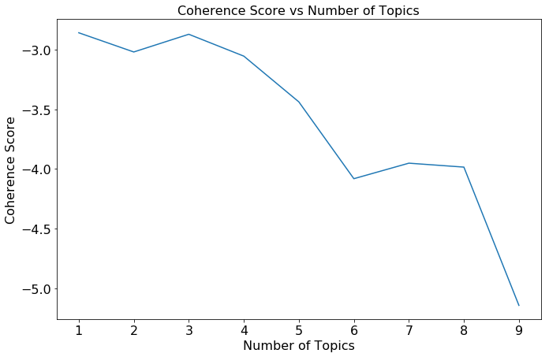
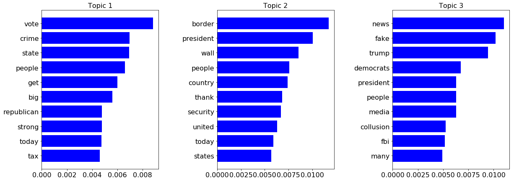

## Contents
{:.no_toc}
*  
{: toc}


```python
import requests
from IPython.core.display import HTML
styles = requests.get("https://raw.githubusercontent.com/Harvard-IACS/2018-CS109A/master/content/styles/cs109.css").text
HTML(styles)
```


<style>
blockquote { background: #AEDE94; }
h1 { 
    padding-top: 25px;
    padding-bottom: 25px;
    text-align: left; 
    padding-left: 10px;
    background-color: #DDDDDD; 
    color: black;
}
h2 { 
    padding-top: 10px;
    padding-bottom: 10px;
    text-align: left; 
    padding-left: 5px;
    background-color: #EEEEEE; 
    color: black;
}

div.exercise {
	background-color: #ffcccc;
	border-color: #E9967A; 	
	border-left: 5px solid #800080; 
	padding: 0.5em;
}

span.sub-q {
	font-weight: bold;
}
div.theme {
	background-color: #DDDDDD;
	border-color: #E9967A; 	
	border-left: 5px solid #800080; 
	padding: 0.5em;
	font-size: 18pt;
}
div.gc { 
	background-color: #AEDE94;
	border-color: #E9967A; 	 
	border-left: 5px solid #800080; 
	padding: 0.5em;
	font-size: 12pt;
}
p.q1 { 
    padding-top: 5px;
    padding-bottom: 5px;
    text-align: left; 
    padding-left: 5px;
    background-color: #EEEEEE; 
    color: black;
}
header {
   padding-top: 35px;
    padding-bottom: 35px;
    text-align: left; 
    padding-left: 10px;
    background-color: #DDDDDD; 
    color: black;
}
</style>


```python
import warnings
warnings.filterwarnings('ignore')

import os
os.environ['R_HOME'] = "/usr/share/anaconda3/lib/R"
```


```python
import pyjags
import pandas as pd
from rpy2.robjects.packages import importr
r_utils = importr('utils')
import numpy as np
%matplotlib inline 
import matplotlib.pyplot as plt
import rpy2
from rpy2.robjects import pandas2ri
pandas2ri.activate()
r_coda = importr('coda')
from sklearn.feature_extraction.text import CountVectorizer
from gensim.corpora import Dictionary
from gensim.models.ldamodel import LdaModel
from gensim.models import CoherenceModel
from nltk.corpus import stopwords
from nltk.tokenize import RegexpTokenizer
from datetime import datetime
from scipy.special import expit
```


```python
from collections import Counter

pd.set_option('display.width', 500)
pd.set_option('display.max_columns', 100)
pd.set_option('display.notebook_repr_html', True)
```


## Latent Dirichlet Allocation

In the first part of this assignment, you will be working with text from the @realDonaldTrump Twitter account. This consists of all tweets from the account from 5/4/2009 to 2/26/2019. The goal is to use Latent Dirichlet Allocation in order to model the topics tweeted about since President Trump's inauguration.

The dataset is from http://www.trumptwitterarchive.com/archive.

Start by reading the dataset into a pandas data frame.


```python
df = pd.read_csv("data/trump_tweets.csv")
```


Now, extract only the rows since President Trump's inauguration on January 20, 2017 (you can use midnight on that date as the start time). You should use the datetime.strptime to convert dates to type `datetime`. Hint: first, you should remove any rows with missing timestamps.


```python
df_clean = df.dropna(axis=0, how='any')
df_clean['created_at'] = pd.to_datetime(df_clean['created_at'], format='%m-%d-%Y %H:%M:%S')
df_clean = df_clean[df_clean.created_at >= "01-20-2017 00:00:00"]
```


Preprocess the data by making it all lowercase. Remove a reasonable set of stopwords from the dataset and tokenize. Then, report the 50 most common words and their count. You may need to iterate this process, adding some stop words as you understand the structure of the data. Justify additional stop words you've added.


```python
import nltk
nltk.download('stopwords')
tokenizer = RegexpTokenizer(r'[\w\']+') # \w means any letter or digit. 
```


    [nltk_data] Downloading package stopwords to
    [nltk_data]     /home/71387712/nltk_data...
    [nltk_data]   Package stopwords is already up-to-date!


```python
stop_words = set(stopwords.words('english'))
df_clean['text_clean'] = df_clean.text.str.lower()
df_clean['text_clean'] = df_clean['text_clean'].apply(tokenizer.tokenize)
df_clean['text_clean'] = df_clean['text_clean'].apply(lambda x: [cur_word for cur_word in x if cur_word not in stop_words])

total_counter = Counter()
for words in df_clean['text_clean']:
    word_count = Counter(words)
    total_counter += word_count
    
total_counter.most_common(50)
```


    [('co', 2240),
     ('https', 2232),
     ('great', 1518),
     ('amp', 1152),
     ('rt', 1015),
     ('people', 789),
     ('president', 642),
     ('trump', 599),
     ('country', 568),
     ('news', 550),
     ('u', 512),
     ('fake', 495),
     ('big', 481),
     ('thank', 467),
     ('border', 467),
     ('democrats', 465),
     ('many', 464),
     ('today', 435),
     ('america', 416),
     ('get', 407),
     ('time', 394),
     ('new', 372),
     ('much', 338),
     ('would', 336),
     ('american', 335),
     ('realdonaldtrump', 328),
     ('good', 316),
     ('want', 316),
     ('years', 302),
     ('must', 302),
     ('never', 300),
     ('media', 295),
     ('security', 293),
     ('back', 287),
     ('vote', 284),
     ('wall', 283),
     ('one', 280),
     ('make', 278),
     ('jobs', 276),
     ('military', 272),
     ('united', 265),
     ('trade', 261),
     ('house', 260),
     ('states', 255),
     ('tax', 253),
     ('first', 251),
     ('job', 250),
     ('going', 247),
     ('election', 246),
     ('crime', 246)]


Justification: 
- There are some abbreviation words that show up as most common words, for example co, amp, u, rt, which do not carry any real meanings, so we decide to drop those words.
- @realDonaldTrump is the twitter account name, so we decide to drop it. 
- We noticed that 'Trump' is also a common word and it's Donald Trump's last name, but we decided to keep it because there are many other names show as common words like 'Obama' and 'Clinton'. These names do carry real meanings, so we kept them. 
- 'Great' as a word by itself carries positive meanings, but we decided to drop it since it almost appears in every Trump's tweet. 


```python
## Preprocess the data by default stop words + Trump-specific words 
stop_words = set(stopwords.words('english'))
stop_words.update(['co', 'https', 'amp', 'rt', 'u', 'realdonaldtrump', 'great'])
df_clean['text_clean'] = df_clean.text.str.lower()
df_clean['text_clean'] = df_clean['text_clean'].apply(tokenizer.tokenize)
df_clean['text_clean'] = df_clean['text_clean'].apply(lambda x: [cur_word for cur_word in x if cur_word not in stop_words])

## Show the top 50 common words 
total_counter = Counter()
for words in df_clean['text_clean']:
    word_count = Counter(words)
    total_counter += word_count
    
total_counter.most_common(50)
```


    [('people', 789),
     ('president', 642),
     ('trump', 599),
     ('country', 568),
     ('news', 550),
     ('fake', 495),
     ('big', 481),
     ('thank', 467),
     ('border', 467),
     ('democrats', 465),
     ('many', 464),
     ('today', 435),
     ('america', 416),
     ('get', 407),
     ('time', 394),
     ('new', 372),
     ('much', 338),
     ('would', 336),
     ('american', 335),
     ('good', 316),
     ('want', 316),
     ('years', 302),
     ('must', 302),
     ('never', 300),
     ('media', 295),
     ('security', 293),
     ('back', 287),
     ('vote', 284),
     ('wall', 283),
     ('one', 280),
     ('make', 278),
     ('jobs', 276),
     ('military', 272),
     ('united', 265),
     ('trade', 261),
     ('house', 260),
     ('states', 255),
     ('tax', 253),
     ('first', 251),
     ('job', 250),
     ('going', 247),
     ('election', 246),
     ('crime', 246),
     ('even', 245),
     ('state', 245),
     ('russia', 241),
     ('fbi', 238),
     ('done', 237),
     ('day', 234),
     ('working', 221)]


Find the optimal number of topics using the `u_mass` coherence measure. Plot the results; what does this plot suggest about the number of topics in the text?


```python
masterdictionary = Dictionary(df_clean['text_clean'])
mastercorpus = [masterdictionary.doc2bow(doc) for doc in df_clean['text_clean']]
```


```python
coherence_vals = []
for ntop in range(1, 10):
    mod = LdaModel(mastercorpus, num_topics=ntop, id2word=masterdictionary, passes=5, random_state=1)
    cmod = CoherenceModel(model=mod, corpus=mastercorpus, dictionary=masterdictionary, coherence='u_mass')
    cval = cmod.get_coherence()
    coherence_vals.append(cval)
```


```python
fig, ax = plt.subplots(1, 1, figsize=(11, 7))
ax.plot(range(1,10), coherence_vals)
ax.set_title("Coherence Score vs Number of Topics", fontsize=16)
ax.set_xlabel("Number of Topics", fontsize=16)
ax.set_ylabel("Coherence Score", fontsize=16)
ax.tick_params(labelsize=16)
```





The number of topics in the text:
- The plot above suggests that there are 3 different topics in the text, as a value of k=3 maximized the coherence score. The results vary depending on the random seed though. 

Run LDA on the texts using the optimal value of $k$ found via your analysis above. Print out the top 10 words and associated betas for each of the $k$ topics. Comment on the results and their plausibility. What does each topic seem to represent?


```python
num_topics = 3
model = LdaModel(mastercorpus, num_topics=num_topics, id2word=masterdictionary, passes=10, random_state=123)
```


```python
top_words = [[word for word,_ in model.show_topic(topicno, topn=50)] for topicno in range(model.num_topics)]
top_betas = [[beta for _,beta in model.show_topic(topicno, topn=50)] for topicno in range(model.num_topics)]

gs = plt.GridSpec(1,3)
gs.update(wspace=0.5, hspace=0.5)
plt.figure(figsize=(20, 7))
for i in range(num_topics):
    ax = plt.subplot(gs[i])
    plt.barh(range(10), top_betas[i][:10], align='center', color='blue', ecolor='black')
    ax.invert_yaxis()
    ax.set_yticks(range(10))
    ax.set_yticklabels(top_words[i][:10])
    ax.tick_params(labelsize=16)
    plt.title("Topic " + str(i + 1), fontsize=16)
```





**Summary**: Topic 1 seems to represent the campaign and election by mentioning words of republican, vote and tax. Topic 2 has to deal with Trump's border security by key words of border, wall, and security. Topic 3 is all about fake news related to FBI investigation. Overall, it seems that LDA did a good job of captureing the latent topics that are embedded within Trump's tweets.
